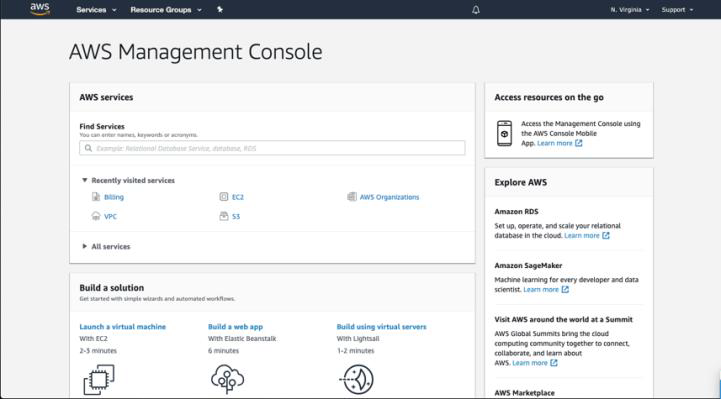
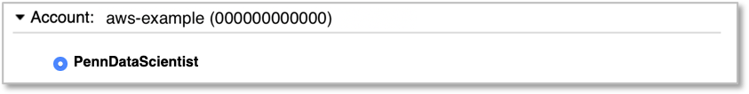
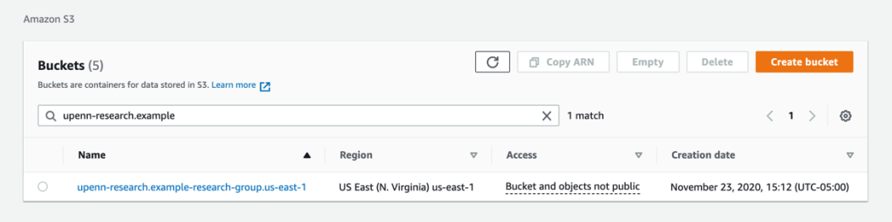
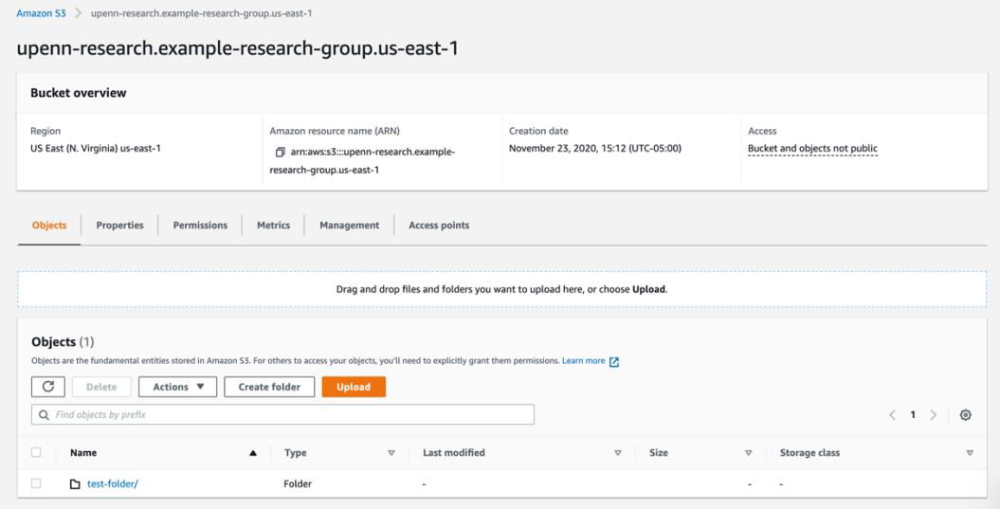
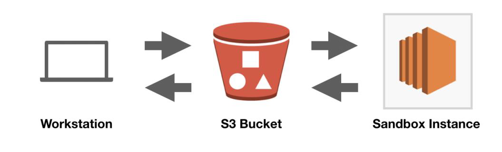
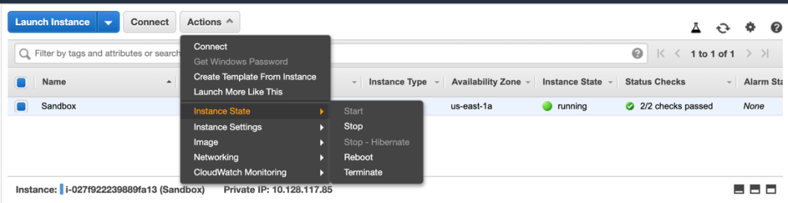
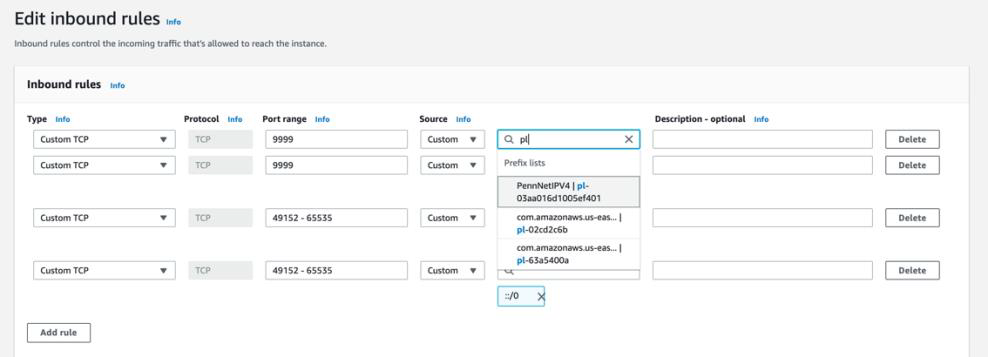

# AWS @ Penn: Getting Started

!!! abstract "What this page tells you"
    Penn ISC's Getting Started guide for AWS @ Penn: sign in via aws.cloud.upenn.edu, use N. Virginia region, choose services (EC2, S3, SageMaker), cost and security recommendations, VPC/SSH access rules, password policy, and handling PHI/regulated data.

## Getting Started with AWS @ Penn

Congratulations! You’ve been granted access to a Penn Amazon Web Services account, which you can think of a workspace for using AWS services.

**Table of Contents:**

## AWS for Research

AWS provides many options for researchers to take advantage of the flexibility, control, and scalability of cloud computing.   

•**High Performance Computing (HPC)** clusters can be quickly created to meet specific research requirements using a wide array of different compute, storage, and networking capabilities  
•**Data Analyses** can be run with standard workflow languages such as CWL, Nextflow, or WDL, and by using software written in programming languages such as Python or R  
•**Data Management** tools can provide storage at almost any scale, with sophisticated capabilities for securely managing access, running analytics, and optimizing costs based on how frequently the data will be retrieved 
•**Machine Learning (ML)** tasks can be accomplished with minimal setup using frameworks and languages such as Jupyter, TensorFlow, PyTorch, MXNet, and Hugging Face
•**Web Applications** can be hosted to facilitate collaboration and to provide interactive access and visualizations of published data 

To get started using AWS, the first step is generally tosign into the AWS Management Console, which is a browser-based user interface. This user interface provides access to all the different services that AWS offers (there are over 200). Each “service” is a grouping of capabilities organized around some functional area. More details on some services that might be relevant for Penn researchers are provided further down.  

## Accessing the AWS Management Console

Your access to AWS has been configured to take advantage of Penn’s existing single-sign-on capabilities through WebLogin. To access the AWS Management Console, you can simply open a browser window and navigate to the following site:

[https://aws.cloud.upenn.edu](https://aws.cloud.upenn.edu)

You may want to add the link above to your browser bookmarks. Each time you navigate to it, your browser will be redirected, first to the WebLogin screen, if you are not yet authenticated, and then, once you are authenticated, to a landing page where you can identify what role you want to use to access your AWS account. 

Initially, you may only have one role. If you have only one role, then you will not be taken to the landing page – instead, you’ll be redirected immediately to the AWS Management Console.

_Figure 1: Screenshot of the AWS Management Console_

The AWS Management Console provides you with a user interface to explore all of the various cloud services that AWS provides. These services are grouped into different categories such as Compute, Storage, Database, etc. 

To navigate between services, you can begin typing in the search box labelled Find Services. For example, you can type “EC2” if you want to navigate to the Elastic Compute Cloud service to create a new virtual machine. Another way to navigate between services is by selecting the drop down at the top left of your screen labelled “Services” and then picking the service listed there.

More directions on using the AWS Management Console can be found in the AWS documentation, by navigating to the link below.

[docs.aws.amazon.com](https://docs.aws.amazon.com/awsconsolehelpdocs/latest/gsg/getting-started.html)

If you have more than one role, or if you have a role in multiple accounts, then you will be taken to a landing page where you can select the account and role you would like to use. 

 
_Figure 2: Example of single-sign-on AWS account role selection_

If you are presented with a landing page, select the radio button for the role in the account that you would like to sign in with, as shown above, and then click on the button labelled “Sign In” at the bottom of the screen. 

One common issue that people run into with the AWS Management Console is finding themselves in the wrong region. There is a dropdown at the top right of the screen that should be labelled N. Virginia for most purposes. If it shows Ohio, Oregon, or another region, we recommend switching back to N. Virginia. This is also known as the US East 1 region. 

## Choosing services to use

If you don’t already have a clear sense of which AWS service meets your needs, you may want to start with one or more of the following:

•[Elastic Compute Cloud (EC2) a](https://docs.aws.amazon.com/AWSEC2/latest/UserGuide/concepts.html)llows you to create and manage virtual machines with a wide array of different CPU, GPU, memory, networking, and storage capabilities   
•[Simple Storage Service (S3) p](https://docs.aws.amazon.com/AmazonS3/latest/userguide/Welcome.html)rovides a general-purpose storage system where very large amounts of data can be stored at different pricing based on speed and cost of retrieval   
•[Relational Database Service (RDS) r](https://docs.aws.amazon.com/AmazonRDS/latest/UserGuide/Welcome.html)educes the effort involved in operating many different database engines (such as Oracle, Postgres, etc.)   
•[SageMaker p](https://docs.aws.amazon.com/sagemaker/)rovides tools to build, train, and deploy ML models and to work interactively through integrated development environments such as RStudio or Jupyter notebooks  
•[Athena a](https://docs.aws.amazon.com/athena/latest/ug/what-is.html)llows you to analyze petabyte-scale data in S3 and other locations – for example, to run SQL queries directly against very large collections of CSV or JSON files    
•[HealthOmics h](https://docs.aws.amazon.com/omics/latest/dev/what-is-service.html)elps researchers to store, query, and analyze genomic, transcriptomic, and other similar data using bioinformatics workflows written in WDL, Nextflow, or CWL   
•[Glue i](https://docs.aws.amazon.com/glue/latest/dg/what-is-glue.html)s a serverless data integration service that supports workloads to extract, transform, and load data (for example, using Spark and Ray)   
•[Batch p](https://docs.aws.amazon.com/batch/latest/userguide/what-is-batch.html)rovides a scheduler for efficiently running containerized jobs at scale   
•[Lambda e](https://docs.aws.amazon.com/lambda/latest/dg/welcome.html)nables code written in common languages like Python, Go, PowerShell, Node.js or Ruby to be run as “serverless functions” without having to manage virtual machines  

## Storing data in the Simple Storage Service (S3)

Amazon Web Services provides a very useful and flexible object storage service called S3. This service allows you to store arbitrarily large units of data as objects that are grouped within conceptual buckets. 

With the correct adjustments to the access control settings, data stored in S3 buckets can be accessed from other services both within AWS and outside of it. The simplest way to sync data from EBS to S3 is using the [command line interface](https://docs.aws.amazon.com/cli/latest/reference/s3/) (CLI). 

A bucket has already been created in your account for this purpose. The bucket name begins with the prefix upenn-research and includes an unique identifier for your research group and the region (probably useast-1) where it has been created. 

To see the bucket, assuming you have already signed into the AWS Management Console, you should be able to navigate to the following link in your browser and type upenn-research into the search box, as shown in the screenshot below.

[s3.console.aws.amazon.com](https://s3.console.aws.amazon.com/s3/home?region=us-east-1)

_Figure 5: Screenshot of the upenn-research S3 bucket_ 

To move data up to the S3 bucket, you can select the bucket and then click on the Upload button to choose one or more files from your workstation.

_Figure 6: Screenshot of the contents of an example bucket_

Additionally, it is possible to use the AWS Command Line Interface (CLI) from a terminal window to upload data from your workstation. Note that there is some setup required on your workstation to use the AWS CLI. Specifically, you’ll need to configure the AWS CLI with an access token and secret key for a user or role in your account that have the appropriate permissions to put objects into that bucket. 

You may want to refer to the [AWS @ Penn: Getting Started with Penn Single Sign On](https://upenn.box.com/v/AWS-GettingStarted-SSO) for more information on the recommended method for setting up this programmatic access to AWS through the University’s Identity Provider. 

Once you have completed the necessary setup and authentication steps, you will be able to execute a command like the following to sync all the data in a folder called “data” into a folder called “test” in your research bucket. 

$ aws s3 sync /data s3://upenn-research.example-research-group.us-east-1/test
upload: ./test.txt to s3://upenn-research.example-research-group.us-east-1/test/test.txt

Once a file or folder is uploaded to your S3 bucket, you can then sync it back down to your workstation by running the following AWS CLI command

$ aws s3 sync s3://upenn-research.example-research-group.us-east-1 

Note that the period (.) at the end of the command references the current working directory where the command is run. Executing the command above will synchronize all content in the S3 bucket to the folder where it is run. You can further specify individual folders in both locations. For example:

$ aws s3 sync s3://upenn-research.example-research-group.us-east-1/test bar

If you execute this command, it will synchronize anything in the “test” folder in the S3 bucket down to a folder called “bar” on your workstation. 

If you are using Amazon Elastic Cloud Compute (EC2) instances to analyze data, we recommend using your S3 bucket as an intermediate point for copying data from your workstation up to AWS and then to the instance (or vice versa). 

 

For example, you might upload input data into a folder on your S3 bucket called _input_– then sync _input_ to your instance data folder as /data/input 

aws s3 sync s3://upenn-research.example-grp.us-east-1/input /data/input  

Then, you might process the data through one or more steps and put it into a folder on the instance called /data/out. To sync this data back to S3, you could run the following command:

aws s3 sync /data/output s3://upenn-research.example-grp.us-east-1/output  

It is also possible to use the AWS programming-language specific software development kits (SDKs) to send and retrieve data from an S3 bucket. For example, you can modify a Python script that is processing some data from your file system to first download one or more files from an S3 bucket, and then to process the data normally. The benefit of this approach is that it allows the data processing scripts that you develop to be moved off of a specific virtual machine and into a variety of other compute environments that can be more easily and efficiently scaled to process larger datasets. 

## Cost of Compute

One of the nice features of AWS is that you can allocate a fairly small amount of compute to an instance initially, which means you can spend time installing software, troubleshooting, and refining your process with a relatively lower hourly cost than would be required to do more intensive computation tasks. Then, once everything is working, you can change the instance size to something with more vCPUs, memory, and networking bandwidth. 

You can check the price of your instance by visiting the AWS Pricing page:

[aws.amazon.com](https://aws.amazon.com/ec2/pricing/on-demand/)

Another common strategy for running more compute intensive analyses is to deploy [AWS ParallelCluster](https://aws.amazon.com/hpc/parallelcluster/) in the account. This provides a similar experience to using a traditional High-Performance Compute (HPC) cluster. The Cloud Solutions team can set this up if you would like to run your analyses on larger and more expensive EC2 instance types. There is some overhead and fixed cost involved because it is necessary to share data between the different cluster nodes and to run a head node where you will install software and stage reference data. However, it allows for a much more efficient use of expensive compute resources since the worker nodes are brought up only as needed and for the duration of the processing. 

## Overall Costs

It is important to recognize that the overall cost of maintaining an AWS account will be higher than just the compute cost. There are generally some baseline costs associated with running the necessary network connections back to campus (roughly $90 / month), security compliance and threat detection (roughly $5 / month), and storage of data (varies widely depending on how the data is stored). The network connection back to campus is part of our standard build for those that will be using the EC2 or RDS services, but it is packaged as a separate service offering that can be turned off if you prefer. This service offering is called [CloudNetwork Transit Hub.](http://upenn.box.com/v/Introducing-Cloud-Transit-Hub) It also provides network address translation and outbound access to the internet for private network resources. The standard build generally includes the deployment of a NAT gateway in order to facilitate EC2 instances being able to make outbound connections to the internet from the private subnets. This has a hourly cost of $0.045 and can be deleted if it is not needed. 

For the person designated as the account owner permissions have been configured to allow for these costs to be reviewed using the cloud management dashboard:

[manage.cloud.upenn.edu](https://manage.cloud.upenn.edu/)

It is also possible to get notifications over email to track usage. Please contact the Cloud Solutions service team for more information about this if you’re interested in getting emailed notifications. 

## Stopping & Starting an EC2 Instance

Even if your instance is relatively cheap, there may be longer periods of time when you don’t need it to be running. In that case, you may want to stop the instance and then start it up again later. 

To stop a running instance, navigate to the EC2 Dashboard, select the instance, click on the Actions button above and select Instance state > Stop. 

_Figure 1: Screenshot of stopping an instance in EC2 Dashboard_

To start the instance again, follow the same steps but select Start instead. Note that stopping and starting the instance can take several minutes, and the instance will not be reachable after being started until it passed the two status checks indicated in the dashboard. 

## Securing remote access to an EC2 Instance

If you are going to be creating new EC2 instances in your account, you will want to ensure that you lock down the remote access ports used for SSH and/or RDP access (22 and 3389, respectively). There is an existing security group in the account called upenn-remote-access-sg that can be attached to an EC2 instance in order to allow those ports to be accessible from the campus network and/or via the [University VPN.](https://vpn.upenn.edu/) Alternatively, you may want to configure [AWS Systems Manager Session Manager](https://docs.aws.amazon.com/systems-manager/latest/userguide/session-manager.html) to enable remote access via the [AWS Command Line Interface (CLI).](https://aws.amazon.com/cli/) 

We recommend that you deploy EC2 instances in Northern Virginia, in the pennnet-research-vpc-1 that has been created there, using one of the subnets marked “private” – if you have the Cloud Network Transit Hub enabled, you will be able to reach those private IP addresses from campus, but they will not be routed over the internet. This significantly reduces the risk of brute-force attacks.  

Note that EC2 instances deployed in private subnets are not reachable from the internet. This is by design. Even if you attach a public IPv4 address to the instance, there will be no route for the traffic to reach it. The Cloud Network Transit Hub provides a private route from the campus network as part of a broader approach to security, following the principle of “defense in depth.”  

When creating an EC2 instance, you will also need to require the use of IMDSv2 – this is an important security control to help reduce the risk of privilege escalation if your instance is compromised:

[docs.aws.amazon.com](https://docs.aws.amazon.com/AWSEC2/latest/UserGuide/configuringIMDS-new-instances.html)

## Interacting with AWS services

The AWS Management Console is not the only method that Amazon provides to interact with its cloud services. In general, there are at least three other distinct ways that people and systems can use. 

•Command Line Interface (CLI)
•Application Programming Interface (API)
•Software Development Kit (SDK)

Additional methods of interacting with AWS services are listed on the following site:

[aws.amazon.com](https://aws.amazon.com/tools/)

When interacting with AWS services through any of these methods, you will generally want to use [AWS access keys](https://docs.aws.amazon.com/general/latest/gr/aws-sec-cred-types.html#access-keys-and-secret-access-keys) rather than using the Penn credentials that you use to login to the Management Console. 

Generally speaking, when you use AWS access keys, this will also involve creating users, roles, and policies in the AWS Identify and Access Management (IAM) service. More details on using that service can be found at the following site:

[aws.amazon.com](https://aws.amazon.com/iam/)

## Enterprise Support

Penn has negotiated a contract with Amazon that provides account owners with AWS Enterprise Support. Enterprise Support provides numerous benefits to account owners to help with cloud risk management, including the ability to open cases directly with Amazon for support, access to their Trusted Advisor service, and programmatic access to their Support API. More details can be found in the AWS documentation at the link below:

[aws.amazon.com](https://aws.amazon.com/premiumsupport/plans/enterprise/)

## Note on Information Security

It is important to understand that although your AWS account has already been locked down in specific ways to reduce information security risks, you remain responsible for taking the necessary steps to maintain the security of your account and to ensure that the credentials that you use to access AWS services are not shared or compromised. It is particularly important to avoid accidentally making the various resources you are working with in AWS publicly available. Specifically, you should be especially careful with S3 bucket permissions or ports that are opened up in EC2 virtual machines (for example, to allow SSH remote login). 

You can and should reach out to ISC Cloud Solutions if you have any questions about best practices. 

We recommend that you review the following AWS whitepaper on Security Best Practices prior to using any AWS services. 

[d0.awsstatic.com](https://d0.awsstatic.com/whitepapers/Security/AWS_Security_Best_Practices.pdf)

Additional AWS whitepapers on security and other topics can be found:

[aws.amazon.com](https://aws.amazon.com/whitepapers/)

More details about recommended security controls and best practices are available in the [AWS @ Penn Fact Sheet.](https://upenn.box.com/v/AWS-PennFactSheet) 

## Standard Configuration

To help ensure consistent use of Amazon Web Services, and to reduce information security risk and risk of data loss, we configure a number of different standard settings in each account under the following services. 

•AWS Backup – a standard vault is created with Governance Lock enabled and a backup plan exists for DynamoDB tables, EC2 instances, EBS volumes, EFS file systems, as well as RDS and Aurora databases – to disable backup, you can add the resource
tag Security-RiskAccepted=NOT-BACKED-UP
•Virtual Private Cloud – a VPC virtual network is defined in the Northern Virginia region using PennNet IP address space – this should be used for all network resources; please reach out to the service team if you need additional address space or would like to use a different region
•Simple Storage Service (S3) – the account is configured to block public access and each bucket is similarly configured
•Security Hub – a couple of different standards are enabled and are tracked centrally
•CloudTrail – these records are managed and retained centrally
•GuardDuty – intelligent threat detection is enabled centrally 
•Config – this is enabled in each account

## Recommendations

#### Avoid use of the “Default VPC”

We recommend that account holders avoid using the “Default VPC” that AWS creates in the account. This default VPC is configured to make it quick and easy to get started, but it does not provide important security controls. 

Instead, please assign all AWS resources that require a VPC to the one named pennnet-research-group-vpc-1. This VPC was created by Cloud Solutions and is configured to avoid conflicting with other IP address space in use on PennNet as well as to take advantage of Penn’s Network Transit Hub.

#### Avoid using public subnets to host EC2 instances, Lambda functions, etc.

It is generally advisable to avoid using public subnets within a VPC for any purpose other than hosting Elastic Load Balancers or other compute that is playing a similar application proxy role. For example, if you are setting up an RDS database or an EC2 instance, it is recommended that you use one of the existing subnets under pennnet-research-vpc-1 that are labelled “Private.”

We recommend that AWS @ Penn users avoid creating [Bastion hosts](https://en.wikipedia.org/wiki/Bastion_host) or assigning Public IPs directly to EC2 instances.  

#### Provide remote access to instances via SSH or RDP through Penn’s network transit hub

Where possible, we recommend that EC2 instances be placed in private subnets, and that SSH or RDP access is restricted by security group to only allow access from PennNet IPs. A [shared prefix list](https://docs.aws.amazon.com/vpc/latest/userguide/sharing-managed-prefix-lists.html) is available for AWS @ Penn use for this purpose. To use the PennNetIPv4 prefix list, simply begin typing in the security group rule source textbox, as shown in the screenshot below. 

#### Use the University VPN to access PennNet when off-campus

Restricting to PennNet IP addresses will prevent off-campus users from directly accessing EC2 instances via SSH or RDP. This means that they will need access to a VPN that provides them with a PennNet IP address. We recommend that AWS @ Penn users take advantage of the [University VPN](http://vpn.upenn.edu/) for this purpose.  

#### Enable encryption for all EBS volumes, S3 buckets and objects, etc.

In general, encryption of data at rest in AWS has no additional cost associated, and we strongly encourage Penn community members to enable encryption whenever creating a resource that allows it and/or uploading data.

More details may be found in Amazon’s documentation on a service-byservice basis, for example:

•[Encrypting File Data with Amazon Elastic File System](https://docs.aws.amazon.com/whitepapers/latest/efs-encrypted-file-systems/efs-encrypted-file-systems.html)
•[Amazon EBS Encryption](https://docs.aws.amazon.com/AWSEC2/latest/WindowsGuide/EBSEncryption.html)
•[Setting default server-side encryption behavior for Amazon S3buckets](https://docs.aws.amazon.com/AmazonS3/latest/userguide/bucket-encryption.html)

#### Use the Systems Manager Patch Manager to ensure EC2 instances are patched automatically

AWS provides a [Systems Manager](https://aws.amazon.com/systems-manager/) service that greatly simplifies the standard tasks involved in managing EC2 instances. By ensuring that their standard agent is running on your EC2 instances and that those instances have the correct AWS IAM permissions, you can convert your EC2 instances into “managed instances” that are automatically patched.  

#### Use the Systems Manager Session Manager to provide secure remote access instead of direct SSH or RDP

Another benefit of the Systems Manager service is Session Manager, which provides a browser-based interactive shell and CLI for managing Windows and Linux EC2 instances. This avoids the need to open specific ports, manage keypairs, or use bastion hosts. 

#### Opt into the AWS @ Penn Intelligent Threat Detection through GuardDuty
New accounts created through AWS @ Penn will automatically be enrolled in GuardDuty, which provides intelligent threat detection. We recommend that migrated accounts also enable this service and join as members of the organization so that findings are shared with the service team. 

#### Require that EC2 instances use the Instance Metadata Service v2 (IMDSv2)

EC2 instances can use the instance metadata service to get access to information about themselves. There are risks involved in allowing the original version of that service to be available to the instance. Please follow these directions to ensure that your instances require IMDSv2:

[docs.aws.amazon.com](https://docs.aws.amazon.com/AWSEC2/latest/UserGuide/configuring-)

[IMDS-new-instances.html#configure-IMDS-new-instances](https://docs.aws.amazon.com/AWSEC2/latest/UserGuide/configuring-IMDS-new-instances.html#configure-IMDS-new-instances)

## Service Control Policies

Our standard configuration includes the following Service Control Policies to increase the security of the linked accounts and support their management at scale.

•Limit access to standard US AWS regions of N. Virginia, Ohio, and Oregon
•Prevent changes to Cloud Trail or Config
•Prevent changes to GuardDuty 
•Prevent capacity reservations (EC2 & RDS)

## Password Policy

We recommend that all user access to the AWS Management Console takes advantage of the integration with Penn’s Identity Provider to use WebLogin for single-sign-on. 

However, if account holders choose to create AWS IAM users and to enable console access, the standard AWS @ Penn configuration establishes the following password policy:

•Minimum password length is 16 characters
•Require at least one uppercase letter from Latin alphabet (A-Z)
•Require at least one lowercase letter from Latin alphabet (a-z)
•Require at least one number
•Require at least one non-alphanumeric character
•Password expires in 90 days
•Allow users to change their own password
•Remember at least 24 passwords and prevent reuse

It is important that any AWS IAM users that are created with management console access (i.e. a password) are [also set up with multifactorauthentication (MFA).](https://docs.aws.amazon.com/IAM/latest/UserGuide/id_credentials_mfa.html)  

## Working with Sensitive and/or Regulated Information

Working with certain information in an AWS account requires that specific additional privacy and security safeguards be implemented. These safeguards may be mandated by laws or regulations, and/or by university policy or agreement. 

If you are working with sensitive and/or regulated information, such as electronic protected health information (ePHI), you will need to take specific actions to help prevent the loss or exposure of that information.
You will also need to work with your entity’s security and privacy officers to ensure that you are in compliance with all applicable policies, laws, and regulations. 

It is also important that you inform the ISC Cloud Solutions service team so that specific actions can be taken on our side. For example, in order be in compliance with specific regulations, such as HIPAA, Amazon Web Services needs to be informed that the account is being used for this purpose in order to maintain compliance with the Business Associate
Agreement (BAA). 

## Working with Intellectual Property

We recommend that you limit or avoid storing material containing Intellectual Property, whether it belongs to Penn or to an investigator.
This may include data, algorithms, documents, etc.
