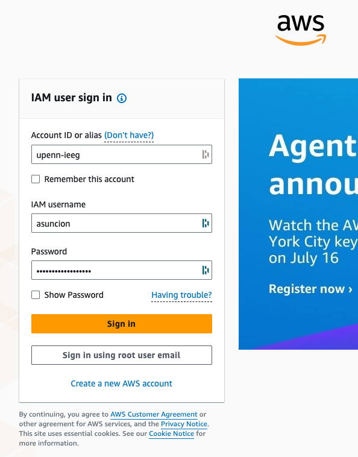
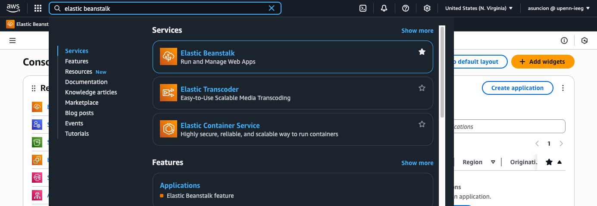
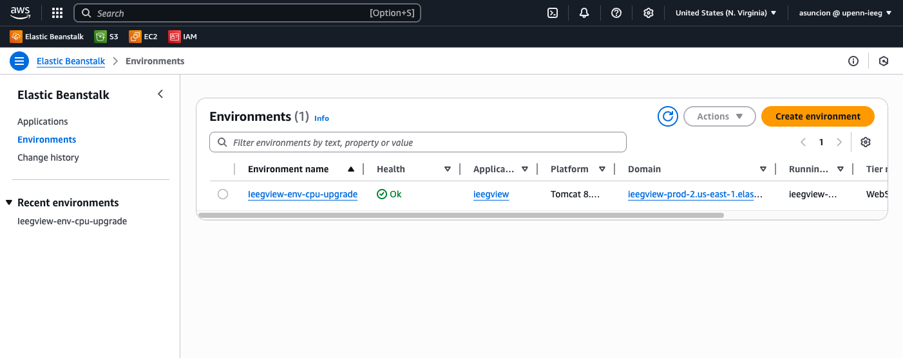
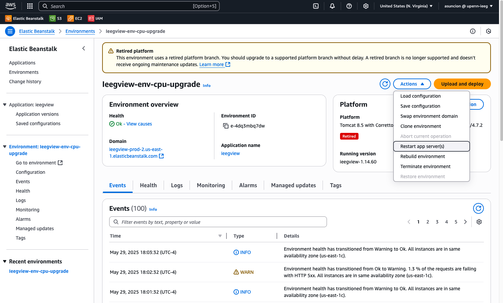
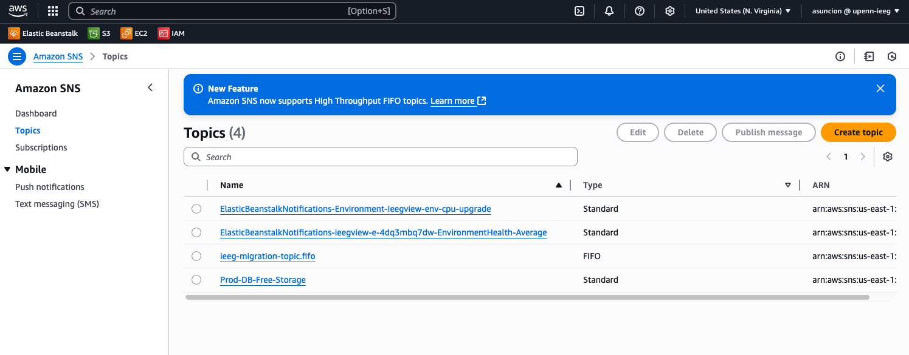
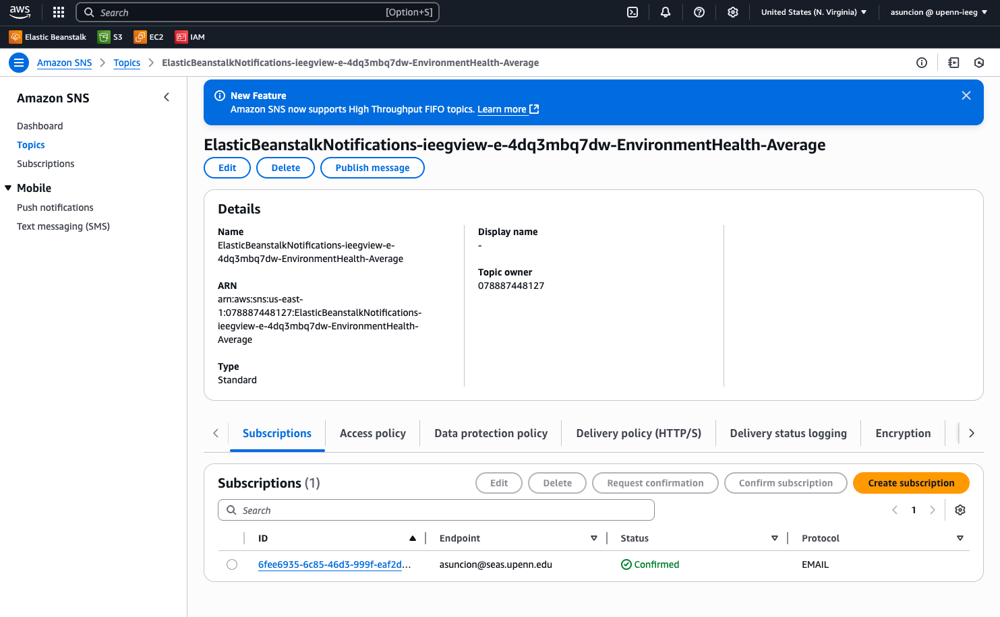
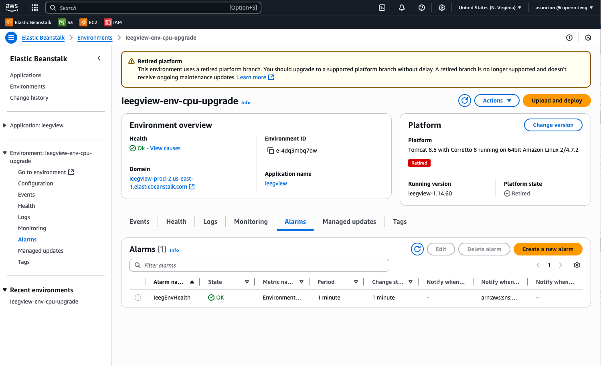
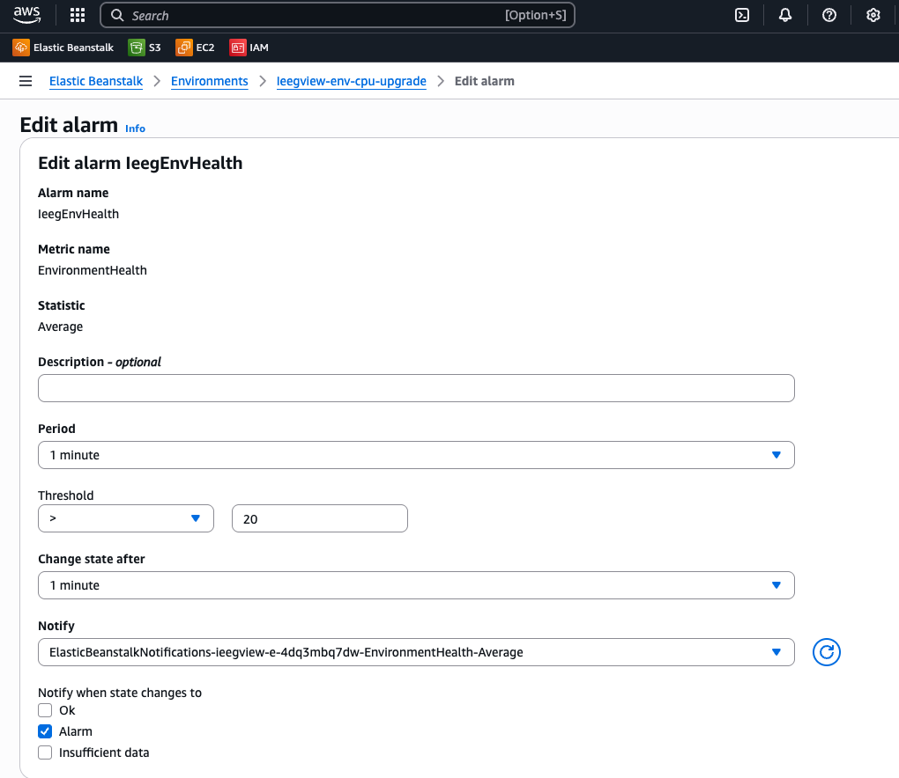

# Restarting the ieeg.org AWS Server

!!! abstract "What this page tells you"
    When ieeg.org is degraded, log into AWS (account upenn-ieeg, us-east-1), open Elastic Beanstalk environment Ieegview-env-cpu-upgrade, and use Actions > Restart app server(s) only. Also explains subscribing to SNS health alerts and editing the alarm.

## **Restarting the** [**ieeg.org**](http://ieeg.org) **environment**

1. Go to [aws.amazon.com](http://aws.amazon.com) and click "Sign in to the Console"
2. Login with the following credentials, then click "Sign in"
    1. Account ID / alias: upenn-ieeg
    2. IAM username
    3. Password

1. In the upper right hand corner, make sure that the "United States (N. Virginia) us-east-1" region is selected.
2. Search for and navigate to "Elastic Beanstalk"

1. You will see the `Ieegview-env-cpu-upgrade` environment and its current Health. Click on the environment name

1. If the environment Health is Degraded and you would like to restart the server, click the dropdown "Actions" button, then click "Restart app server(s)"
    1. **WARNING: DO NOT CLICK ANY OF THE OTHER OPTIONS IN THE DROPDOWN OR YOU MIGHT ACCIDENTALLY TAKE DOWN THE ENTIRE PLATFORM**

1. Once you click "Restart app server(s)", the page will refresh and you will see that the server is restarting. Feel free to close the tab. It should take a few minutes before the server is back up and running and the Health is restored to OK.
2. In a few minutes, logon to [ieeg.org](http://ieeg.org) to verify that the server is up and running again.

## **Optional: Subscribe to AWS automated alerts**
You are able to have AWS automated alerts sent to your email whenever Elastic Beanstalk notices that the [ieeg.org](http://ieeg.org/) server Health is degraded.

1. Logon to [https://console.aws.amazon.com/sns/home](https://console.aws.amazon.com/sns/home)
2. Click Amazon SNS, click Topics, then click the Topic name "ElasticBeanstalkNotifications-ieegview-e-4dq3mbq7dw-EnvironmentHealth-Average"

1. Click the "Subscriptions" tab, then click the "Create Subscription" button

1. Fill out the form with the following details:
    1. Topic ARN: "arn:aws:sns:us-east-1:078887448127:ElasticBeanstalkNotifications-ieegview-e-4dq3mbq7dw-EnvironmentHealth-Average" (don't change)
    2. Protocol: Email
    3. Endpoint: insert your email address
2. Click "Create subscription" at the bottom. You will then receive a confirmation email from Amazon SNS, which you will need to confirm first before you can start receiving notifications.

#### If you would like to edit the settings for the Ieeg Env Health Alarm:

1. In Elastic Beanstalk, in Environments, in the `Ieegview-env-cpu-upgrade` environment menu, click the "Alarms" tab

1. Click the checkbox for the "IeegEnvHealth" Alarm, then click the blue "Edit" button
2. You are free to adjust the following parameters as needed. Do not change anything else.
    1. Period
    2. Change state after

#### Instructions on how I created this Alarm, if you would like to create your own Alarm:

1. In Elastic Beanstalk, in Environments, in the `Ieegview-env-cpu-upgrade` environment menu, click the "Alarms" tab
2. Click the "Create a new alarm" button
3. Fill out the form with the following details:
    1. Resource: `Ieegview-env-cpu-upgrade` (don't change)
    2. Metric: EnvironmentHealth (don't change)
    3. Dimensions: no dimensions (don't change)
    4. Statistic: Average
    5. Name: insert whatever name you want
    6. Description - optional: leave blank
    7. Period: 1 minute
    8. Change state after: 1 minute
    9. Threshold: > 20
    10. Notify: Create a new SNS topic
    11. Topic name: insert whatever name you want
    12. Email: insert your email address
    13. Notify when state changes to: Alarm
