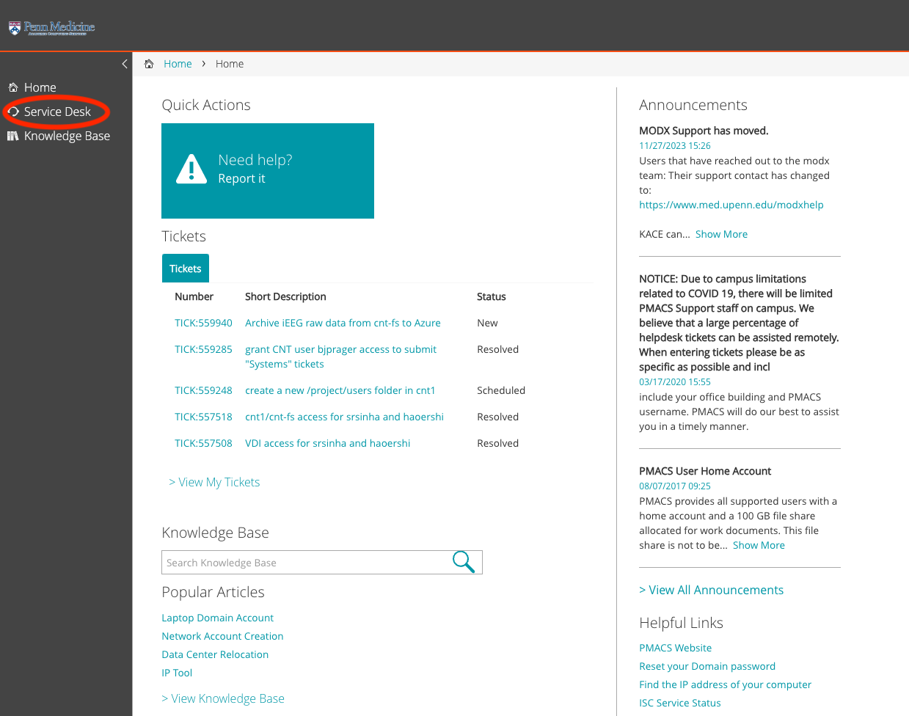
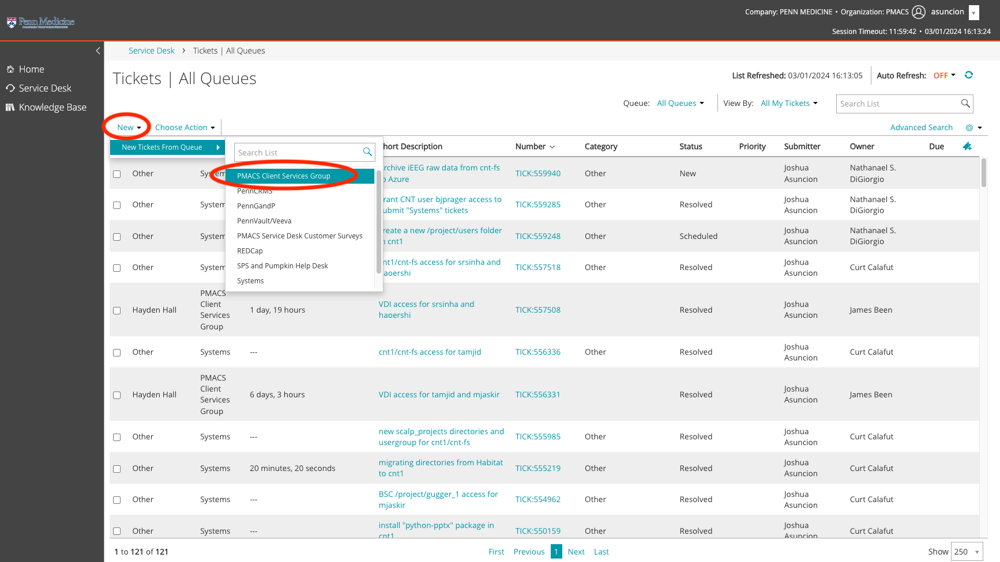
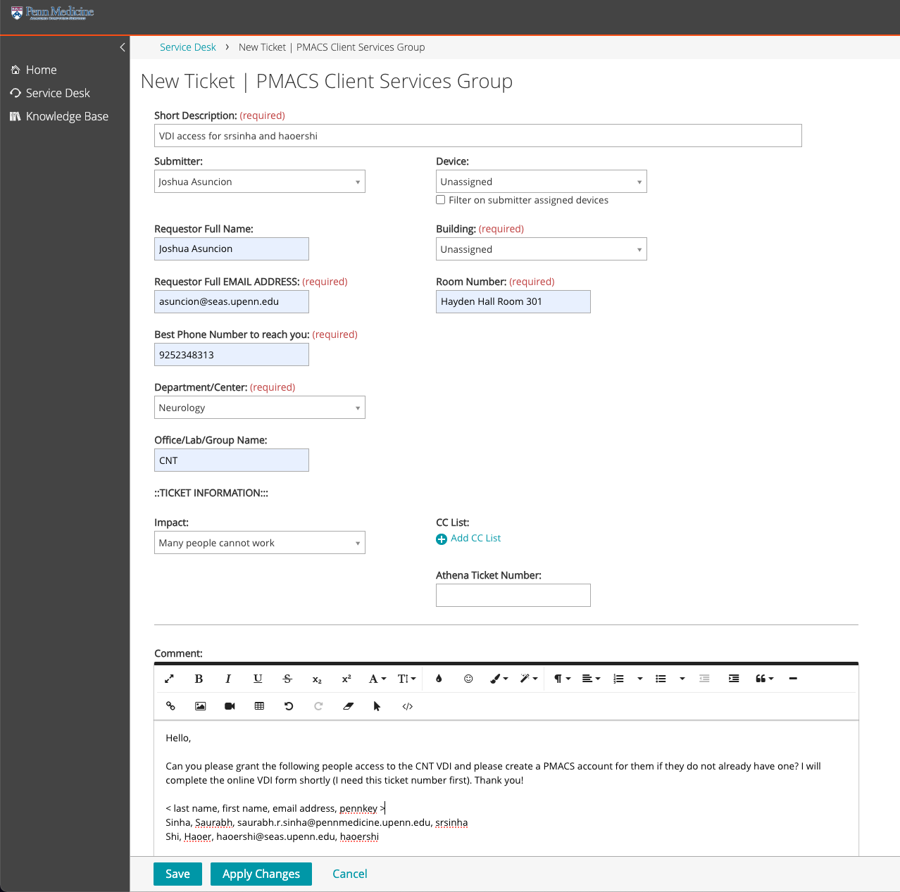
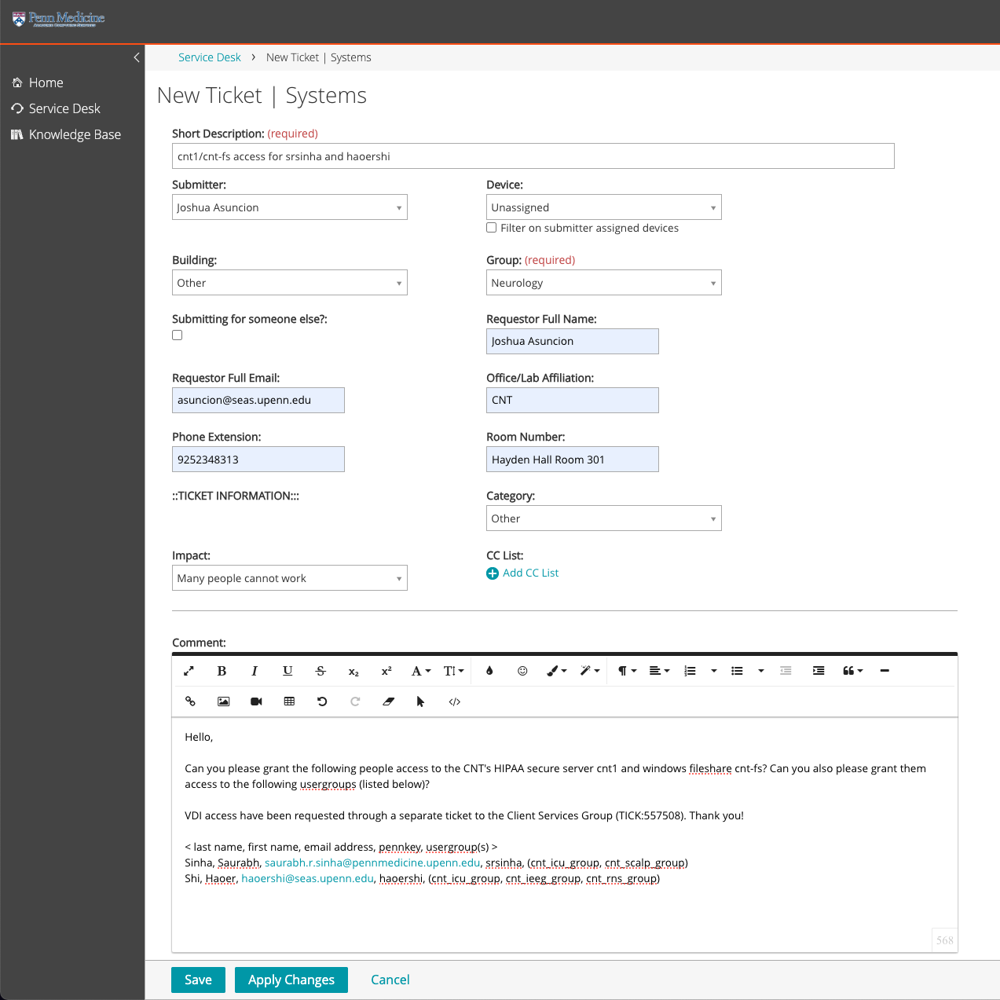

# Submitting CETS & PMACS Helpdesk Tickets

!!! abstract "What this page tells you"
    How to submit PMACS and CETS tickets with email templates: VDI, cnt1/cnt-fs (requires IRB and usergroup), BSC cluster, REDCap accounts, Littlab servers (Borel, Pioneer, Finkel, Sauce) via cets@seas.upenn.edu, and yearly renewals.

## Table of Contents

## Submitting PMACS tickets

**In general:**

1. Log in to the PMACS helpdesk using your PMACS credentials: [https://helpdesk.pmacs.upenn.edu/userui/welcome.php](https://helpdesk.pmacs.upenn.edu/userui/welcome.php)
2. Click on "Service Desk"

1. Click on "New", then "PMACS Client Services Group" to open a new ticket. This will be sent to the general PMACS Group, and from there your ticket will be forwarded to the appropriate PMACS sub-team if needed.

1. Fill out the following information. Feel free to use this screenshot as a template to fill out some of the ticketing fields.

1. **Note**: If you are submitting a ticket for a PMACS LPC resource (ex: cnt1, cnt-fs, VDI, BSC, cntgpu1), open a ticket for the "Systems" group instead of the "PMACS Client Services Group" to expedite the request. (The Systems Team handles all LPC requests)

### PMACS: Request access to VDI (Virtual Desktop Interface), cnt-fs server, cnt1 server

1. Access to cnt-fs / cnt1 servers is only needed if the CNT member will be working with PHI data. If so, they will first need to be added to the corresponding IRB(s). Please fill out this form to request to be added to IRB protocols: [https://redcap.link/CNTIRBpersonnelrequestform](https://redcap.link/CNTIRBpersonnelrequestform)
    1. All personnel being added to IRB protocols must have completed CITI Biomedical, CITI GCP, and HIPAA training. To complete your trainings, please see the instructions on under the Training folder in LabArchives.
    2. Please reach out to Brandon Bach (IRB & Regulatory Coordinator) with any IRB-related questions.
2. VDI (Virtual Desktop Interface) access should be requested first by the Data & Systems Manager.
    1. The Data & Systems Manager must submit a PMACS IT ticket through their online ticketing system, KACE ([https://helpdesk.pmacs.upenn.edu/userui/summary.php](https://helpdesk.pmacs.upenn.edu/userui/summary.php)), as a "PMACS Client Services Group" ticket
        1. Template to use in ticket:
1.     Hello,
    Can you please grant the following people access to the CNT VDI and please create a PMACS account for them if they do not already have one? I will complete the online VDI form shortly (I need this ticket number first). Thank you!
    < last name, first name, email address, pennkey >
    <Last>, <First>, <email>, <pennkey>
    1. 1. A PMACS account will be created for them if they do not already have an account. If they do not already have an existing PennMed account and have missing Penn affiliations, PMACS may ask you to provide a sponsor for proper affiliation. If asked, the affiliation should be:
2.     Sponsor: < Kathryn Davis / Brian Litt / Flavia Vitale >
    Dept: Neurology
    1. 1. **Note:** If a PMACS account has already been requested in a separate ticket, such as for BSC access, you must reference that ticket number in this ticket as well.
    1. After the ticket is submitted, the VDI request form ([https://somapps.med.upenn.edu/forms/pmacs/view.php?id=6236](https://somapps.med.upenn.edu/forms/pmacs/view.php?id=6236)) must be submitted. You will need to save the PMACS ticket number (TICK:XXXXXX) and enter it in the VDI request form.
        1. Answers to the form questions:
        2. SELECT EXISTING VDI ONBOARDING AND CNT IN THE SECOND DROP DOWN

    1. 1.     1. **Please explain in the simplest terms possible how you will be using VDI.**
                **_VDI only answer:_** This set of users will use the VDI to access software that will allow them to annotate CNT data stored on PMACS managed servers. These users do NOT need direct access to the server where the data are stored, cnt1.
                **_To access cnt1 answer:_** As remote users without PMACS managed computers, we plan to use the VDI to connect to our HIPAA secure server cnt1.
    1. 1.     1. **VDI is not ideal for a desktop replacement, do you plan on using the VDI as your only computer?**
                No
                1. b. **If no, do you have another Penn purchased computer or plan to purchase a computer for everyday use?**
                    Yes
    1. 1.     1. **Do you work off-site? If so, explain methods (VPN, RDP)**
                Yes, VPN preferred. VDI.
    1. 1.     1. (This question is missing from the form)
            2. **Do you need to print from the VDI?**
                No
    1. 1.     1. **Please provide valid Pennkeys for all users requesting access.**
                < list Pennkeys >
    1. 1.     1. **Do all users requesting access above have a PMACS supported device?**
                No
                1. **7a) If No, please provide the PennKeys for the users without supported devices.**
                    < list Pennkeys >
    1. 1.     1. **What software do you require to accomplish your objective? (note: the list of standard software titles is at the end of the questionnaire)**
                The CNT VDI is up-to-date with our software installation needs.
    1. 1.     1. **Where does the data currently reside that will be needed in the VDI?**
                cnt1 and cnt-fs
    1. 1.     1. **Will you be working with HIPAA data in the VDI?**
                Yes, data on cnt1 and cnt-fs will be HIPAA data.
    1. 1.     1. (If more explanation is needed:)
                The Center for Neuroengineering & Therapeutics (CNT) spans multiple schools within the Penn community. Members of the CNT have Penn computers, but very few, if any, are managed by PMACS, and our office is located in the School of Engineering and not on the PMACS network (though we are all working remotely). Therefore, when we purchased our HIPAA secure server through PMACS (called cnt1, setup by Rick Bryson and Nate DiGiorgio), it was determined that all CNT members would access cnt1 from a VDI that we paid to have setup for our specific use.

    1. Once granted VDI access, users will receive notification from PMACS on how to install and access the VDI. Instructions are also found on LabArchives.
2. Next, the Data & Systems Manager must submit a PMACS IT ticket for cnt1 and cnt-fs access as a "Systems" ticket. When requesting access, users must be granted access to both cnt-fs and cnt1.
    1. Note: The staff submitting the ticket must have "Systems" be granted to them first by PMACS before they are able to submit "Systems" tickets in the portal. Contact the data research coordinator.
    2. Note: Directories / usergroups in cnt1 and cnt-fs are tied to IRBs. CNT members must be on the correct IRBs first before they can be added to the corresponding directories / usergroups in cnt1 and cnt-fs.
    3. groups for cnt1/fs are as follows:
        1. cnt\_staff\_group
        2. cnt\_3t\_group
        3. cnt\_7t\_group
        4. cnt\_dac\_group
        5. cnt\_icu\_group
        6. cnt\_ieeg\_group
        7. cnt\_nlp\_group
        8. cnt\_pioneer\_group
        9. cnt\_stafftemp\_group
        10. cnt\_rns\_group
        11. cnt\_scalp\_group
    4. Template to use in ticket:
3.     Hello,
    Can you please grant the following people access to the CNT's HIPAA secure server cnt1 and windows fileshare cnt-fs? Can you also please grant them access to the following usergroups: < insert usergroup(s) >
    **Add the user-group options and the coordinating IRBs**
    VDI access have been requested through a separate ticket to the Client Services Group (TICK:XXXXXX). Thank you!
    < last name, first name, email address, pennkey >
    <Last>, <First>, <email>, <pennkey>

### PMACS: Request access to BSC Cluster

1. BSC access is primarily granted to Davis lab users, CNT staff, and any CNT members who will be working primarily with brain imaging data in the BSC.
2. The Data & Systems Manager must submit a PMACS/DART IT ticket through their online ticketing system, KACE ([https://helpdesk.pmacs.upenn.edu/userui/summary.php](https://helpdesk.pmacs.upenn.edu/userui/summary.php)), as a "Systems" ticket.
    1. Note: The staff submitting the ticket must have "Systems" be granted to them first by PMACS before they are able to submit "Systems" tickets in the portal. Contact the data research coordinator.
    2. **Note:** If a PMACS account has already been requested in a separate ticket, such as for VDI / cnt-fs / cnt1 access, you must reference that ticket number in this ticket as well.
    3. Template to use in ticket:
4.     Hello,
    Can you please add the following users to the BSC Cluster by adding them to the following user group and project directory, and please grant them a user folder? Any users without an existing PMACS account will also need to have one created for them. Thank you!
    User group: davisgroup
    Project directory access: /project/davis\_group\_1
    < Last name, first name, email address, pennkey >
    <Last>, <First>, <email>, <pennkey>
    1. Note: A PMACS account will be created for them if they do not already have an account. If they do not already have an existing PennMed account and have missing Penn affiliations, PMACS may ask you to provide a sponsor for proper affiliation. If asked, the affiliation should be:
5.     Sponsor: < Kathryn Davis / Brian Litt / Flavia Vitale >
    Dept: Neurology

### PMACS: Request access to REDCap

1. For CNT members without an existing PMACS account, the Data & Systems Manager will need to request a PMACS account for them by submitting a PMACS/DART IT ticket through their online ticketing system, KACE ([https://helpdesk.pmacs.upenn.edu/userui/summary.php](https://helpdesk.pmacs.upenn.edu/userui/summary.php)), as a "PMACS Client Services Group" ticket.
    1. Note: if they have VDI / cnt1 / cnt-fs access, they already have a PMACS account.
2. They need to complete Penn REDCap HIPAA Training in Workday
3. Once the CNT member has a PMACS account, or already has an existing PMACS account, the RedCap Team has a form to request new accounts. They will handle creating the PMACS account and adding the necessary permissions for RedCap access.
    1. Link to form: [https://somapps.med.upenn.edu/forms/somis/view.php?id=15207](https://somapps.med.upenn.edu/forms/somis/view.php?id=15207)
        1. In the Category dropdown, select Access::Request New Account and in the Comments box put your PennKey information.
4. Once given REDCap access, CNT staff can add users to specific projects.

## Submitting CETS tickets

### CETS: Request access to "Littlab" servers - Borel, Pioneer, Finkel, Sauce

1. Data & Systems Manager to email [cets@seas.upenn.edu](mailto:cets@seas.upenn.edu) the following:
2.     Hello CETS,
    The CNT has the following new staff/student(s). Please grant them access to Borel, Pioneer, Finkel and Sauce, create a user folder for each of them in /users/, and add them to the "littuser" / "davisuser" / "vitaleuser" usergroup (I specify which below) and the "cntgroup" usergroup.
    If they do not have a SEAS account, can you please create a sponsored research account for them? Access to the Littlab servers can expire (a year from now / insert length of time). Thank you!
    <Last name, first name, email address, pennkey, usergroup>
    <Last>, <First>, <email>, <pennkey>, littuser
3. Email template for CNT staff:
6.     Hello CETS,
    The CNT has a new staff member. Please grant them access to Borel, Pioneer, Finkel and Sauce, create a user folder for them in /users/, and add them to the “cntstaff”, “cntgroup” and \_\_\_\_\_\_ ("littuser" / "davisuser" / "vitaleuser") usergroups.
    A SEAS sponsored research account should be created for them if not already done. Access to the CNT servers should expire a year from now.
    <Last name, first name, email address, pennkey, usergroup>
    Prager, Brian, [bjprager@seas.upenn.edu](mailto:bjprager@seas.upenn.edu), bjprager, littuser
    Best,
    <Your name>
1. Note: they will need a SEAS sponsored research account if they do not already have a SEAS account. Access is granted for up to one year. Within a month of expiration, user should receive an email from CETS notifying them of their expiration. You will need to email CETS asking for a renewal:
    1. Example email received from CETS:
7.     Your SEAS account will lose access to the littlab group on 2022-09-01.
    This includes the following servers:
    [borel.seas.upenn.edu](http://borel.seas.upenn.edu/)
    [leif.seas.upenn.edu](http://leif.seas.upenn.edu/)
    [pioneer.seas.upenn.edu](http://pioneer.seas.upenn.edu/)
    If you need to retain access to these servers please contact your research sponsor to request an extension. Thank you.
    1. Email template to send to CETS:
8.     Hello CETS,
    Please extend <Name>'s access (pennkey: <pennkey>) to the Littlab servers Borel, Pioneer and Leif for one more year.
    Thank you,
    <Your name>

### CETS: Request Matlab license if needed

1. The Matlab licenses installed on the Borel / Pioneer servers will be sufficient for most students/researchers. However, if a member needs his/her own Matlab license for personal, offline use, please reach out to the data research coordinator for assistance in requesting a license.
