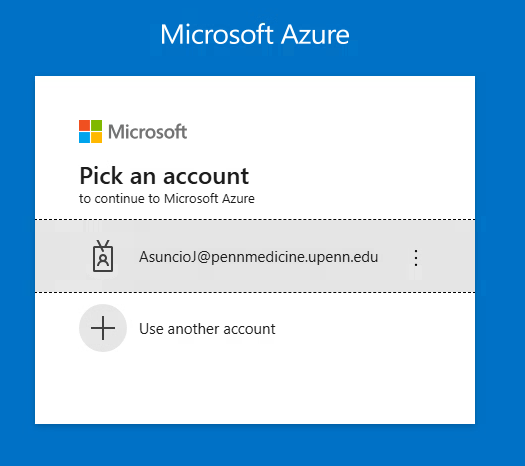
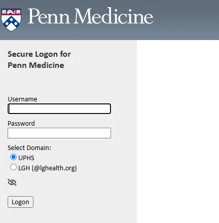
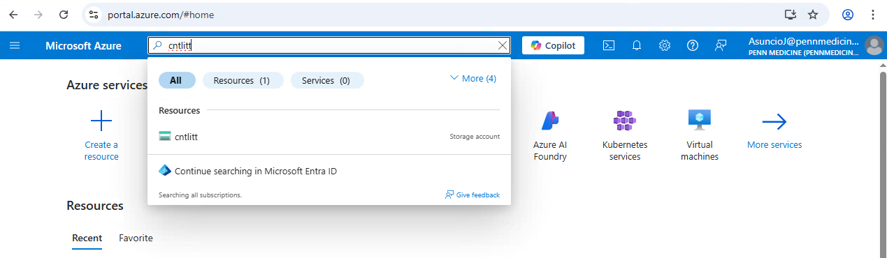
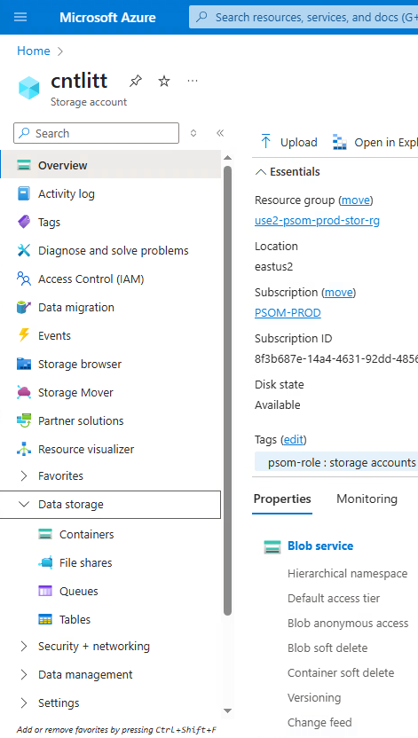
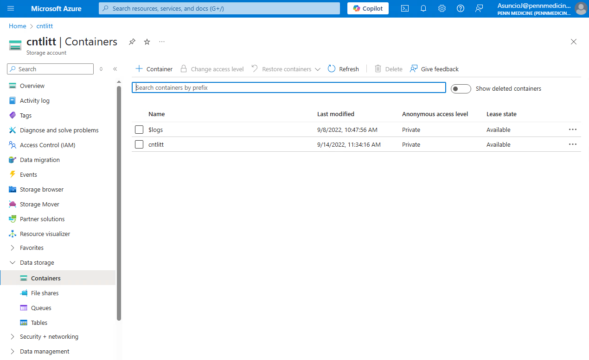

# Archiving EEG Data to Azure

!!! abstract "What this page tells you"
    Archive HUP EEG data to Azure: copy config logs to /ieeg_metadata, run zip_dataset.sh in a screen on cnt1, verify the zip log, move tarball to ready_for_archiving, upload with upload_azcli.sh, verify in portal.azure.com (cntlitt), then delete local copies.

The following instructions are to archive iEEG raw data (original Natus recordings) to Azure cold storage under Brian Litt's account (or any kind of data). Once the data is archived, it can be deleted from `cnt-fs` / `cnt1` .

Prerequisites:

*   You will need to have access to the cntlitt storage account in Microsoft Azure. Access is granted by PMACS.
*   The `upload_azcli.sh` script in `/project/eeg_process/azure_archive/scripts` will need to have a non-expired SAS token (provided by PMACS). At the time of writing, the current token expires on 03/15/2026.

When a HUP EEG dataset is ready to be archived:

1. Copy the HUPXXX config logs into the `/ieeg_metadata` folder on `cnt-fs`
    1. E.g. channel mapping text file, NatusDir file, data collection file, jacksheet PDF, etc.
2. SSH into `cnt1` . Open a new Linux screen for HUPXXX
    1. `screen -S HUPXXX`
3. Go to `/project/eeg_process/azure_archive/scripts`
4. Run `bash zip_dataset.sh /mnt/cnt-fs/eeg_raw/ieeg_raw/HUPXXX`
    1. This will take a long time to run. Detach from the Linux screen by clicking Ctrl A + D. You can check if it's done by reattaching (`screen -r HUPXXX`)
    2. **Optional**: If it is urgent to free up space in `cnt-fs` , run this command **first** to first move the HUP dataset out of `cnt-fs` and into `cnt1` :
    `rsync -ah --stats /mnt/cnt-fs/eeg_raw/ieeg_raw/HUPXXX /project/eeg_process/azure_archive/staging/`
    **Then**, you will run this command:
    `bash zip_dataset.sh /project/eeg_process/azure_archive/staging/HUPXXX`
5. Once the zip dataset process has finished, check the log file `/project/eeg_process/azure_archive/logs_zip/zip_log_HUPXXX.txt` that 1) the number of files/folders and 2) the total size between original dataset and compressed tarball are matching
    1. Once confirmed, delete the HUPXXX dataset from `cnt-fs`
6. Move the HUPXXX tarball (zipped file) `HUPXXX.tar.gz` into the `/project/eeg_process/azure_archive/ready_for_archiving` folder
7. Make sure you are in the HUPXXX Linux Screen for this next step. (If you have detached yourself from it, you can reattach using `screen -r HUPXXX`). Make sure you're in the `/project/eeg_process/azure_archive/scripts` folder.

Then, run the following code to start uploading the tarball to Azure:

`nohup bash upload_azcli.sh HUPXXX.tar.gz &> /project/eeg_process/azure_archive/logs_azure/HUPXXX_azure_archive.log`

1. This will take a long time to run. Detach from the Linux screen by clicking Ctrl A + D. You can check if it's done by reattaching (`screen -r HUPXXX`)

8. Check the log file `/project/eeg_process/azure_archive/logs_azure/HUPXXX_azure_archive.log` for progress on uploading the tarball to Azure. Check the log that the upload is finished, and check that the size of the remote tarball file matches the size of the local tarball file
9. Login to [http://portal.azure.com](http://portal.azure.com) to verify that the tarball has been uploaded to Brian Litt's account
    1. Login using your PennMedicine (UPHS) email account

    1. Search for the "cntlitt" storage account

    1. Go to Data Storage, then go to Containers

    1. Open the "cntlitt" container

    1. Look for the HUPXXX.tar.gz tarball
2. Once verified, delete the HUPXXX.tar.gz tarball from the `/project/eeg_process/azure_archive/ready_for_archiving` folder
