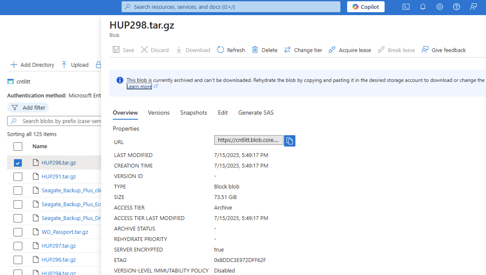
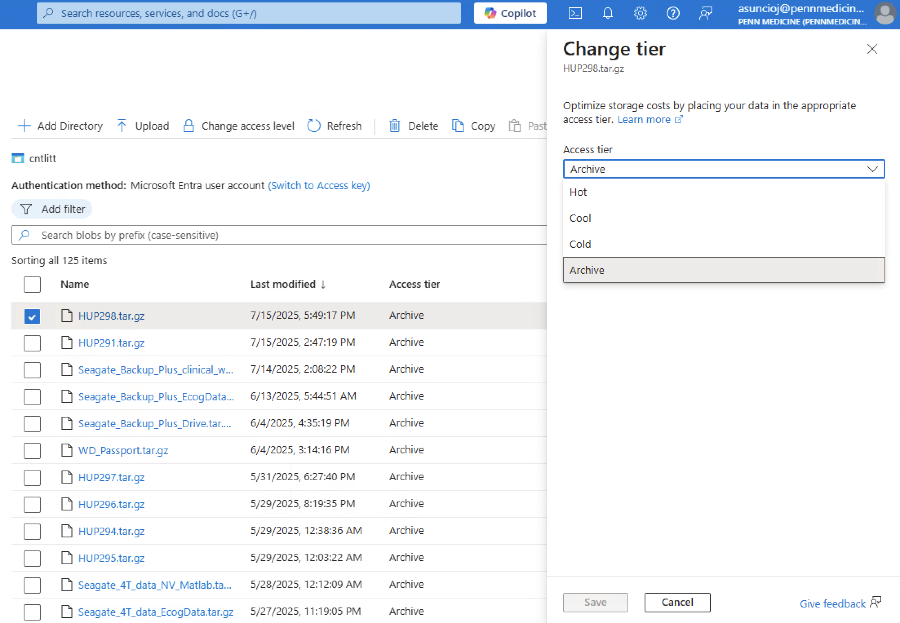

# cnt1 Scripts for Azure Archiving & Unarchiving

!!! abstract "What this page tells you"
    Azure helper scripts in /project/eeg_process/azure_archive/scripts: to unarchive, change blob tier from Archive to Cool in the portal, run download_azcli.sh then unzip_dataset.sh, and set tier back to Archive. Also list_tarball_contents.sh.

The following scripts are useful scripts when uploading data to or downloading data from Microsoft Azure cold storage. All of these scripts are located in `cnt1` in: `/project/eeg_process/azure_archive/scripts`

## Unarchiving:
**NOTE:** Azure storage offers different [access tiers](https://learn.microsoft.com/en-us/azure/storage/blobs/access-tiers-overview) so that you can store your blob data in the most cost-effective manner based on how it's being used. See [Azure Blob Storage pricing](https://azure.microsoft.com/en-us/pricing/details/storage/blobs/) for more information. Azure Storage access tiers include:

*   **Hot tier** - An online tier optimized for storing data that is accessed or modified frequently. The hot tier has the highest storage costs, but the lowest access costs.
*   **Cool tier** - An online tier optimized for storing data that is infrequently accessed or modified. Data in the cool tier should be stored for a minimum of **30** days. The cool tier has lower storage costs and higher access costs compared to the hot tier.
*   **Cold tier** - An online tier optimized for storing data that is rarely accessed or modified, but still requires fast retrieval. Data in the cold tier should be stored for a minimum of **90** days. The cold tier has lower storage costs and higher access costs compared to the cool tier.
*   **Archive tier** - An offline tier optimized for storing data that is rarely accessed, and that has flexible latency requirements, on the order of hours. Data in the archive tier should be stored for a minimum of **180** days.
When you want to download a blob, you will first need to temporarily unarchive it from **Archive tier** to a hotter access tier in order to access it.
Hotter tiers cost significantly more, so it is very important to make sure that once you finish downloading a blob that you reassign it back to **Archive tier** for long term storage.

1. To download a blob, first go to the storage container and click open the name of the blob you wish to unarchive. Once open, click "Change tier" at the top of the blob menu that opens up.

1. Change the tier level from **Archive** to **Cool.**
    1. **Cool tier** is the lowest, cheapest tier possible to make a blob available for download.
    2. Note: It will take Azure several hours to retrieve the data from cloud storage, so the blob will not be available to download right away.

1. Now you are ready to download the blob. Run the `download_azcli.sh` script which utilizes the Azure CLI to programmatically download a blob.
2. Once you're finished downloading the blob, make sure you don't forget to change the blob's access tier back to **Archive tier.**

#### Programs:

*   `download_azcli.sh`
    *   This script downloads blobs from Azure cold storage (any data uploaded to Azure are called blobs). This script will download and save the blob in the `/project/eeg_process/azure_archive/recently_unarchived` folder.
    *   It is best to run this program in a Linux Screen (how to create a new Screen: `screen -S insert_name`) since it will take awhile to run if the data is large.
    *   Prerequisites:
        *   You will need to have access to the cntlitt storage account in Microsoft Azure. Access is granted by PMACS.
        *   The script will need to have a non-expired SAS token to work (provided by PMACS). This token is a copy of the token in `upload_azcli.sh`. At the time of writing, the current token expires on 03/15/2026.
    *   How to run: `bash download_azcli.sh INSERT_BLOB_NAME`
        *   E.g.: `bash download_azcli.sh HUP1234.tar.gz`
            *   This code will fail if the `HUP1234.tar.gz` blob does not exist in the cntlitt storage account.
*   `unzip_dataset.sh`
    *   Once a tarball blob is downloaded onto `cnt1` in the `/project/eeg_process/azure_archive/recently_unarchived` folder, run this script to unzip the tarball. The script will output the unzipped data in the same `/project/eeg_process/azure_archive/recently_unarchived` folder.
    *   It is best to run this program in a Linux Screen (how to create a new Screen: `screen -S insert_name`) since it will take awhile to run if the data is large.
    *   How to run: `bash unzip_dataset.sh /project/eeg_process/azure_archive/recently_unarchived/TARBALL_NAME.tar.gz`

## Archiving:

*   `zip_dataset.sh`
    *   See [Complete SOP for archiving EEG (or any) data to Azure](archiving-eeg-data-to-azure.md)
*   `list_tarball_contents.sh`
    *   This is an important script if you have a tarball and want to save a list of its contents. The script will create and save a `tar_contents_TARBALL_NAME.log` log file in the `/project/eeg_process/azure_archive/logs_zip` folder.
    *   It is best to run this program in a Linux Screen (how to create a new Screen: `screen -S insert_name`) since it will take awhile to run if the data is large.
    *   How to run: `bash list_tarball_contents.sh /project/eeg_process/azure_archive/staging/TARBALL_NAME.tar.gz`
*   `upload_azcli.sh`
    *   See [Complete SOP for archiving EEG (or any) data to Azure](archiving-eeg-data-to-azure.md)
