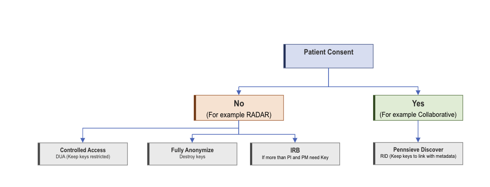

# Pennsieve Data Access Rules

!!! abstract "What this page tells you"
    If a patient consented to data sharing, data can go on Pennsieve Discover with keys kept. If not (e.g., RADAR), use controlled access with a data request form, fully anonymize and destroy keys, or contact the IRB when more than PIs/PMs need the key.

Did the patient consent to sharing their data?
If yes:

*   The data can go on Pennsieve discover
*   Keep the keys to link with metadata
If no:

*   There are 3 ways to go about patient data on Pennsieve if they did not consent to sharing their data (for example RADAR study)
    1. Controlled Access
        1. Have those that want to access the data submit a data request form for the specific dataset
        2. The keys are to be restricted to just a few members of the lab
    2. Fully Anonymized
        1. The data once up on Pennsieve has to be fully anonymized
        2. The keys must be destroyed and the metadata cannot be linked back to patients
    3. IRB
        1. If more than the PIs and Project Managers need the key to a dataset (students, etc...) then contact the IRB

For reference a flowchart is embedded below:

