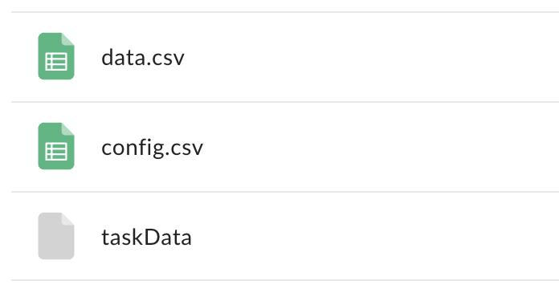

# Bedside Testing: Gold Audio Task

!!! abstract "What this page tells you"
    Run the Gold tones task in the EMU research room on the TNL-Macbook using ReportPredict_uPenn_Final_v2.py in PsychoPy2 with Subject ID = RID; plug the sync cable into DC1/DC7 and annotate START/END TONES TASK. Then upload the csv and taskData files to the PennBox HUP###/Session1 folder.

!!! warning "Credential removed"
    A password that appeared in the original text has been removed. Get it from the lab password manager, never from a wiki page.

In the EMU epilepsy research room...

*   Get the laptop from the drawer; the key for the drawer is hanging on the black rack by the TV
*   Turn the laptop on
*   Make sure the laptop is charged before you go in to test the patient
*   Laptop Username: **TNL-Macbook**
*   Laptop Password: ***(in the password manager)***
*   (You do not need wifi on)
*   Task bar: **PsychoPy2 (or filepath: Applications → PsychoPy\_1\_83\_04)**
*   Task name: **ReportPredict\_uPenn\_Final\_v2.py** **(make sure it is version 2 !!)**
*   Data output pathway:  MATLAB/Goldlab\_TonesTask/ToneTask/Psychopy/data
*   To run experiment run **ReportPredict\_uPenn\_Final\_v2.py** in **PsychoPy2**
*   Click **green play button** on the top of the screen.
*   ReportPredict Task pop up will display.
*   Enter patient data:
    *   **Subject ID = RID**
    *   **Session # = 1** This corresponds to how many times they are trying the last. If you have to come back to finish on a different day, it should be labeled session 2.
    *   do this when in the room with the patient, as the task will start after putting in this data
*   In the room:
    *   plug in the black cord to the natus box port that says DC1/DC7 and plug the other side into the computer
    *   write START TONES TASK on eeg monitor when the task is beginning, and END TONES TASK when finished so that we can clip it
    *   the task will take about 15-20 min to complete

**After you run the task, follow these steps to share the data**
In [this pennbox folder:](https://upenn.app.box.com/folder/140181113751?box_action=go_to_item&box_source=legacy-notify_existing_collab_folder)

*   Make a HUP### folder
*   Put the de-identified implant powerpoint you get from the EMU techs in this folder (named RIDXXX\_HUPXXX)
*   Within the HUP### folder, make a folder called "Session1"
    *   In this folder, you will put the 2 .csv files and the taskData file from the EMU computer (should look like this)

*       *       *   Path in EMU computer to find files:
            *   Correct path: MATLAB/Goldlab\_TonesTask/ToneTask/Psychpy/V2/data/RID####/
            *   might also end up in this folder: MATLAB/Goldlab\_TonesTask/ToneTask/Psychpy/data/RID####
\*\*make sure parameters is set for: \['options\_sendSYNC'\] params = True

*   any patient you don't get the config.csv for, **add to list of incomplete data:**

[https://upenn.box.com/s/vlukqelgaejyryp5wbpeerb49or1hcj6](https://upenn.box.com/s/vlukqelgaejyryp5wbpeerb49or1hcj6)
