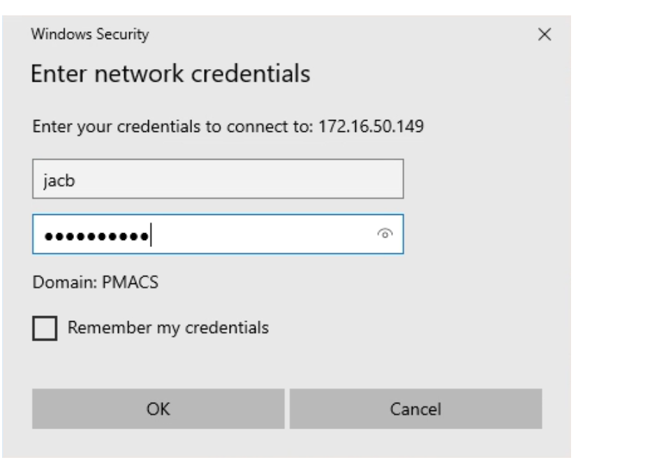

# Exporting EEG from Natus via VNC (Pioneer)

!!! abstract "What this page tells you"
    Remote into lab kitchen computer MJ0HKNDA, open VNC Viewer to HUP-XLTEK-CNT (password in the lab password manager; three wrong attempts wipes Natus data), mount cnt-fs if needed, then EDF-export the Mxene and clinical clips (no video) into cnt-fs/eeg_raw/Mxene_project/RIDXXXX_Mxene and _Clinical folders. Record actual recording dates/times.

!!! warning "Credential removed"
    A password that appeared in the original text has been removed. Get it from the lab password manager, never from a wiki page.

*   We need to remote into the Natus computer which is in the EMU testing room.
*   To do this, we first will remote into the computer in the lab kitchen and then from there enter the Natus computer.
*   First, log into the remote access portal
*   Click on PennChart and Citrix Apps
*   Click on the remote desktop connection and enter the name of the computer:
    *   **MJ0HKNDA**
    *   Penn medicine password
*   Once you are in the computer, search VNC Viewer and click on the VNC app
*   Click on: HUP-XLTEK-CNT
*   **Password: *(in the password manager)* (USE THE CORRECT PASSWORD !!!)**
    *   _If you put in the incorrect password 3 times, all of the data in natus across all the hospitals will delete and you cannot stop it_
*   Once you are in Natus, make sure you are in the EMU Database in the top left
*   Search patient in the left hand side by name
*   You need to mount cnt-fs in the VNC Server Computer if it is not mounted already.
*   **Mounting cnt-fs:**
1. Log into VDI
2. Search up file explorer
3. Go to “This PC”
4. You should see the CNT server there
5. Click on CNT
6. If CNT is not there, then you have to remount it:
    1. Right click on Network
    2. Select “Map Network Drive
    3. In Drive, select Z:
    4. In Folder, type in this pathway: \\\\[pmacs.upenn.edu](http://pmacs.upenn.edu/)\\depts\\NE-4322-Neurology\\CNT OR type **\\\\172.16.50.149\\CNT**
    5. Be sure to check "Connect using different credentials"
    6. Hit Finish
    7. When the login page pops up, put in your pmacs login:
        1. If the Domain does not say pmacs, then for your username put in **pmacs\\pennkey**
        2. In the screenshot below, if the domain did not say PMACS then the username would have been: **pmacsXjacb**
        3. 
*   Right click on the clip you want to **export → select edf export → uncheck video → click browse folder to find the folder you need (Intracranial\_EEG, CCEPS, Gottfried, Gold\_Audio, etc.)**
*   As the recording is exporting from Natus to cnt-fs, there should be a pop-up window with a green bar and estimated time left for export. Within that window, there will be the patient's name followed by a random combination of letters and numbers. For example, "XXXXX~XXX\_1g67f23h." The first 8 letters and numbers are the unique file name for each eeg.

#### **Exporting the data:**

*   The data will be exported into cnt-fs
*   In cnt-fs, create a folder titled **RIDXXXX** in cnt-fs/eeg\_raw/Mxene\_project
*   Inside this folder (cnt-fs/eeg\_raw/Mxene\_project), create 2 folders called **RIDXXXX\_Mxene** and **RIDXXXX\_Clinical**
cnt-fs/eeg\_raw/Mxene\_project/RIDXXXX/RIDXXXX\_Mxene
cnt-fs/eeg\_raw/Mxene\_project/RIDXXXX/RIDXXXX\_Clinical

*   Create a data collection file and document the actual times and dates that the Mxene and Clinical recordings were done. You can leave this file in the RIDXXXX folder.
    *   This is just for record-keeping to make sure we have the actual dates/times documented somewhere. We do not need this for processing. Look at a previous patient for an example.
*   Log into the remote desktop to access the Natus computer
*   In the Natus computer, go to Database on the upper left hand side, and make sure to select EEG instead of EMU
*   Scroll to the date that the test was completed
*   **Export the data as an edf file!**
*   Export both the research file that you did AND the clinical eeg recorded. These will be 2 separate files
*   Export the Mxene file in the following folder in cnt-fs: eeg\_raw/Mxene\_project/RIDXXXX/RIDXXXX\_Mxene
*   Export the Clinical file in the following folder in cnt-fs: eeg\_raw/Mxene\_project/RIDXXX/RIDXXXX\_Clinical
