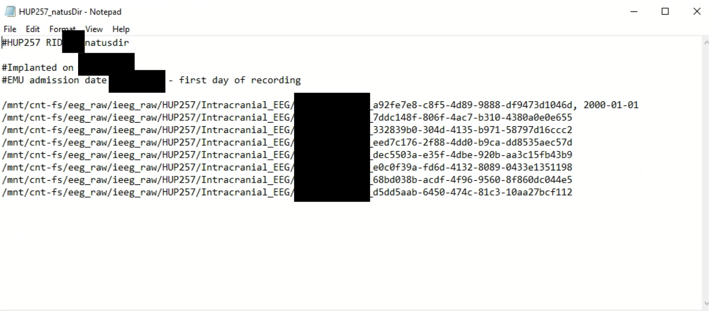
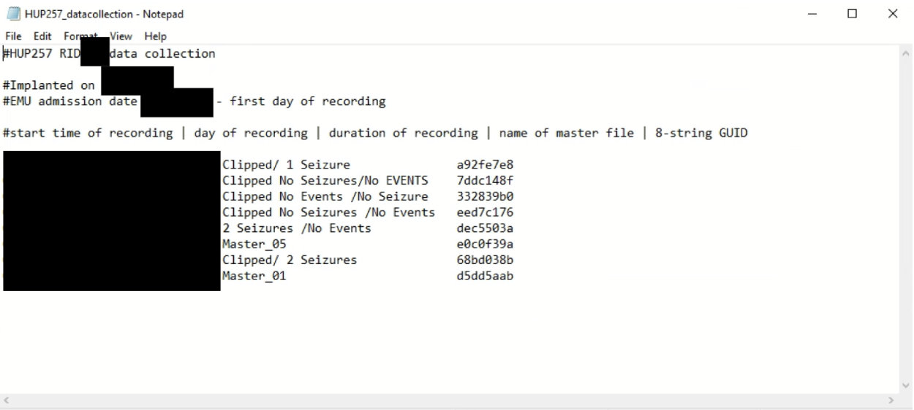

# natusdir & Data Collection Files

!!! abstract "What this page tells you"
    The pipeline needs three files: channel mapping (see Automated Channel Mapping), natusdir (tells natus2mef where raw files and output mefs go), and data collection (records real Natus start times). Copy natusdir and data collection from the example patient in ieeg_metadata; name them HUPXXX_natusdir, HUPXXX_CCEPS_natusdir, etc.

In order to run the EEG processing pipeline, you need 3 files: **Channel Mapping, Natusdir****,** and **Data Collection.**

**These files are:**

1. **Channel Mapping**
    1. Go to Automated Channel Mapping ([Automated Channel Mapping](../channel-mapping/automated-channel-mapping.md))
2. **Natusdir**
    1. This file is used to run the natus to mef conversion. It essentially will tell the code where to find all of the raw natus eeg files and then where to output the mefs.
    2. For the Natusdir files, please name them accordingly:
        1. **HUPXXX\_natusdir** (for intracranial)
        2. **HUPXXX\_CCEPS\_natusdir**
        3. **HUPXXX\_Gottfried\_natusdir**
        4. **HUPXXX\_Gold\_natusdir**
3. **Data Collection**
    1. This file is used to keep track of the actual start times, dates, and names of the eeg files in Natus, since this will all be date-shifted to 2000-01-01 when uploaded to [ieeg.org](http://ieeg.org)
    2. For the data collection files, please name them accordingly:
        1. **HUPXXX\_datacollection** (for intracranial)
        2. **HUPXXX\_CCEPS\_datacollection**
        3. **HUPXXX\_Gottfried\_datacollection**
        4. **HUPXXX\_Gold\_datacollection**

For the Natusdir and Data Collection files, **you can copy them from the example patient (in ieeg\_metadata) into the HUPXXX folder you are working with (in ieeg\_raw)**, and then change the information inside to match your current patient.

**Below is an example natusdir file:**

**Below is an example data collection file:**

