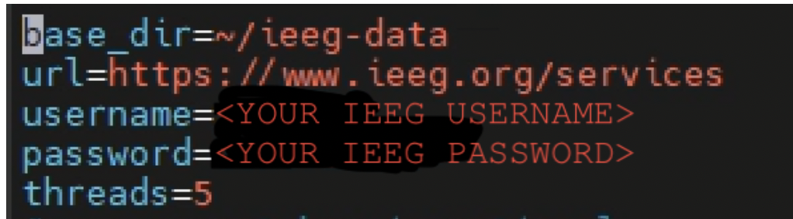

# The ieeg.properties File

!!! abstract "What this page tells you"
    Create an ieeg.properties file in your cnt1 home directory (ssh cnt1, touch ieeg.properties) with base_dir, url, username, password, and threads=5, so you can upload to ieeg.org. Test with ./ieeg size 'Study 005' in ieeg-latest; expect 3.438GB.

## How to Create an [ieeg.](http://ieeg.properties)[**properties**](http://ieeg.properties) File

#### This file is necessary in order to be able to upload to [ieeg.org](http://ieeg.org)
Helpful link:

[bitbucket.org](https://bitbucket.org/ieeg/ieeg/wiki/cli.md)

1. Go to your home directory with these codes:
    1. In Mobaxterm in the VDI, enter the cnt1 server with this code: **ssh cnt1**
    2. Then enter your home directory with this code: **cd /home/pennkey**
3. In your home directory (denoted by /~), create a file called [ieeg.](http://ieeg.properties)[**properties**](http://ieeg.properties) with this code: 
    1. **touch** [**ieeg.properties**](http://ieeg.properties)
    2. cd /project/eeg\_process
    3. cd programs
    4. cd ieeg
    5. cd ieeg-latest
4. Edit the **properties** file to look like the image below, replacing the <> sections with your information
    1. 
base\_dir=~/ieeg-data
url=https://www.ieeg.org/services
username=my\_username
password=my\_password
threads=5
\# aws\_secret\_key is optional
#aws\_secret\_key=AWS\_SECRET\_KEY
4\. To Save: \*skip this step

    1. Hit **escape** key
    2. Then **:w**
5\. To Quit: \*skip this step

    1. Hit **escape** key
    2. Type **:x**
6\. When you eventually upload to [ieeg.org](https://ieeg.org/) for the first time, an ieeg-data folder will also be created in your ~ directory, meaning everything is functional for your account

#### **TO TEST THE INSTALLATION:**

1. In ieeg-latest, run: ./ieeg size 'Study 005'
2. If you created your directory successfully, then you should get an output: **3.438GB**
