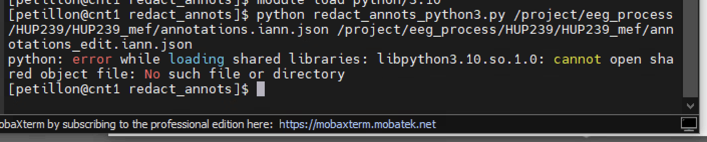

# Processing for ieeg.org (natus2mef → validate → upload)

!!! abstract "What this page tells you"
    Full ieeg.org processing commands for Intracranial, CCEPS, Gottfried, and Gold recordings: natus2mef in a screen, mefvalidate, redact PHI annotations, copy annotation and montage files to cnt-fs, delete original annotations, ieeg upload-directory to the right project, then build config folders. Notify Erin Conrad or Sarah afterward.

Now that you have set up your files and exported the data from Natus, you are now ready to process the eeg files and upload them to [ieeg.org](http://ieeg.org/). **There are 5 steps in this process:**

1. Natus to mef conversion
2. Validate the mef
3. Redact annotations
    1. Once you redact the PHI, copy both annotations files + montages to cnt-fs
    2. Delete original annotations json file from mef
4. Upload to [ieeg.org](http://ieeg.org/)
5. Make config files

Below are the codes for each type of eeg file processing.
**Replace XXX with the HUP ID in sublime text editor.**

## **Intracranial\_EEG**
**First, log into the VDI and enter cnt1 in Mobaxterm with this command: ssh cnt1**

*   if the VDI ever logs you out, the server name is: [connect.pmacs.upenn.edu](http://connect.pmacs.upenn.edu)

1. Natus to mef conversion
**Make sure that the eeg file times do not overlap before you run this conversion. If they do overlap, the natus2mef conversion will fail.** In this case, you need to split the datasets into 2 separate natusdir files (labeled D01 and D02), and then process each one separately. Adjust the names of the files in the code below accordingly. **Instructions are here:** Splitting Datasets ([Splitting Datasets](splitting-datasets.md))

In cnt1: cd /project/eeg\_process/programs/mef/natus-latest
scree
First make a new screen to allow the mef conversion to run for a few hours until it is complete:
screen -S HUPXXX\_convert

Once you are in the new screen now run the code:
./natus2mef -c /mnt/cnt-fs/eeg\_raw/ieeg\_raw/HUPXXX/Intracranial\_EEG/HUPXXX\_natusDir.txt -m /mnt/cnt-fs/eeg\_raw/ieeg\_raw/HUPXXX/Intracranial\_EEG/HUPXXX\_channelMapping.txt -o /project/eeg\_process/HUPXXX/HUPXXX\_mef >/mnt/cnt-fs/eeg\_raw/ieeg\_raw/HUPXXX/Intracranial\_EEG/HUPXXX\_convert\_log 2>&1
~~\--no-annotation-filters~~

Hit **control + a + d** to exit the screen

To go back into the screen to check:
**screen -ls** to check all the screens available
**screen -r** **XXXX** (number of the screen)
**control+a control+\\** terminates a screen

Once the conversion has run, type **exit** to terminate the screen

In order to check that the conversion was successful, **go to the HUPXXX\_convert\_log file in cnt-fs in ieeg\_raw/HUPXXX**. Right click on the convert log, select Notepad++, and scroll all the way down to the bottom. It should say **“processing successful”**. **If the processing was not successful, you will see the error here in this file.**

1. Mef Validate
In cnt1: cd /project/eeg\_process/programs/ieeg/ieeg-latest

./mefvalidate /project/eeg\_process/HUPXXX/HUPXXX\_mef/\*.mef | grep PASS
./mefvalidate /project/eeg\_process/HUPXXX/HUPXXX\_mef/\*.mef | grep FAIL

1. Redact annotations
    1. Run the redact annotations script
        1. _If you accidentally delete an annotation that should have stayed in, or if you keep an annotation that needs to be deleted, do_ **_control + C_** _to end the script, and then start over. Alternatively, you can wait until you finish the rest of the annotations and copy the file over to cnt-fs, then open the file and manually removed one that you missed._
    2. Copy both annotations files + montages to cnt-fs when done
    3. Delete original annotations file from mef (if it has PHI)

**Anything next to the line "type" that has PHI (pronouns, names, initials of patient) you need to remove**

In cnt1: cd /project/eeg\_process/programs/mef/redact\_annots

python redact\_annots\_python3.py /project/eeg\_process/HUPXXX/HUPXXX\_mef/annotations.iann.json /project/eeg\_process/HUPXXX/HUPXXX\_mef/annotations\_edit.iann.json

*   If getting error message below, run:
ssh cnt1
module load python/3.10

Once you redact the annotations **(any with PHI),** enter the mef file that you just created with:
cd /project/eeg\_process/HUPXXX/HUPXXX\_mef

Once you are here, copy over both annotations files and the montages, and **then delete the original annotations file from the mef** since we do not want to upload this to [ieeg.org](http://ieeg.org) because it has PHI (annotations.iann.json):

cp -r annotations.iann.json /mnt/cnt-fs/eeg\_raw/ieeg\_raw/HUPXXX/Intracranial\_EEG

cp -r annotations\_edit.iann.json /mnt/cnt-fs/eeg\_raw/ieeg\_raw/HUPXXX/Intracranial\_EEG

cp -r montages.imtg.json /mnt/cnt-fs/eeg\_raw/ieeg\_raw/HUPXXX/Intracranial\_EEG

**Delete original annotations file if it has PHI before uploading!!**

*   only needed if you edited the original
rm -r annotations.iann.json

1. Upload to [ieeg.org](http://ieeg.org)
In cnt1: cd /project/eeg\_process/programs/ieeg/ieeg-latest

First make a new screen to allow the ieeg upload to run for a few hours until it is complete:
screen -S HUPXXX\_ieeg\_upload

**Upload to** [**ieeg.org**](http://ieeg.org) **using the code and instructions below:**

1. ./ieeg upload-directory -n 'Human\_Data/Hospital of the University of Pennsylvania/HUP\_Intracranial\_Data/HUPXXX\_phaseII' '/project/eeg\_process/HUPXXX/HUPXXX\_mef'

1. ~~go into~~ [~~ieeg.org~~](http://ieeg.org) ~~and open the dataset you uploaded-~~ **~~Don't Upload to HUP\_SEEG ANYMORE~~**
~~then open project you want to add it to and check off dataset you want to add to that projectnow dataset is in both projects~~
~~./ieeg upload-directory -n 'Human\_Data/Hospital of the University of Pennsylvania/HUP\_SEEG/HUPXXX\_phaseII' '../../HUPXXX/HUPXXX\_mef'~~

Hit **control + a + d** to exit the screen

To go back into the screen to check do:
**screen -ls** to check all the screens available
**screen -r** **XXXX** (number of the screen)

Once the upload is complete, type **exit** to terminate the screen

1. Make config files
    1. Once you are done with your processing, in the **eeg\_raw/ieeg\_raw/HUPXXX/Intracranial\_EEG** folder in cnt-fs, place the files below in a folder called **config\_intracranial**. When you are done with all processing for this patient, this will be placed in a master config file which will be put in **ieeg\_metadata**.
        1. Natusdir
        2. Data Collection
        3. Convert log
        4. annotations.iann.json
        5. annotations\_edit.iann.json
        6. Montages
        7. channel mapping

## **CCEPS**
**First, log into the VDI and enter cnt1 in Mobaxterm with this command: ssh cnt1**

*   if the VDI ever logs you out, the server name is: [connect.pmacs.upenn.edu](http://connect.pmacs.upenn.edu)

1. Natus to mef conversion
In cnt1: cd /project/eeg\_process/programs/mef/natus-latest

~~NO machine annotations:~~
~~./natus2mef -c /mnt/cnt-fs/eeg\_raw/ieeg\_raw/HUPXXX/Research/CCEPS/HUPXXX\_CCEPS\_natusDir.txt -m /mnt/cnt-fs/eeg\_raw/ieeg\_raw/HUPXXX/Research/CCEPS/HUPXXX\_channelMapping.txt -o ../../HUPXXX/HUPXXX\_CCEPS\_mef >/mnt/cnt-fs/eeg\_raw/ieeg\_raw/HUPXXX/Research/CCEPS/HUPXXX\_CCEPS\_convert\_log 2>&1~~

WITH machine annotations:
./natus2mef --no-annotation-filters -c /mnt/cnt-fs/eeg\_raw/ieeg\_raw/HUPXXX/Research/CCEPS/HUPXXX\_CCEPS\_natusDir.txt -m /mnt/cnt-fs/eeg\_raw/ieeg\_raw/HUPXXX/Research/CCEPS/HUPXXX\_channelMapping.txt -o /project/eeg\_process/HUPXXX/HUPXXX\_CCEPS\_mef >/mnt/cnt-fs/eeg\_raw/ieeg\_raw/HUPXXX/Research/CCEPS/HUPXXX\_CCEPS\_convert\_log 2>&1

In order to check that the conversion was successful, **go to the HUPXXX\_CCEPS\_convert\_log file in cnt-fs in ieeg\_raw/HUPXXX/Research/CCEPS**. Right click on the convert log, select Notepad++, and scroll all the way down to the bottom. It should say **“processing successful”**. **If the processing was not successful, you will see the error here in this file.**

1. Mef Validate
In cnt1: cd /project/eeg\_process/programs/ieeg/ieeg-latest

./mefvalidate /project/eeg\_process/HUPXXX/HUPXXX\_CCEPS\_mef/\*.mef | grep PASS
./mefvalidate /project/eeg\_process/HUPXXX/HUPXXX\_CCEPS\_mef/\*.mef | grep FAIL

1. Redact annotations
    1. Run the redact annotations script
        1. _If you accidentally delete an annotation that should have stayed in, or if you keep an annotation that needs to be deleted, do_ **_control + C_** _to end the script, and then start over._
    2. Copy both annotations files + montages to cnt-fs when done
    3. Delete original annotations file from mef
    4. Run the "edit\_annots\_cceps.py" script to de-identify "Annotator" field and check if any channels are missing
**Anything next to the line "type" that has PHI (pronouns, names, initials of patient, room number) you need to remove**

In cnt1: cd /project/eeg\_process/programs/mef/redact\_annots

python redact\_annots\_python3.py /project/eeg\_process/HUPXXX/HUPXXX\_CCEPS\_mef/annotations.iann.json /project/eeg\_process/HUPXXX/HUPXXX\_CCEPS\_mef/annotations\_edit.iann.json

Once you redact the annotations **(any with PHI),** enter the mef file that you just created with:
cd /project/eeg\_process/HUPXXX/HUPXXX\_CCEPS\_mef 

Once you are here, copy over both annotations files and the montages, and **then delete the original annotations file from the mef** since we do not want to upload this to [ieeg.org](http://ieeg.org) because it has PHI (annotations.iann.json):

cp -r annotations.iann.json /mnt/cnt-fs/eeg\_raw/ieeg\_raw/HUPXXX/Research/CCEPS

cp -r annotations\_edit.iann.json /mnt/cnt-fs/eeg\_raw/ieeg\_raw/HUPXXX/Research/CCEPS

cp -r montages.imtg.json /mnt/cnt-fs/eeg\_raw/ieeg\_raw/HUPXXX/Research/CCEPS

**Delete original annotations file if it has PHI before uploading!!**
rm -r annotations.iann.json

In cnt1: cd /project/eeg\_process/programs/mef

python edit\_annots\_cceps.py /mnt/cnt-fs/eeg\_raw/ieeg\_raw/HUPXXX/Research/CCEPS/annotations\_edit.iann.json /mnt/cnt-fs/eeg\_raw/ieeg\_raw/HUPXXX/Research/CCEPS/HUPXXX\_channelMapping.txt

This script will remove any entries in the "Annotator" header in the annotations .json file and replace them with "null". In addition, this script will cross-check the "Closed relay to ...." annotations in the annotations .json file with the channel mapping file, and it will alert you if there are any missing channels from the channel mapping.

1. Upload to [ieeg.org](http://ieeg.org)

In cnt1: cd /project/eeg\_process/programs/ieeg/ieeg-latest

./ieeg upload-directory -n 'Human\_Data/Hospital of the University of Pennsylvania/HUP\_CCEPs/HUPXXX\_CCEP' '/project/eeg\_process/HUPXXX/HUPXXX\_CCEPS\_mef'

1. Make config files
    1. Once you are done with your processing, in the **eeg\_raw/ieeg\_raw/HUPXXX/Research/CCEPS** folder in cnt-fs, place the files below in a folder called **config\_CCEPS**. When you are done with all processing for this patient, this will be placed in a master config file which will be put in **ieeg\_metadata**.
        1. Natusdir
        2. Data Collection
        3. Convert log
        4. annotations.iann.json
        5. annotations\_edit.iann.json
        6. Montages

1. Let Erin Conrad know that the file is uploaded.

## **Gottfried**
**First, log into the VDI and enter cnt1 in Mobaxterm with this command: ssh cnt1**

*   if the VDI ever logs you out, the server name is: [connect.pmacs.upenn.edu](http://connect.pmacs.upenn.edu)
*   you will login with your pmacs username and password to login to the VDI

1. Natus to mef conversion
ssh cnt1

In cnt1: cd /project/eeg\_process/programs/mef/natus-latest

./natus2mef -c /mnt/cnt-fs/eeg\_raw/ieeg\_raw/HUPXXX/Research/Gottfried/HUPXXX\_Gottfried\_natusDir.txt -m /mnt/cnt-fs/eeg\_raw/ieeg\_raw/HUPXXX/Research/Gottfried/HUPXXX\_Gottfried\_channelMapping.txt -o /project/eeg\_process/HUPXXX/HUPXXX\_Gottfried\_mef >/mnt/cnt-fs/eeg\_raw/ieeg\_raw/HUPXXX/Research/Gottfried/HUPXXX\_Gottfried\_convert\_log 2>&1

In order to check that the conversion was successful, **go to the HUPXXX\_Gottfried\_convert\_log file in cnt-fs in ieeg\_raw/HUPXXX/Research/Gottfried**. Right click on the convert log, select Notepad++, and scroll all the way down to the bottom. It should say **“processing successful”**. **If the processing was not successful, you will see the error here in this file.**

_Work arounds: can try processing with only one RESP channel if the convert log is failing with both of them_

1. Mef Validate

In cnt1: cd /project/eeg\_process/programs/ieeg/ieeg-latest

./mefvalidate /project/eeg\_process/HUPXXX/HUPXXX\_Gottfried\_mef/\*.mef | grep PASS

*   this should show a bunch of lines with \[PASS\]; this means it worked
./mefvalidate /project/eeg\_process/HUPXXX/HUPXXX\_Gottfried\_mef/\*.mef | grep FAIL

*   there should be no lines if it worked

1. Redact annotations
    1. Run the redact annotations script
        1. _If you accidentally delete an annotation that should have stayed in, or if you keep an annotation that needs to be deleted, do_ **_control + C_** _to end the script_
    2. Copy both annotations files + montages to cnt-fs when done
    3. Delete original annotations file from mef

In cnt1: cd /project/eeg\_process/programs/mef/redact\_annots

python redact\_annots\_python3.py /project/eeg\_process//HUPXXX/HUPXXX\_Gottfried\_mef/annotations.iann.json /project/eeg\_process/HUPXXX/HUPXXX\_Gottfried\_mef/annotations\_edit.iann.json

**Anything next to the line "type" that has PHI (pronouns, names, initials of patient) you need to remove**

Once you redact the annotations **(any with PHI),** enter the mef file that you just created with:
cd /project/eeg\_process/HUPXXX/HUPXXX\_Gottfried\_mef 

Once you are here, copy over both annotations files and the montages, and **then delete the original annotations file from the mef** since we do not want to upload this to [ieeg.org](http://ieeg.org) because it has PHI (annotations.iann.json):

cp -r annotations.iann.json /mnt/cnt-fs/eeg\_raw/ieeg\_raw/HUPXXX/Research/Gottfried

cp -r annotations\_edit.iann.json /mnt/cnt-fs/eeg\_raw/ieeg\_raw/HUPXXX/Research/Gottfried

*   _this file wont exist if you didnt delete any annotations_

cp -r montages.imtg.json /mnt/cnt-fs/eeg\_raw/ieeg\_raw/HUPXXX/Research/Gottfried

**Delete original annotations file ONLY if it has PHI before uploading!!**
rm -r annotations.iann.json

1. Upload to [ieeg.org](http://ieeg.org)

In cnt1: cd /project/eeg\_process/programs/ieeg/ieeg-latest

./ieeg upload-directory -n 'Human\_Data/Hospital of the University of Pennsylvania/Yarko\_the\_Great/HUPXXX\_Gottfried\_Odor\_Features' '/project/eeg\_process/HUPXXX/HUPXXX\_Gottfried\_mef'

1. Make config files
    1. Once you are done with your processing, in the **eeg\_raw/ieeg\_raw/HUPXXX/Research/Gottfried** folder in cnt-fs, place the files below in a folder called **config\_Gottfried**. When you are done with all processing for this patient, this will be placed in a master config file which will be put in **ieeg\_metadata**.
        1. Natusdir
        2. Data Collection
        3. Convert log
        4. annotations.iann.json
        5. annotations\_edit.iann.json
        6. Montages

1. Let Sarah from the Gottfried Lab know that the file is uploaded.

## **Gold Lab Audio Task (need to update with new scripts)**
**First, log into the VDI and enter cnt1 in Mobaxterm with this command: ssh cnt1**

*   if the VDI ever logs you out, the server name is: [connect.pmacs.upenn.edu](http://connect.pmacs.upenn.edu)

1. Natus to mef conversion
ssh cnt1

In cnt1: cd /project/eeg\_process/programs/mef/natus-latest

./natus2mef -c /mnt/cnt-fs/eeg\_raw/ieeg\_raw/HUPXXX/Research/Gold\_Audio/HUPXXX\_Gold\_natusDir.txt -m /mnt/cnt-fs/eeg\_raw/ieeg\_raw/HUPXXX/Research/Gold\_Audio/HUPXXX\_Gold\_channelMapping.txt -o /project/eeg\_process/HUPXXX/HUPXXX\_Gold\_mef >/mnt/cnt-fs/eeg\_raw/ieeg\_raw/HUPXXX/Research/Gold\_Audio/HUPXXX\_Gold\_convert\_log 2>&1

In order to check that the conversion was successful, **go to the HUPXXX\_Gold\_convert\_log file in cnt-fs in ieeg\_raw/HUPXXX/Research/Gold\_Audio**. Right click on the convert log, select Notepad++, and scroll all the way down to the bottom. It should say **“processing successful”**. **If the processing was not successful, you will see the error here in this file.**

1. Mef Validate

In cnt1: cd /project/eeg\_process/programs/ieeg/ieeg-latest

./mefvalidate /project/eeg\_process/HUPXXX/HUPXXX\_Gold\_mef/\*.mef | grep PASS
./mefvalidate /project/eeg\_process/HUPXXX/HUPXXX\_Gold\_mef/\*.mef | grep FAIL

1. Redact annotations
    1. Run the redact annotations script
        1. _If you accidentally delete an annotation that should have stayed in, or if you keep an annotation that needs to be deleted, do_ **_control + C_** _to end the script, and then start over._
    2. Copy both annotations files + montages to cnt-fs when done
    3. Delete original annotations file from mef
    4. **Usually the Gold Task does not have any annotations that need to be redacted. In this case, you would just copy over the original annotations file and the montages to cnt-fs, and DO NOT DELETE the original annotations file from the mef.**

In cnt1: cd /project/eeg\_process/programs/mef/redact\_annots

python redact\_annots\_python3.py /project/eeg\_process/HUPXXX/HUPXXX\_Gold\_mef/annotations.iann.json /project/eeg\_process/HUPXXX/HUPXXX\_Gold\_mef/annotations\_edit.iann.json

Once you redact the annotations **(any with PHI),** enter the mef file that you just created with:
cd /project/eeg\_process/HUPXXX/HUPXXX\_Gold\_mef

Once you are here, copy over both annotations files and the montages, and **then delete the original annotations file from the mef** since we do not want to upload this to [ieeg.org](http://ieeg.org) because it has PHI (annotations.iann.json):

cp -r annotations.iann.json /mnt/cnt-fs/eeg\_raw/ieeg\_raw/HUPXXX/Research/Gold\_Audio

cp -r annotations\_edit.iann.json /mnt/cnt-fs/eeg\_raw/ieeg\_raw/HUPXXX/Research/Gold\_Audio
(only if you redacted annotations)

cp -r montages.imtg.json /mnt/cnt-fs/eeg\_raw/ieeg\_raw/HUPXXX/Research/Gold\_Audio

**Delete original annotations file if it has PHI before uploading!!**

*   only if there is an edited vs non-edited (usually not needed for Gold testing)
rm -r annotations.iann.json

1. Upload to [ieeg.org](http://ieeg.org)

In cnt1: cd /project/eeg\_process/programs/ieeg/ieeg-latest

./ieeg upload-directory -n 'Human\_Data/Hospital of the University of Pennsylvania/Gold\_Lab\_Audio/HUPXXX\_Audio\_Task' '/project/eeg\_process/HUPXXX/HUPXXX\_Gold\_mef'

1. Make config files
    1. Once you are done with your processing, in the **eeg\_raw/ieeg\_raw/HUPXXX/Research/Gold\_Audio** folder in cnt-fs, place the files below in a folder called **config\_Gold**. When you are done with all processing for this patient, this will be placed in a master config file which will be put in **ieeg\_metadata**.
        1. Natusdir
        2. Data Collection
        3. Convert log
        4. annotations.iann.json
        5. annotations\_edit.iann.json (if present)
        6. Montages
