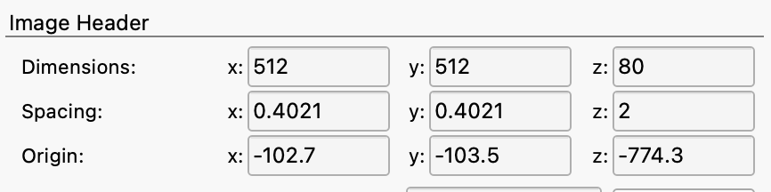
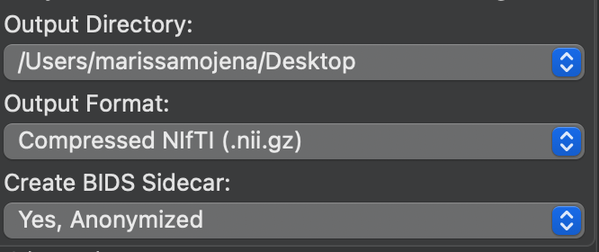
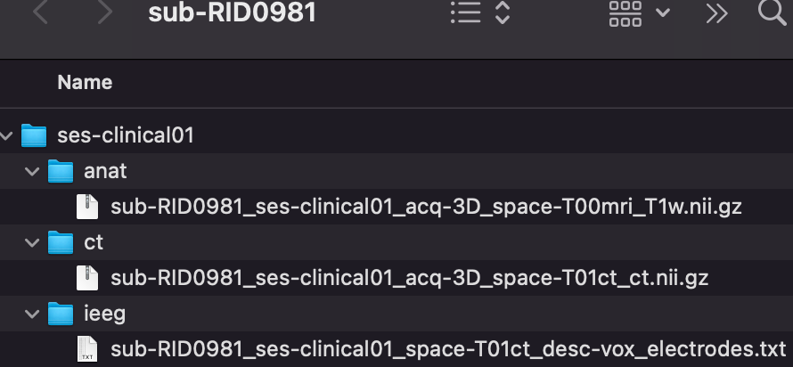
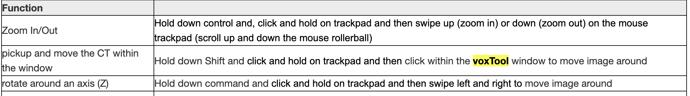
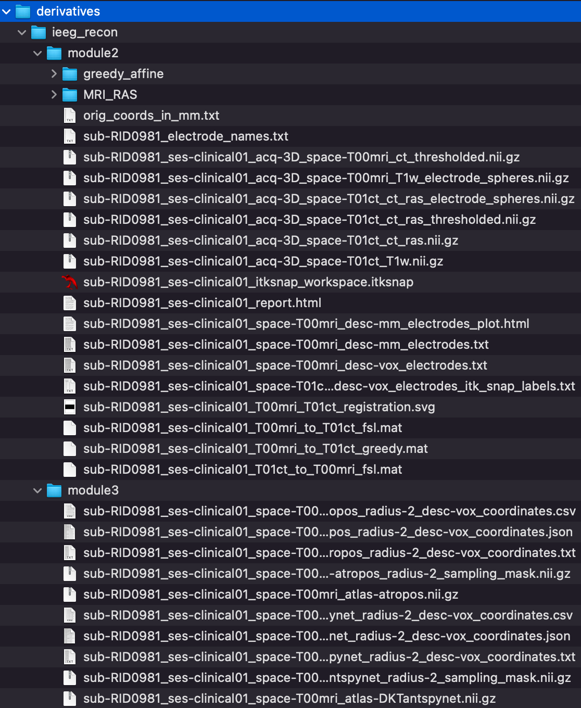

# Electrode Reconstruction: Prep & Software

!!! abstract "What this page tells you"
    Full iEEG reconstruction SOP for Penn patients: export pre-implant T1 MPRAGE and post-implant BONE_AX CT from Sectra into cnt-fs, convert to BIDS-named NIfTIs, label electrodes in voxtool, run run_penn_recons.py on Borel, build the ITK-SNAP workspace, upload to PennBox, and email the clinical team.

#### Reconstruction prep- things you will need to run or troubleshoot

*   ITK-SNAP: [http://www.itksnap.org/pmwiki/pmwiki.php?n=Downloads.SNAP4](http://www.itksnap.org/pmwiki/pmwiki.php?n=Downloads.SNAP4)
*   MRIcroGL: [https://www.nitrc.org/frs/?group\_id=889](https://www.nitrc.org/frs/?group_id=889)
*   C3D:  [/c3d/Nightly/c3d-nightly-MacOS-x86\_64.dmg](https://sourceforge.net/projects/c3d/files/c3d/Nightly/c3d-nightly-MacOS-x86_64.dmg/download) download Mac compatible version
*   Sublime Text Editor: [https://www.sublimetext.com/3](https://www.sublimetext.com/3)
*   Computer: MJ0HKNDA

**Reconstruction Using GUI/Docker:** [https://github.com/penn-cnt/ieeg-recon/blob/main/python/docs/Running\_iEEG-recon.md](https://github.com/penn-cnt/ieeg-recon/blob/main/python/docs/Running_iEEG-recon.md)

*   (the easier way!)

#### PART I: PRE-IMPLANT:

You need 2 images to run the reconstruction: the preimplant MRI and the postimplant CT. You need to export these images from Sectra and put them into cnt-fs. Once there you will convert the dicoms to niftis and then put the nifti files into your desktop to run the reconstruction pipeline.

*   **Open cnt-fs and create directory to which you will send the imaging:**
    *   Use Big IP-Edge Client to connect to UPHS VPN (see Lab Archives for instructions on how to do this)-
    *   On the top left of your desktop go to:
        *   Go → connect to server → [**smb://172.16.50.149/CNT**](smb://172.16.50.149/CNT) →Put in PMACS username and password-
    *   You are now in cnt-fs. Go to /imaging\_process\_fs/imaging\_raw/HUP/ -
    *   Make folder called **RID###**
    *   Inside this folder:
        *   Make folder called **preimplant\_MRI**
        *   Make folder called **postimplant\_CT**
*   **Open Sectra IDS7 on HUP computer:** 
    *   Go to [https://pennmedaccess.uphs.upenn.edu→](https://pennmedaccess.uphs.upenn.edu→) chose Drives & Remote Access under Employee Resources→ chose Remote Desktop Connection and open the download
    *   Computer name: MJ0HKNDA
    *   Enter UPHS credentials
    *   Mount cnt-fs. Instructions are here: Mounting cnt-fs ([Mounting cnt-fs](../../electrophysiology/overview-and-setup/mounting-cnt-fs.md))
    *   Open PennChart, Dept: Neurology South Pavilion (956)
    *   Click Chart in top left corner, find patient’s chart (cross reference REDCap to find MRN, etc)
    *   Click down arrow at top right of screen (below Log Out button and next to the wrench symbol) → Sectra IDS7 
*   **Export appropriate preimplant images in Sectra:**
    *   In Sectra, right click on an MRI scan
    *   Select Export to media
    *   Click through the different preimplant MRI scans and use the tiny arrow on the left to see all of their sequences
    *   Find the sequence that we want.
        *   Try to pick a sequence from a recent scan, not one from like 10 years ago
    *   We want the **MR T1 Axial mprage** – this should be isotropic
        *   It is much better if it is without contrast, and PRE is preferred
        *   The reason we want PRE is because it stands for pre-contrast; POST stands for post-contrast, and wholebrainseg would likely fail in that case
    *   If no axial mprage fit this criteria, please search for **Sagittal T1 mprage** imaging instead
    *   **Make sure to select only the sequence you want**
    *   Uncheck: ‘Include DICOM viewer’ and ‘Include annotations’
        *   Leave the following checked: ‘Include DICOM images’, ‘Export requests’, ‘Export reports’
    *   In **Destination**, select the **preimplant\_MRI** folder you just made in cnt-fs in **imaging\_process\_fs/imaging\_raw/HUP/RIDXXX**
        *   Make sure cnt-fs is mounted or else this folder will not show up
    *   Hit Export
*   **Export appropriate postimplant images in Sectra:**
    *   Post implant CT - this should be labeled **BONE\_AX\_HEAD or anything beginning with BONE\_AX\_**
        *   This image should have at least 120 slices or above
        *   This image should be LESS THAN 2mm thick. To check this, download the image-➝convert from dicom to nifty-➝open in itk snap-➝hit tools-➝layer inspector-➝info-➝it should be about 512x512x60 or 80, with spacing z<2mm

*       *   This is the CT scan done on the day of their implant
    *   **If no bone axial exists** then you need to either let Joel know or you can call the Pavilion CT Scan Tech to have them make this for you. This number is found in Important Contacts ([Important Contacts & Emergency Numbers](../../operations/contacts/important-contacts-and-emergency-numbers.md))
    *   Right click on scan→ Export to media
    *   Select ONLY the bone axial head sequence in the CT
    *   Uncheck: ‘Include DICOM viewer’ and ‘Include annotations’
        *   Leave the following checked: ‘Include DICOM images’, ‘Export requests’, ‘Export reports’
*       *   In **Destination**, select the **postimplant\_CT** folder you just made in cnt-fs in **imaging\_process\_fs/imaging\_raw/HUP/RIDXXX**
        *   Make sure cnt-fs is mounted or else this folder will not show up
*       *   Hit Export

At this point, you can close out of the remote desktop connection.

*   **Convert from dicom to niftis in Desktop:**
    *   Keep cnt-fs mounted on your desktop
    *   Open up MRIcroGL
    *   Select **Import** in the top left
    *   Select **Convert DICOM to NIfTI**
    *   For the pre-implant MRI, in **Output Filename** please name the file: **sub-RID####\_ses-clinical01\_acq-3D\_space-T00mri\_T1w**
    *   For the post-implant CT, in **Output Filename** please name the file: **sub-RID####\_ses-clinical01\_acq-3D\_space-T01ct\_ct**
    *   For **Output Directory** put your Desktop
        *   Or you can put it directly into the **sub-RIDXXXX** folder
    *   For **Output Format** leave it as **Compressed NIfTI (.nii.gz)**
    *   Example:

*       *   In **Select Folder to Convert…** drag and drop or select the dicom folder of either the MRI or the CT scan **from cnt-fs** (postimplant\_CT or preimplant\_MRI) into the space that says “Drop files/folders to convert here”
        *   The spinning rainbow wheel means that MRIcroGL is converting
*   **Now that the converted niftis are made, please create the following folders and put the niftis in the sub-RIDXXXX/ses-clinical01 folder in your Desktop:**
    *   Put the MRI nifti in the folder called **anat**
    *   Put the CT nifti in the folder called **ct**
    *   Once you label the electrodes, the electrode coordinates will go in the folder called **ieeg**
    *   Parent folder: **sub-RID####**
        *   Sub-folder: **ses-clinical01**
            *   **anat**
                *   sub-RID####\_ses-clinical01\_acq-3D\_space-T00mri\_T1w.nii.gz
            *   **ct**
                *   sub-RID####\_ses-clinical01\_acq-3D\_space-T01ct\_ct.nii.gz
            *   **ieeg**
                *   sub-RID####\_ses-clinical01\_space-T01ct\_desc-vox\_electrodes.txt
*   **At this point, you can close out of MRIcroGL and disconnect from cnt-fs/UPHS VPN**

*   **Check Voxel Spacing** **(****_not necessary by default due to pipeline being updated in 2022; use if other site has question_****)**
    *   The reconstruction pipeline should accommodate variations in voxel sizing. If this needs to be checked, it can be done through c3d.
    *   Download c3d with the link at the top of this SOP and follow the instructions to install it and put it in your Applications
    *   **c3d T00\_RID###\_(mprage or tse).nii.gz -info-full | grep pacing**
        *   CT: first 2 terms should be <1 (0.5, 0.5, 1.0)
        *   MR: needs to be roughly 0.9, 0.9, 0.9
        *   **If not, need to re-sample (for example, 0.4 needs to be resampled due to memory constraints because 0.4,0.4,1 resolution is too high and will cause segmentation to fail)**
            *   **c3d <nifti> -resample-mm .9x.9x.9mm -o <nifti\_resampled>**
            *   Can replace .9x.9x.9 with desired size, although typically you are re-sizing mprage to that size (must include a decimal)
            *   Ie: c3d sub-RIDXXXX\_ses-clinical01\_acq-3D\_space-T01ct\_ct.nii.gz -resample-mm .5x.5x1.0mm -o sub-RIDXXXX\_ses-clinical01\_acq-3D\_space-T01ct\_ct\_resampled.nii.gz

#### PART II: Electrode Labeling

*   At this point, you can disconnect from the UPHS VPN and close out of MRIcroGL
*   Completing this process will require both the post implant bone CT and the iEEG map created by the clinic
*   Go to your terminal to open voxtool:
    *   Type:
        *   **conda activate voxtool\_2**
        *   for Mariam: (conda activate voxtool\_env2)
    *   Followed By:
        *   **voxtool**
*   Load in post implant CT nifti using “Load Scan” lab on the lower left corner of the application
    *   Select the post-implant CT nifti that we just made
    *   The CT image should appear within the black space
        *   Check for display abnormalities: compressed CT, incorrect orientation of superior/inferior, anterior/posterior, and right/left. 
            *   If the CT image has high impedance, you can adjust the threshold from the original 99.96 to a more suitable threshold (ie: 99.94 or 99.98)
                *   When saving the completed electrode labels, the threshold MUST be returned back to 99.96. Pre-save the coordinated at your labeled threshold to fill in any blanks if they get erased when going to the original 99.96
*   Define leads as specified by clinic map
    *   Click **“Define Leads”** on the lower left section of the application and pop-up will appear
        *   Select the lead **“Type”** \- currently Penn is only using **Depth electrodes** 
        *   “Lead name” is listed in the implant map as an abbreviation and Dimensions refers the number of contacts per electrode that is implanted

*       *       *   The X coordinate is the point closest to the center of the brain and should always be 1
        *   The Y coordinate is the point closes to the skull and should be the max number of contacts within that electrode
        *   After each lead name and dimension is entered, you must select Submit or this parameter will not be saved
        *   You can check whether each lead with the correct number of electrodes has been entered in the display area under the submit tab.
        *   When you confirm this process is done, click Confirm
*       *   Begin labeling by selecting the label name from the drop down menu
    *   First pick a distinguishable electrode on the map/CT scan to being with
    *   Once you locate that electrode, click on the electrode that is closest to the center of the brain and click submit. This will automatically be label 1.
        *   The next label in the “Label” column and Y coordinate on the “Lead” column will now change to show 2, meaning the 2nd contact of that electrode. 
        *   Change the label and Y coordinate to 12 to denote that you are labeling the last contact that is closest to the skull. (In this example, the last point will be the 12th contact, if the total number of contacts is a different number, you will change these labels to that quantity)
        *   Count the remaining contacts of the electrode and select the final contact point, then click submit
        *   When the first and last contacts have been labeled, click “Interpolate”, to auto-calculate the coordinates of the remaining electrodes
            *   If a label does not interpolate, this may indicate that the electrode is curved and will need to be manually labeled
                *   Indicate the contact number by counting from the point closest to the center of the brain (point 1) and count up to the non-labeled contact
                *   Insert the number of the unlabeled contact in the. “Label:” row and again in the “Y:” coordinate space
                *   Select that contact then select “submit”
            *   if you are clicking and nothing is being registered, you can check the terminal to see if your mouse clicks are being registered
            *   if they aren't, you will need to exit out and start the process again by reloading ct image and entering in electrodes/contacts

*       *   To save completed labeling, select “Save as…”
        *   Change file name to **sub-RID####\_ses-clinical01\_space-T01ct\_desc-vox\_electrodes**
        *   

*   Select the folder for where labels should export (**sub-RID####/ses-clinical01/ieeg**)
*   Set file type to “ TXT (\*.txt) “
*   **Edit voxel coordinates text file for format compatibility**
    *   The reconstruction will look for coordinates that are integers (non-decimals). 
        *   Open the voxel coordinate text file with sublime text (or text editor of choice)
        *   Type in **command + f** (for mac) or **control + f** (for windows), type “.0” in the search bar. 
        *   Select “find all” and delete all “.0” characters.
        *   Re-save coordinates. 

#### PART III: Running Reconstruction: can be done via Docker or terminal with Python in Leif (mounted via Borel)

*   **Set up the correct folder structure in your Desktop:**
    *   Parent folder: **sub-RID####**
        *   Sub-directory: **ses-clinical01**
            *   **anat**
                *   sub-RID####\_ses-clinical01\_acq-3D\_space-T00mri\_T1w.nii.gz
            *   **ct**
                *   sub-RID####\_ses-clinical01\_acq-3D\_space-T01ct\_ct.nii.gz
            *   **ieeg**
                *   sub-RID####\_ses-clinical01\_space-T01ct\_desc-vox\_electrodes.txt
*   **Move the sub-RID#### folder from your desktop into the Borel server:**
    *   Make sure you are connected to **AirPennNet**. If not, follow these steps:
        *   Turn on Global Protect and sign in with Pennkey and password when prompted
    *   Open the terminal and navigate to your Desktop with this commands: **cd Desktop**
    *   Then, type in the command below to copy the sub-RID#### folder into Borel:
        *   **scp -r sub-RID####** [**pennkey@borel.seas.upenn.edu**](mailto:pennkey@borel.seas.upenn.edu)**:/mnt/leif/littlab/data/Human\_Data/recon/BIDS\_penn**
        *   (put your pennkey in where it says pennkey)
        *   If you get error code: file not found-➝try manually typing in the code rather than copying and pasting

*   **Change the permissions of the sub-RID#### in Borel**
    *   In the terminal, ssh into the Borel server with:
        *   **ssh** [**pennkey@borel.seas.upenn.edu**](mailto:pennkey@borel.seas.upenn.edu) 
        *   (put your pennkey in where it says pennkey)
    *   Type:
        *   **cd /mnt/leif/littlab/data/Human\_Data/recon/BIDS\_penn**
    *   Type:
        *   **chmod 777 -R sub-RID####**
    *   Then, navigate to the **code** folder with this command:
        *   **cd ../code**
*   **Run the reconstruction with this code:** 
**python run\_penn\_recons.py**

*       *   This code will run through every subject in the BIDS folders and create a derivatives folder for the output. If a subject already has a derivatives folder, it will not be reconstructed. (if this finishes quickly that probably means there's an error)
    *   **If an error has occurred and you need to re-run a subject, you must first delete the derivatives folder.**
        *   **cd pennkey@borel:/mnt/leif/littlab/data/Human\_Data/recon/BIDS\_penn**
        *   **cd into the sub-RID folder you need to delete from**
        *   **rm -r the derivatives folder**
        *   **also delete from your desktop**
*       *   The output for the reconstruction will be module 2 (containing ITK-SNAP workspace) and module 3: 
*   **Move the sub-RID#### folder from Borel back into your local** **Downloads** **so you can upload to Box:**
    *   **First: Open a new terminal window**
    *   Go to your Downloads with: **cd Downloads**
    *   Then, type:
        *   **scp -r** [**pennkey@borel.seas.upenn.edu**](mailto:pennkey@borel.seas.upenn.edu)**:/mnt/leif/littlab/data/Human\_Data/recon/BIDS\_penn/sub-RID#### .**

#### **scp -r mjosyula**[**@borel.seas.upenn.edu**](mailto:pennkey@borel.seas.upenn.edu)**:/mnt/leif/littlab/data/Human\_Data/recon/BIDS\_penn/sub-RIDXXXX .**

#### PART IV: Create ITK-SNAP Workspace

*   Go to the module2 folder in your Downloads (sub-RID####/ses-clinical01/derivatives/ieeg\_recon/module2) 
*   Right click on **sub-RID####\_ses-clinical01\_itksnap\_workspace.itksnap** file and open in ITK-SNAP (this file will have the red itk-snap icon next to it)
    *   Scroll through to make sure colored electrode coordinates line up with the coregistered MRI/CT
**if this doesn't work, try these steps:**

1. load "sub-RID####\_ses-clinical01\_acq-3D\_space-T01ct\_T1w.nii.gz" into itksnap
2. load "sub-RID####\_ses-clinical01\_acq-3D\_space-T01ct\_ct\_ras\_thresholded.nii.gz" as another image
3. load "sub-RID####\_ses-clinical01\_acq-3D\_space-T01ct\_ct\_ras\_electrode\_spheres.nii.gz" as a segmentation
4. Save everything as a workspace

*   Import label descriptions so electrode names are visible when toggling over each coordinate
    *   Click **Segmentation** and scroll to import label descriptions. 
    *   The Open Label Descriptions pop up will prompt you to specify the label description file
    *   Click Browse and select **sub-RID####\_ses-clinical01\_space-T01ct\_desc-vox\_electrodes\_itk\_snap\_labels.txt**
*   Save the ITK-SNAP file with these edits.
*   Upload reconstruction to PennBox CNT Implant Reconstructions folder.
    *   Go to **CNT Implant Reconstructions** folder
    *   Make a folder called RIDXXX\_HUPXXX
    *   Go into this folder
    *   Drag and drop the entire sub-RIDXXXX folder in your **Downloads (NOT YOUR DESKTOP)** into this Penn Box folder
    *   Upload the HUPXXX\_anon implant map pdf into this folder as well

#### 

#### Part V: Send email to Clinical Team to notify reconstruction is complete and ready to access

*   Create a shared link in the subject folder in Penn Box and make it so that anyone with the link can view and download
*   Only via Pennmedicine email, send out this link to the **Epilepsy MDs NPs** group and to the **Epilepsy Fellows** group and cc Joel Stein, Gabriela Bustamante and your co-CRC
