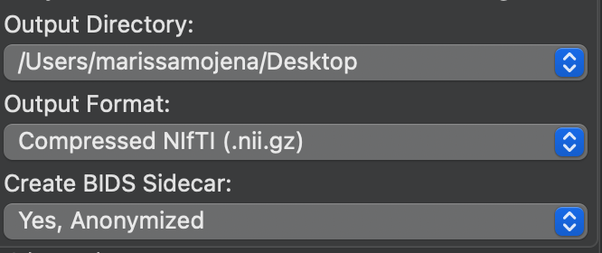
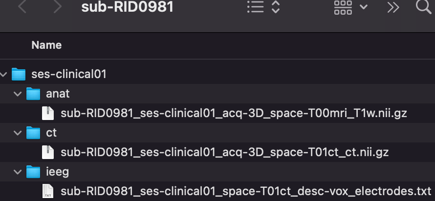
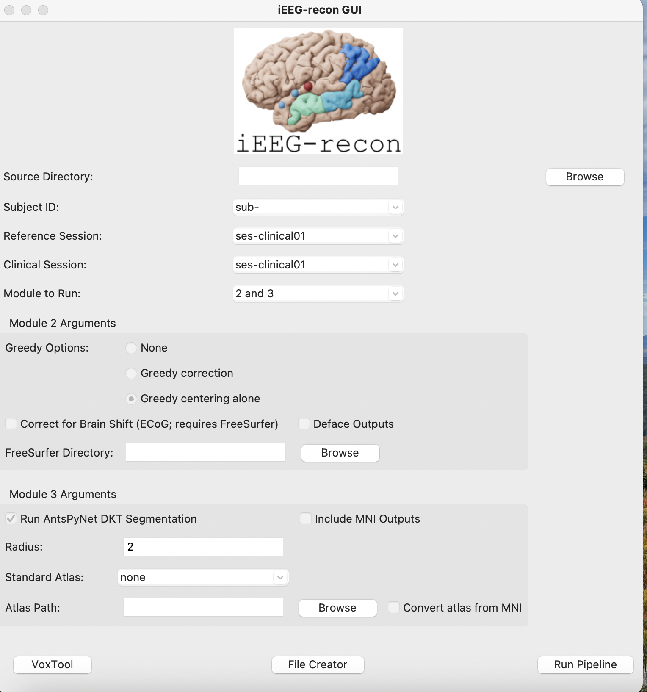
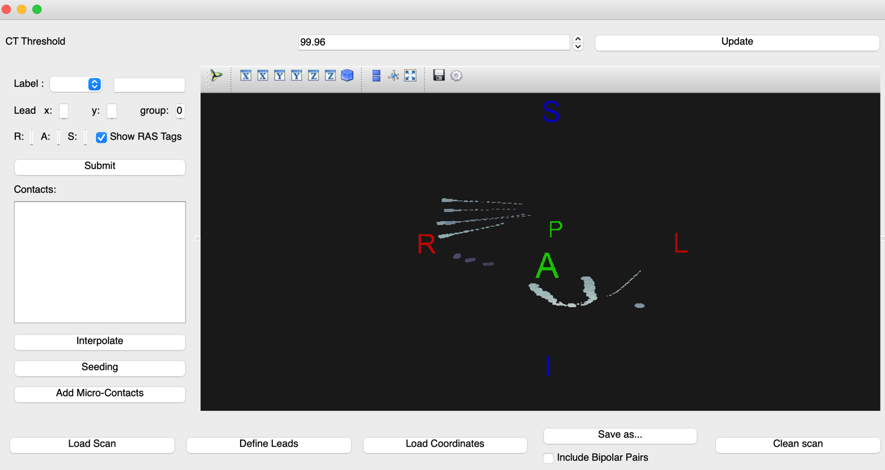
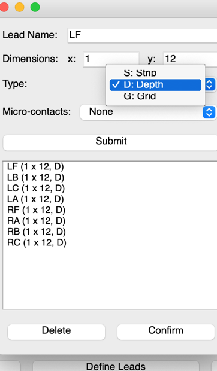
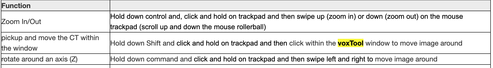
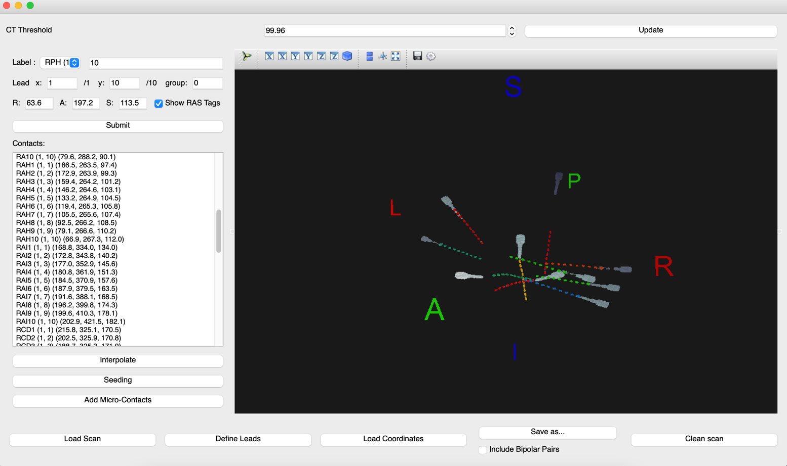

# GUI/Docker Reconstruction Workflow

!!! abstract "What this page tells you"
    The easier Docker/GUI route for iEEG reconstruction: same Sectra export and NIfTI conversion, then in iEEG-recon-docker set source directory and sessions, choose Greedy centering and AntsPyNet DKT (radius 2), label electrodes in voxtool, click Run Pipeline, build the ITK-SNAP workspace, upload to PennBox.

*   **Open Sectra IDS7 on HUP computer:** 
    *   Go to [https://pennmedaccess.uphs.upenn.edu→](https://pennmedaccess.uphs.upenn.xn--edu-ww1a/) chose Drives & Remote Access under Employee Resources→ chose Remote Desktop Connection and open the download
    *   **Computer name:** MJ0HKNDA
    *   Enter UPHS credentials
    *   Mount cnt-fs. Instructions are here: Mounting cnt-fs ([Mounting cnt-fs](../../electrophysiology/overview-and-setup/mounting-cnt-fs.md))
    *   Open PennChart, Dept: Neurology South Pavilion (956)
    *   Click Chart in top left corner, find patient’s chart (cross reference REDCap to find MRN, etc)
    *   Click down arrow at top right of screen (below Log Out button and next to the wrench symbol) → Sectra IDS7 

*   **Open cnt-fs and create directory to which you will send the imaging:**
    *   Use UPHS VPN to mount cnt-fs on your desktop
    *   On the top left of your desktop go to:
        *   Go → connect to server → [**smb://172.16.50.149/CNT**](smb://172.16.50.149/CNT) →Put in PMACS username and password-
    *   You are now in cnt-fs. **Go To:** /imaging\_process\_fs/imaging\_raw/HUP/ -
    *   Make folder called **RID###**
    *   Inside this folder:
        *   Make folder called **preimplant\_MRI**
        *   Make folder called **postimplant\_CT**

*   **Export appropriate preimplant images in Sectra:**
    *   In Sectra, right click on an MRI scan
    *   Select Export to media
    *   Click through the different preimplant MRI scans and use the tiny arrow on the left to see all of their sequences
    *   Find the sequence that we want.
        *   Try to pick a sequence from a recent scan, not one from like 10 years ago
    *   We want the MR T1 Axial mprage – this should be isotropic
        *   It is much better if it is without contrast, and PRE is preferred
        *   The reason we want PRE is because it stands for pre-contrast; POST stands for post-contrast, and wholebrainseg would likely fail in that case
    *   If no axial mprage fit this criteria, please search for Sagittal T1 mprage imaging instead
    *   **Make sure to select only the sequence you want**
    *   Uncheck: ‘Include DICOM viewer’ and ‘Include annotations’
        *   Leave the following checked: ‘Include DICOM images’, ‘Export requests’, ‘Export reports’
    *   In **Destination**, select the **preimplant\_MRI** folder you just made in cnt-fs in **imaging\_process\_fs/imaging\_raw/HUP/RIDXXX**
        *   Make sure cnt-fs is mounted or else this folder will not show up
    *   Hit Export
*   **Export appropriate postimplant images in Sectra:**
    *   Post implant CT - this should be labeled **BONE\_AX\_HEAD or anything beginning with BONE\_AX\_**
        *   This image should have at least 120 slices or above

*       *   This is the CT scan done on the day of their implant
    *   **If no bone axial exists** then you need to either let Joel know or you can call the Pavilion CT Scan Tech to have them make this for you. This number is found in Important Contacts ([Important Contacts & Emergency Numbers](../../operations/contacts/important-contacts-and-emergency-numbers.md))
    *   Right click on scan→ Export to media
    *   Select ONLY the bone axial head sequence in the CT
    *   Uncheck: ‘Include DICOM viewer’ and ‘Include annotations’
        *   Leave the following checked: ‘Include DICOM images’, ‘Export requests’, ‘Export reports’
*       *   In **Destination**, select the **postimplant\_CT** folder you just made in cnt-fs in **imaging\_process\_fs/imaging\_raw/HUP/RIDXXX**
        *   Make sure cnt-fs is mounted or else this folder will not show up
*       *   Hit Export

*   **Convert from dicom to niftis in Desktop:**
    *   Keep cnt-fs mounted on your desktop
    *   Open up MRIcroGL
    *   Select **Import** in the top left
    *   Select **Convert DICOM to NIfTI**
    *   For the pre-implant MRI, in **Output Filename** please name the file: **sub-RID####\_ses-clinical01\_acq-3D\_space-T00mri\_T1w**
    *   For the post-implant CT, in **Output Filename** please name the file: **sub-RID####\_ses-clinical01\_acq-3D\_space-T01ct\_ct**
    *   For **Output Directory** put your Desktop
        *   Or you can put it directly into the **sub-RIDXXXX** folder
    *   For **Output Format** leave it as **Compressed NIfTI (.nii.gz)**
    *   Example:

*       *   In **Select Folder to Convert…** drag and drop or select the dicom folder of either the MRI or the CT scan **from cnt-fs** (postimplant\_CT or preimplant\_MRI) into the space that says “Drop files/folders to convert here”
        *   The spinning rainbow wheel means that MRIcroGL is converting
*   **Now that the converted niftis are made, please create the following folders and put the niftis in the sub-RIDXXXX/ses-clinical01 folder in your Desktop:**
    *   Put the MRI nifti in the folder called **anat**
    *   Put the CT nifti in the folder called **ct**
    *   Once you label the electrodes, the electrode coordinates will go in the folder called **ieeg**
    *   Parent folder: **sub-RID####**
        *   Sub-folder: **ses-clinical01**
            *   **anat**
                *   sub-RID####\_ses-clinical01\_acq-3D\_space-T00mri\_T1w.nii.gz
            *   **ct**
                *   sub-RID####\_ses-clinical01\_acq-3D\_space-T01ct\_ct.nii.gz
            *   **ieeg**
                *   sub-RID####\_ses-clinical01\_space-T01ct\_desc-vox\_electrodes.txt

**Open iEEG-recon-docker**

*   click on 'browse' point gui to where your sub\_RID### folder is stored (ex: downloads, desktop, etc)
*   it should find your sub-RID### folder

**source directory:** sub-RID## folder pathway
**subject ID:** sub-RID###
**reference session:** ses-clinical01
**clinical session:** ses-clinical01

Greedy Options:

*   check: Greedy centering alone

Module 3 Arguments:

*   check: Run AntsPyNet DKT Segmentation
*   Radius: 2
*   Standard Atlas: none
*   Atlas Path: leave blank

Now, click Voxtool in the lower left corner

*   this will open Voxtool
*   Load in post implant CT nifti:
    *   Click: “Load Scan” in the lower left corner of the application
    *   Select the post-implant CT nifti that we just made
    *   The CT image should appear within the black space
        *   **Check for display abnormalities:** compressed CT, incorrect orientation of superior/inferior, anterior/posterior, and right/left
            *   If the CT image has high impedance, you can adjust the threshold from the original 99.96 to a more suitable threshold (ie: 99.94 or 99.98)
                *   **When saving the completed electrode labels, the threshold MUST be returned back to 99.96.** Pre-save the coordinated at your labeled threshold to fill in any blanks if they get erased when going to the original 99.96
*   Define leads as specified by clinic map
    *   Click “Define Leads” on the lower left section of the application and pop-up will appear
        *   Select the lead “Type” \- currently Penn is only using Depth electrodes 
        *   “Lead name” is listed in the implant map as an abbreviation and Dimensions refers the number of contacts per electrode that is implanted

*       *       *   **The X coordinate is the point closest to the center of the brain and should always be 1**
        *   **The Y coordinate is the point closes to the skull and should be the max number of contacts within that electrode**
        *   After each lead name and dimension is entered, select Submit to save this parameter
        *   You can check whether each lead with the correct number of electrodes has been entered in the display area under the submit tab.
        *   When you confirm this process is done, click Confirm

**Labeling**

*       *   Begin labeling by selecting the label name from the drop down menu
    *   First pick a distinguishable electrode on the map/CT scan to being with
    *   Once you locate that electrode, **click on the electrode that is closest to the center of the brain and click s****ubmit**. **This will automatically be label 1.**
        *   The next label in the “Label” column and Y coordinate on the “Lead” column will now change to show 2, meaning the 2nd contact of that electrode. 
        *   **Change the label and Y coordinate to 12 to denote that you are labeling the last contact that is closest to the skull**. (In this example, the last point will be the 12th contact, if the total number of contacts is a different number, you will change these labels to that quantity)
        *   Count the remaining contacts of the electrode and select the final contact point, then click submit
        *   **When the first and last contacts have been labeled, click “Interpolate”, to auto-calculate the coordinates of the remaining electrodes**
            *   If a label does not interpolate, this may indicate that the electrode is curved and will need to be manually labeled
                *   Indicate the contact number by counting from the point closest to the center of the brain (point 1) and count up to the non-labeled contact
                *   Insert the number of the unlabeled contact in the. “Label:” row and again in the “Y:” coordinate space
                *   Select that contact then select “submit”
            *   if you are clicking and nothing is being registered, you can check the terminal to see if your mouse clicks are being registered
            *   if they aren't, you will need to exit out and start the process again by reloading ct image and entering in electrodes/contacts
**Save the file**

*       *   To save completed labeling, select “Save as…”
        *   Change file name to sub-RID####\_ses-clinical01\_space-T01ct\_desc-vox\_electrodes
        *   

*   Select the folder for where labels should export (sub-RID####/ses-clinical01/ieeg)
*   Set file type to “ TXT (\*.txt) “

**Running Pipeline-**

*   exit out of Voxtool
*   You should be in the iEEG-recon GUI screen
*   in the bottom right, click "run pipeline"
    *   ensure docker app is open
    *   ensure the terminal is open and running
*   now pipeline should automatically run
*   it will say "successfully completed!" when finished
*   check sub-RID### folder for derivatives folder that will have a module 2 folder

*   **if Module 3 doesn't run, do this in Borel**

#### PART IV: Create ITK-SNAP Workspace

*   Go to the module2 folder in your Downloads (sub-RID####/ses-clinical01/derivatives/ieeg\_recon/module2) 
*   Right click on sub-RID####\_ses-clinical01\_itksnap\_workspace.itksnap file and open in ITK-SNAP (this file will have the red itk-snap icon next to it)
    *   Scroll through to make sure colored electrode coordinates line up with the coregistered MRI/CT
*   Import label descriptions so electrode names are visible when toggling over each coordinate
    *   Click Segmentation and scroll to import label descriptions
    *   The Open Label Descriptions pop up will prompt you to specify the label description file
    *   Click Browse and select sub-RID####\_ses-clinical01\_space-T01ct\_desc-vox\_electrodes\_itk\_snap\_labels.txt
*   Save the ITK-SNAP file with these edits.
*   Upload reconstruction to PennBox CNT Implant Reconstructions folder.
    *   Go to CNT Implant Reconstructions folder
    *   Make a folder called RIDXXX\_HUPXXX
    *   Go into this folder
    *   Drag and drop the entire sub-RIDXXXX folder into this PennBox folder
    *   Upload the HUPXXX\_anon implant map pdf into this folder as well

**if this doesn't work, try these steps:**

1. load "sub-RID####\_ses-clinical01\_acq-3D\_space-T01ct\_T1w.nii.gz" into itksnap
2. load "sub-RID####\_ses-clinical01\_acq-3D\_space-T01ct\_ct\_ras\_thresholded.nii.gz" as another image
3. load "sub-RID####\_ses-clinical01\_acq-3D\_space-T01ct\_ct\_ras\_electrode\_spheres.nii.gz" as a segmentation
4. Save everything as a workspace

#### 

#### Part V: Send email to Clinical Team to notify reconstruction is complete and ready to access

*   Create a shared link in the subject folder in Penn Box and make it so that anyone with the link can view and download **(Pennbox Folder:** CNT Implant Reconstructions)
*   Only via Pennmedicine email, send out this link to the **Epilepsy MDs NPs** group and to the **Epilepsy Fellows** group and cc Joel Stein, and your co-CRC
