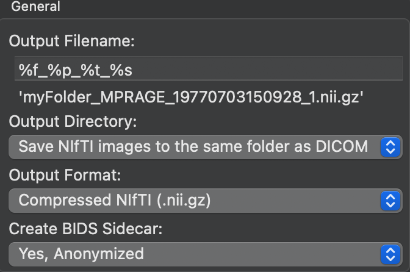
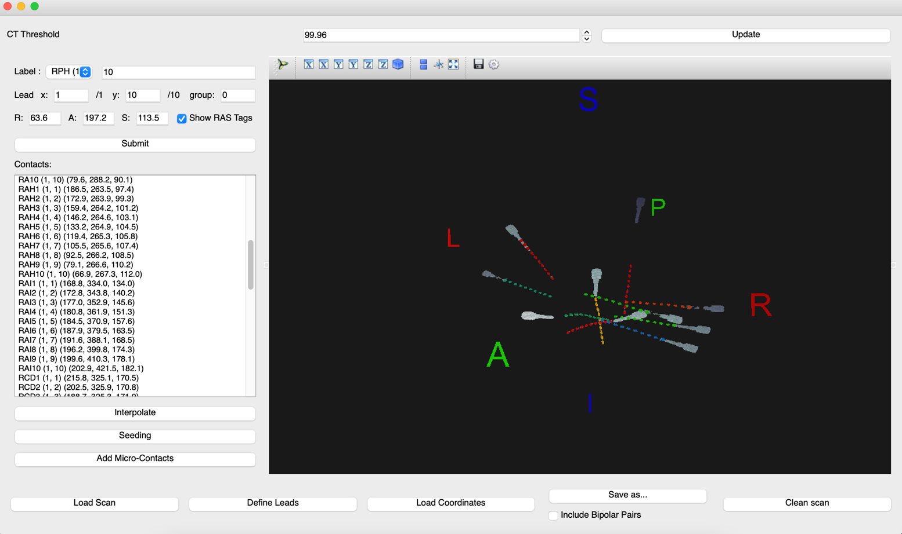
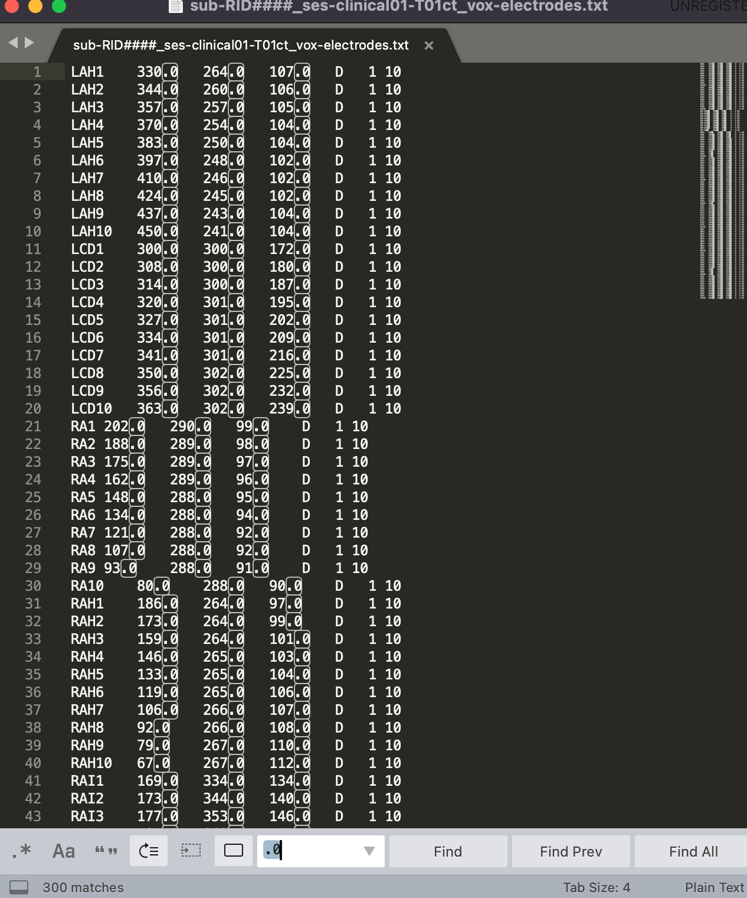
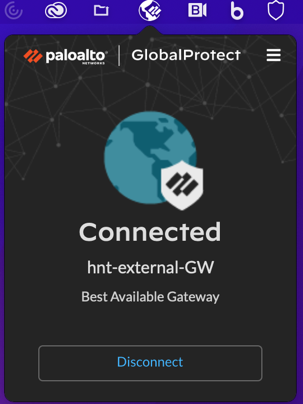

# MUSC Reconstruction

!!! abstract "What this page tells you"
    Reconstruction SOP for MUSC patients: create a REDCap record in the MUSC DAG, download dicoms from the Penn_MUSC_R01 Box folder, convert with MRIcroGL (SAG T1 MPRAGE PRE, AX BONE), label electrodes in voxtool, run run_musc_recons.py on Borel, upload to Box, email Jarrod and Alexandra Parashos.

#### **PART I: PRE-IMPLANT:**

*   **Create redcap ID for the MUSC patient:**
    *   At the top: make sure you are in no assignment
    *   Create record
    *   It will give an RID ### and you can add the MUSC id for both the “last name” and “first name” spaces
    *   Check MUSC for institution and put Epilepsy Patient
    *   **Make sure to assign the record to the MUSC Data Access Group in REDCap**
*   **Export the correct images:**
    *   In Penn Box go to: Penn\_MUSC\_R01 → MUSC\_Subject\_Data → MUSC\_Epilepsy\_Patient Data → SEEG\_Implant\_Reconstruction → 3T subject ID folder
    *   Within the subject ID folder download (one at a time) the dicoms in:
        *   Pre\_MRI folder 
        *   Implant\_CT folder 
    *   Once downloaded:
        *   Double click the file→a new folder will pop up. Rename this folder to either **Post-CT** or **Pre-MRI** so you can keep track of which is which.
*   **Convert the MRI dicom to nifti in MRIcroGL:**
    *   Go to MRIcroGL in your laptop
    *   Select **Import** in the top left
    *   Select **Convert DICOM to NIfTI**
    *   Select **Reset Defaults**
    *   In **Output Filename**, leave what is there already: **%f\_%p\_%t\_%s**
    *   For **Output Directory** put your Desktop
    *   For **Output Format** leave it as **Compressed NIfTI (.nii.gz)**
    *   Example:
 
*       *   In **Select Folder to Convert…** drag and drop or select the entire downloaded **Pre-MRI** dicom folder into the space that says “Drop files/folders to convert here”
    *   This will convert the entire 3T MRI to niftis but we only need 1 sequence
        *   **For pre-implant MRI we use the: SAG TI MPRAGE 1MM 3D VOL PRE\_MPR\_Tra**
            *   I believe the default in labeling is sagittal, cor means coronal, tra means transverse/axial
*       *   Select this sequence and then rename it to: **sub-RID####\_ses-clinical01\_acq-3D\_space-T00mri\_T1w.nii.gz**
*   **Convert the CT dicom to nifti in MRIcroGL:**
    *   Go to MRIcroGL in your laptop
    *   Select **Import** in the top left
    *   Select **Convert DICOM to NIfTI**
    *   Select **Reset Defaults**
    *   In **Output Filename**, leave what is there already: **%f\_%p\_%t\_%s**
    *   For **Output Directory** put your Desktop
    *   For **Output Format** leave it as **Compressed NIfTI (.nii.gz)**
    *   Example:
 
*       *   In **Select Folder to Convert…** drag and drop or select the entire downloaded **Post-CT** dicom folder into the space that says “Drop files/folders to convert here”
    *   This will convert the entire post-implant CT to niftis but we only need 1 sequence:
        *   **For post-implant CT use: AX BONE or Brain\_Lab\_Bone**
*       *   Select this sequence and then rename it to: **sub-RIDXXXX\_ses-clinical01\_acq-3D\_space-T01ct\_ct.nii.gz**
*   **Now that the converted niftis are made, please put the niftis in the sub-RIDXXXX/ses-clinical01 folder in your Desktop:**
    *   Put the MRI nifti in the folder called **anat**
    *   Put the CT nifti in the folder called **ct**
    *   Once you label the electrodes, the electrode coordinates will go in the folder called **ieeg**
    *   Parent folder: **sub-RID####**

*       *       *   Sub-folder: **ses-clinical01**
            *   **anat**
                *   sub-RID####\_ses-clinical01\_acq-3D\_space-T00mri\_T1w.nii.gz
            *   **ct**
                *   sub-RID####\_ses-clinical01\_acq-3D\_space-T01ct\_ct.nii.gz
            *   **ieeg**
                *   sub-RID####\_ses-clinical01\_space-T01ct\_desc-vox\_electrodes.txt
*   Once you have this set up, you can delete the dicoms and the rest of the niftis from your Desktop

#### PART II: Electrode Labeling

*   Completing this process will require both the post implant bone CT and the iEEG map created by the clinic
*   Go to your terminal to open voxtool:
    *   Type:
        *   **conda activate voxtool\_2**
    *   Followed By:
        *   **voxtool**
*   Load in post implant CT nifti using “Load Scan” lab on the lower left corner of the application
    *   Select the post-implant CT nifti that we just made
    *   The CT image should appear within the black space
        *   Check for display abnormalities: compressed CT, incorrect orientation of superior/inferior, anterior/posterior, and right/left. 
            *   If the CT image has high impedance, you can adjust the threshold from the original 99.96 to a more suitable threshold (ie: 99.94 or 99.98)
                *   When saving the completed electrode labels, the threshold MUST be returned back to 99.96. Pre-save the coordinated at your labeled threshold to fill in any blanks if they get erased when going to the original 99.96
*   Define leads as specified by clinic map
    *   Click **“Define Leads”** on the lower left section of the application and pop-up will appear
        *   Select the lead **“Type”** \- unless specific otherwise by MUSC, select **Depth electrodes** 
        *   “Lead name” is listed in the implant map as an abbreviation and Dimensions refers the number of contacts per electrode that is implanted
            
        *   The X coordinate is the point closest to the center of the brain and should always be 1
        *   The Y coordinate is the point closes to the skull and should be the max number of contacts within that electrode
        *   After each lead name and dimension is entered, you must select Submit or this parameter will not be saved
        *   You can check whether each lead with the correct number of electrodes has been entered in the display area under the submit tab.
        *   When you confirm this process is done, click Confirm
    *   Begin labeling by selecting the label name from the drop down menu
    *   Click on the corresponding electrode on the CT that is closest to the center of the brain and click submit. This will automatically be label 1.
        *   The next label in the “Label” column and Y coordinate on the “Lead” column will now change to show 2, meaning the 2nd contact of that electrode. 
        *   Change the label and Y coordinate to 12 to denote that you are labeling the last contact that is closest to the skull. (In this example, the last point will be the 12th contact, if the total number of contacts is a different number, you will change these labels to that quantity)
        *   Count the remaining contacts of the electrode and select the final contact point, then click submit
        *   When the first and last contacts have been labeled, click “Interpolate”, to auto-calculate the coordinates of the remaining electrodes
            *   If a label does not interpolate, this may indicate that the electrode is curved and will need to me manually labeled
                *   Indicate the contact number by counting from the point closest to the center of the brain (point 1) and count up to the non-labeled contact
                *   Insert the number of the unlabeled contact in the. “Label:” row and again in the “Y:” coordinate space
                *   Select that contact then select “submit”
    *   To save completed labeling, select “Save as…”
        *   Change file name to **sub-RID####\_ses-clinical01\_space-T01ct\_desc-vox\_electrodes**

*   Select the folder for where labels should export (**sub-RID####/ses-clinical01/ieeg**)
*   Set file type to “ TXT (\*.txt) “
*   **Edit voxel coordinates text file for format compatibility**
    *   The reconstruction will look for coordinates that are integers (non-decimals). 
        *   Open the voxel coordinate text file with sublime text (or text editor of choice)
        *   Type in **command + f** (for mac) or **control + f** (for windows), type “.0” in the search bar. 
        *   Select “find all” and delete all “.0” characters.
        *   Re-save coordinates. 

#### PART III: Running Reconstruction: can be done via Docker or terminal with Python in Leif (mounted via Borel)

*   **Set up the correct folder structure in your Desktop:**
    *   Parent folder: **sub-RID####**
        *   Sub-directory: **ses-clinical01**
            *   **anat**
                *   sub-RID####\_ses-clinical01\_acq-3D\_space-T00mri\_T1w.nii.gz
            *   **ct**
                *   sub-RID####\_ses-clinical01\_acq-3D\_space-T01ct\_ct.nii.gz
            *   **ieeg**
                *   sub-RID####\_ses-clinical01\_space-T01ct\_desc-vox\_electrodes.txt
*   **Move the sub-RID#### folder from your desktop into the Borel server: !!!!!**
    *   Make sure you are connected to **AirPennNet**. If not, follow these steps:
        *   Turn on Global Protect and sign in with Pennkey and password when prompted
    *   Open the terminal and navigate to your Desktop with this commands: **cd /Desktop**
    *   Then, type in the command below to copy the sub-RID#### folder into Borel:
        *   **scp -r sub-RID####** [**pennkey@borel.seas.upenn.edu**](mailto:pennkey@borel.seas.upenn.edu)**:/mnt/leif/littlab/data/Human\_Data/recon/BIDS\_musc**
        *   scp -r derivatives
*   **Change the permissions of the sub-RID#### in Borel**
    *   In the terminal, ssh into the Borel server with:
        *   **ssh** [**pennkey@borel.seas.upenn.edu**](mailto:pennkey@borel.seas.upenn.edu) 
    *   Type:
        *   **cd /mnt/leif/littlab/data/Human\_Data/recon/BIDS\_musc**
    *   Type:
        *   **chmod 777 -R sub-RID####**
    *   Then, navigate to the **code** folder with this command:
        *   **cd ../code**
*   **Run the reconstruction with this code:  !!!!s**
    *   **python run\_musc\_recons.py**
    *   This code will run through every subject in the BIDS folders and create a derivatives folder for the output. If a subject already has a derivatives folder, it will not be reconstructed.
    *   **If an error has occurred and you need to re-run a subject, you must first delete the derivatives folder.**
    *   The output for the reconstruction will be module 2 (containing ITK-SNAP workspace) and module 3: 
*   **Move the sub-RID#### folder from Borel back into your local Downloads so you can upload to Box:**
    *   Open a new terminal window
    *   Navigate to Downloads with: **cd /Downloads**
    *   Copy from borel to downloads with:
        *   **scp -r** [**pennkey@borel.seas.upenn.edu**](mailto:pennkey@borel.seas.upenn.edu)**:/mnt/leif/littlab/data/Human\_Data/recon/BIDS\_musc/sub-RID#### .**

#### 

#### PART IV: Create ITK-SNAP Workspace

*   Go to the module2 folder in your Downloads (sub-RID####/ses-clinical01/derivatives/ieeg\_recon/module2) 
*   Right click on **sub-RID####\_ses-clinical01\_itksnap\_workspace.itksnap** file and open in ITK-SNAP (this file will have the red itk-snap icon next to it)
    *   Scroll through to make sure colored electrode coordinates line up with the coregistered MRI/CT
*   Import label descriptions so electrode names are visible when toggling over each coordinate
    *   Click **Segmentation** and scroll to import label descriptions. 
    *   The Open Label Descriptions pop up will prompt you to specify the label description file
    *   Click Browse and select **sub-RID####\_ses-clinical01\_space-T01ct\_desc-vox\_electrodes\_itk\_snap\_labels.txt**
    *   Save the ITK-SNAP file with these edits
*   Upload reconstruction to PennBox.
    *   Go Penn Box
    *   Go to Penn\_MUSC\_R01 → MUSC\_Subject\_Data → MUSC\_Epilepsy\_Patient Data → SEEG\_Implant\_Reconstruction → **3T subject ID folder**
    *   Drag and drop the entire sub-RIDXXXX folder in your **Downloads (NOT YOUR DESKTOP)** into this MUSC folder

#### 

#### Part V: Send email to the MUSC Coordinator, Jarrod and the MUSC PI, Alexandra Parashos to let them know the reconstruction is complete and has been uploaded
