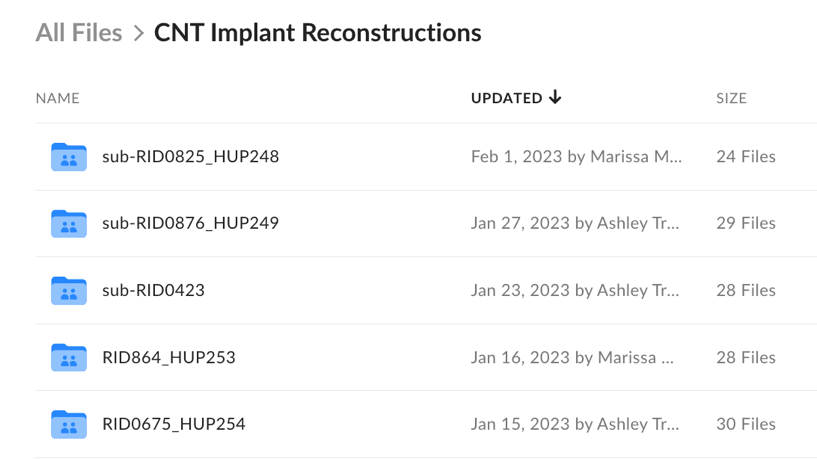
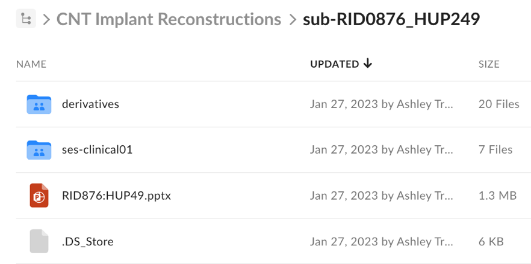
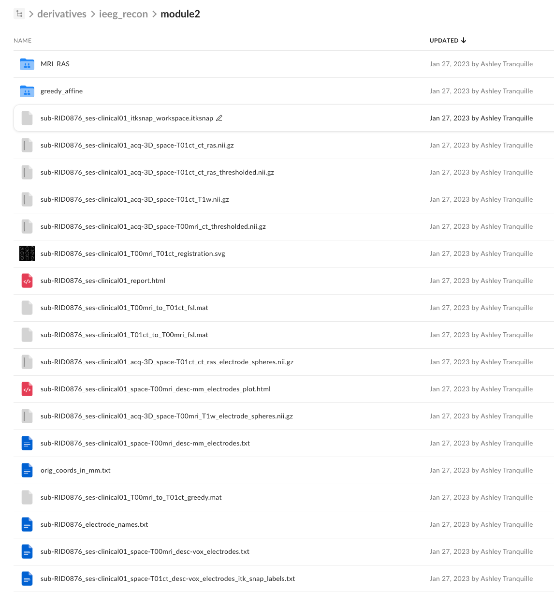
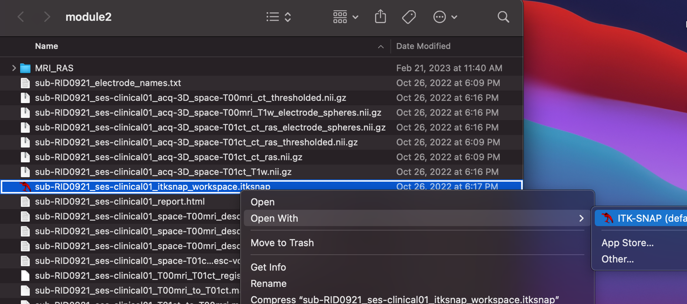
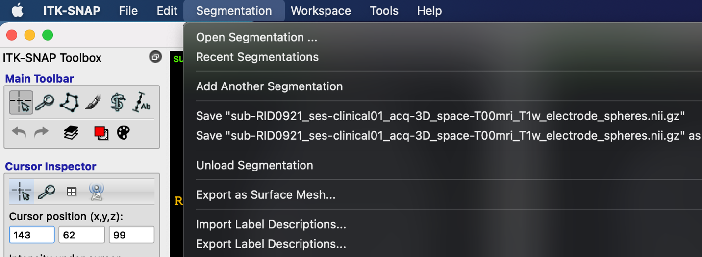
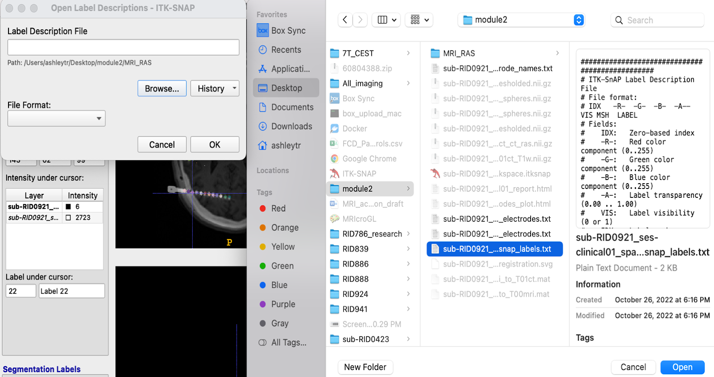

# Opening ITK-SNAP Files from PennBox

!!! abstract "What this page tells you"
    How clinicians open a finished reconstruction from the PennBox CNT Implant Reconstructions folder: download the entire module2 folder, open the .itksnap workspace in ITK-SNAP, and if labels show only 'Label 22', import the electrode label descriptions file via Segmentation > Import Label Descriptions.

1. When Reconstructions are completed, they will be uploaded to CNT Implant Reconstructions folder in PennBox ([https://upenn.box.com/s/rmifp0sft3af3xk8329sqvrlhtqnks5k](https://upenn.box.com/s/rmifp0sft3af3xk8329sqvrlhtqnks5k)). 

1. The reconstruction will be labeled by the patient’s RID and HUP number or as sub-RID0###.
    1. Open the patient's reconstruction folder You will see the following documents at this level:
        1. **derivatives 🡪 this holds the sub-directories with the reconstruction output**
        2. Ses-clinical01 🡪 this holds the original pre-implant MRI, post-implant CT and electrode coordinates for the reconstruction
        3. RID###.pptx 🡪  anonymized implant map
        4. .DS\_Store file

1. Open the derivatives folder and the ieeg\_recon folder inside of derivatives.
2. Within the ieeg\_recon folder will be the **module2** folder.
3. Download the **entire** module2 folder
    1. This will download the complete reconstruction output including the ITKSNAP workspace and ITKSNAP electrode labels file.
    2. Do Not create a new workspace from scratch

1. The module2 folder should now be on your computer where it can be unzipped.
    1. Make sure you have ITK\_SNAP already installed on your computer as well.
2. Open the module2 folder to view the reconstruction output
    1. The ITK-SNAP workspace will be labeled with the red itk-snap icon with the naming \[sub-RID####\_ses-clinical01\_itksnap\_workspace.itksnap \]
3. Right click on the workspace and hover over the “open with” option
    1. An additional tab will appear with the option to use the ITK-SNAP app
    2. Click the ITK-SNAP option

1. The workspace should open up and present the labeled electrodes. To double check if the electrode coordinates are imported, click on a label.
    1. Zooming in may help with this because the voxel which was labeled is what needs to be clicked on specifically. 
    2. On the left-hand column, the section labeled “Label under cursor” will show you which label you have selected and its coordinate. 
    3. If the second cell is only showing you the name of the label, for example “Label 22”, that means the electrode coordinates have not been imported into the workspace. 🚫 Screenshot withheld (PHI review): ITK-SNAP three-plane T1 MRI of sub-RIDXXXX with electrode labels — replace with a de-identified capture
2. To import an electrode label, go to the top of the desktop screen and select “Segmentation”
    1. Scroll down to the “Import Label Descriptions option and select it.
3. Navigate back to the module2 folder and select the electrode labels file \[**sub-RID###\_ses-clinical01\_space-T01ct\_desc-vox\_electrodes\_itk\_snap\_labels**\]
4. Click open after you select the electrode labels and the coordinates for the electrode should show up immediately.
5. You can test out the labels again by clicking on a labeled voxel and looking at the “Label Under Cursor” section to view the label number and coordinate. The name of the electrode should also be displayed directly under this section in the “Segmentation Labels- Active label:” area.🚫 Screenshot withheld (PHI review): ITK-SNAP three-plane T1 MRI of sub-RIDXXXX, label RV10 active — replace with a de-identified capture
