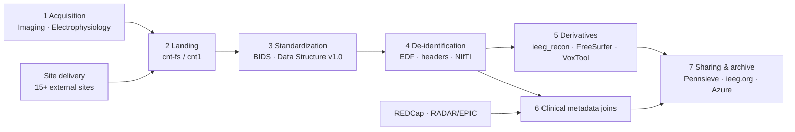

# 4. How data moves through the lab

Every dataset the lab holds went through the same seven stages. Each stage links to the relevant themes in the wiki; the arrows are the hand-offs a coordinator owns.

## The stages

1. **Acquisition** — a prospective HUP patient is scanned ([3T Research Scans: Scheduling & Billing](../imaging/scheduling-and-visits/3t-research-scans-scheduling-and-billing.md)) or recorded in the EMU ([sEEG Phase II Processing: Overview & Timeline](../electrophysiology/overview-and-setup/seeg-phase-ii-processing-overview-and-timeline.md)); or a collaborating site delivers a batch.
2. **Landing** — raw data reaches cnt-fs/cnt1: [Flywheel → cnt-fs (3T)](../imaging/post-scan-transfer/flywheel-cnt-fs-3t.md), [Exporting Files from Natus](../electrophysiology/exporting-from-natus/exporting-files-from-natus.md), [Moving Data Across cnt-fs, cnt1, BSC, Borel & Leif](../data/moving-data/moving-data-across-cnt-fs-cnt1-bsc-borel-and-leif.md). Where each kind lives: [Data Storage Locations](../data/storage-locations/data-storage-locations.md).
3. **Standardization** — into the BIDS layout defined in **Data Structure v1.0 (Data › Sites)** *(not yet in the wiki)*; channel maps for EEG: [Automated Channel Mapping](../electrophysiology/channel-mapping/automated-channel-mapping.md).
4. **De-identification** — before data moves to a destination that requires de-identified data: [De-Identifying EDFs](../data/de-identification/de-identifying-edfs.md) and the header and NIfTI scripts beside it.
5. **Derivatives** — [Electrode Reconstruction: Prep & Software](../imaging/electrode-reconstruction/electrode-reconstruction-prep-and-software.md), FreeSurfer, VoxTool outputs into `derivatives/`.
6. **Clinical metadata joins** — [Surgical Outcomes REDCap Project](../redcap/projects-and-data-entry/surgical-outcomes-redcap-project.md), [RADAR Pull → REDCap Entry](../redcap/clinical-data-pulls-ehr-redcap/radar-pull-redcap-entry.md).
7. **Sharing and archive** — [Processing for ieeg.org (natus2mef → validate → upload)](../electrophysiology/processing-and-upload-to-ieeg-org/processing-for-ieeg-org-natus2mef-validate-upload.md), [Uploading from cnt1 to Pennsieve](../data/sharing-pennsieve-and-ieeg-org/uploading-from-cnt1-to-pennsieve.md), [Archiving EEG Data to Azure](../data/archiving-azure/archiving-eeg-data-to-azure.md).

!!! warning
    **The line that matters:** identified data may be handled on approved PMACS systems, including cnt1, cnt-fs and BSC. BSC permission was confirmed by Nishant Sinha on 2026-09-20. Nothing crosses to Borel, Pennsieve, [ieeg.org](http://ieeg.org), GitHub or this wiki until stage 4 is done.
