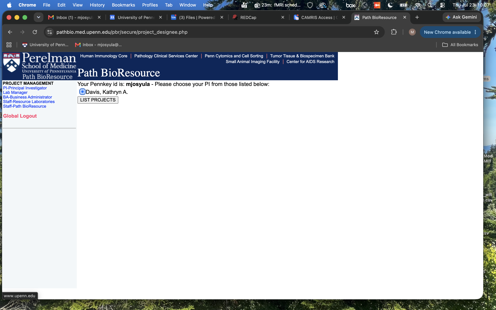

# Adding CAMRIS Users

!!! abstract "What this page tells you"
    To add a CAMRIS user on the Path BioResource site: Lab Manager > Davis, Kathryn A. > List Projects > Manage Studies/Protocols > SAIF Application Manager > Authorize Members, enter their PennID or PennKey, hit Assign, then add them to studies. Includes screenshots.

**Path BioResource Website-** [https://pathbio.med.upenn.edu/pbr/secure/assign.php](https://pathbio.med.upenn.edu/pbr/secure/assign.php)

1. Choose 'Lab Manager' from the tab on the left side of the screen
2. Highlight the 'Davis, Kathryn A.' bubble

1. Hit 'List Projects' bubble
2. Under 'Path BioResource' there will be a yellow box
3. Select the 'Manage Studies/Protocols' textbox

1. Now you will see this view

 7. Under the 'SAIF Application Manager', navigate to the box next to 'AUTHORIZE MEMBERS- 9 assigments'
8\. Here you can add the user by typing in their PennID# or their PennKey
9\. Hit 'assign'
10\. The individual should populate and you can then add them to the applicable studies
