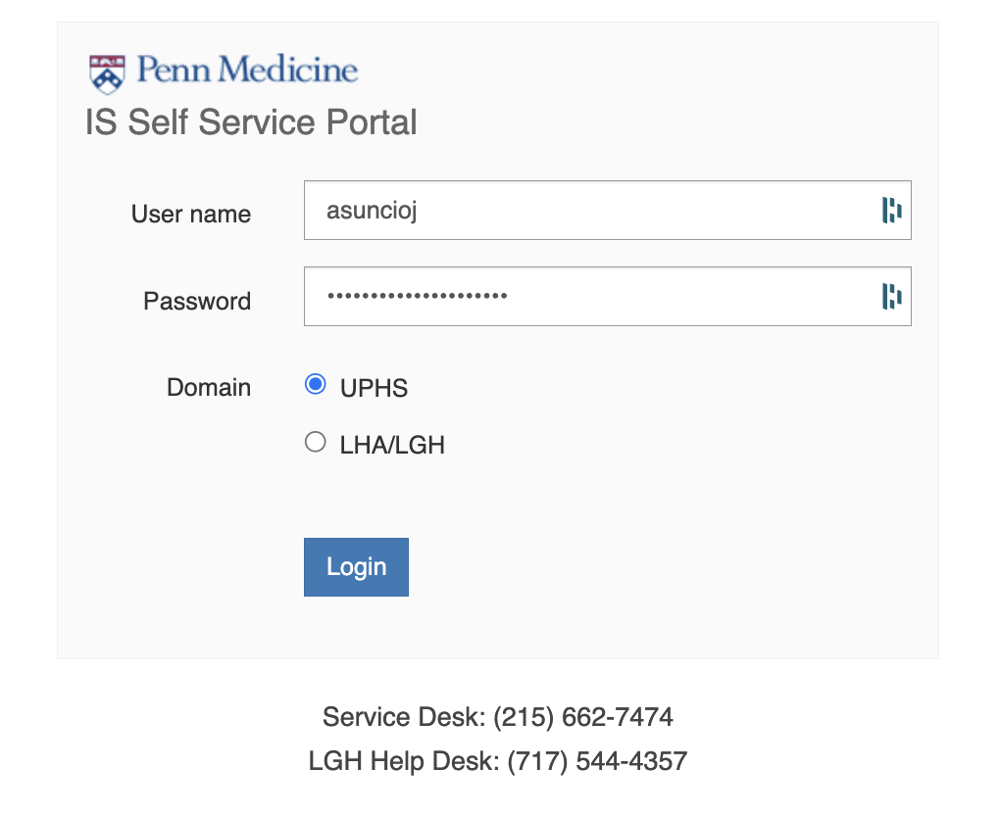
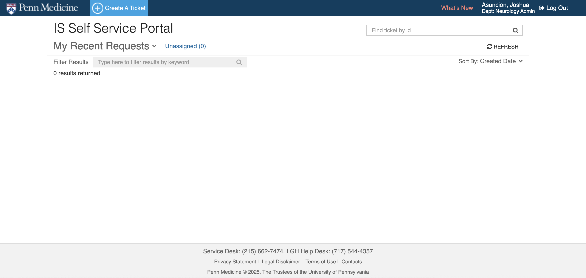
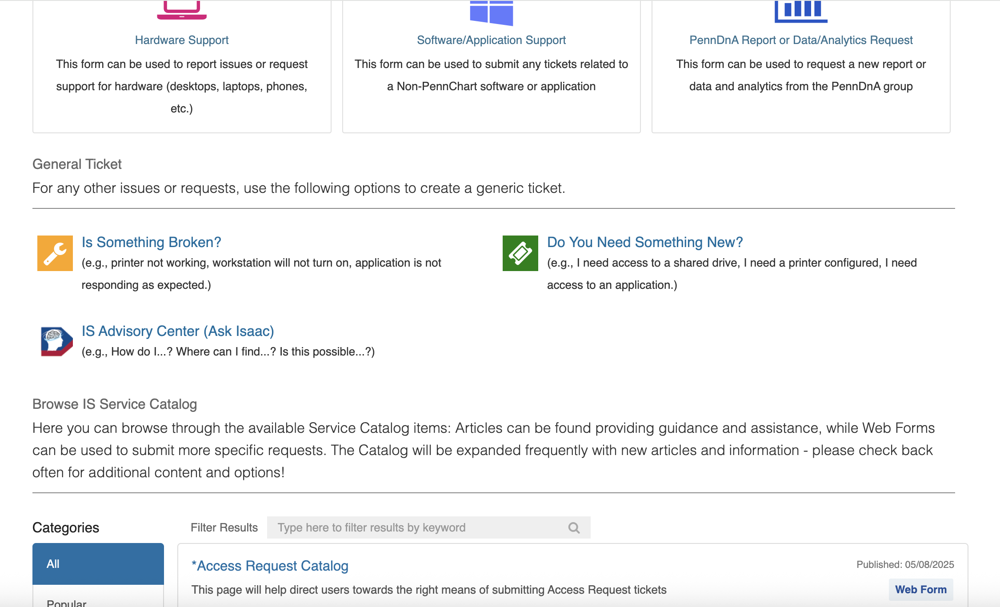
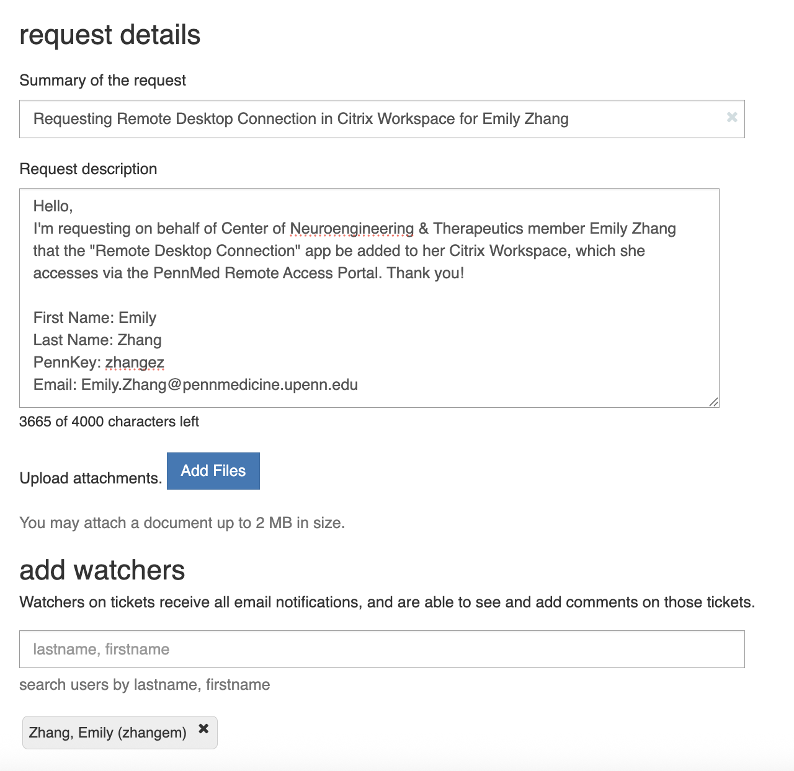

# Citrix Remote Desktop Access

!!! abstract "What this page tells you"
    Submit a UPHS IS ticket via pennmedaccess requesting the Remote Desktop Connection app be added to a staff member's Citrix Workspace; includes an email template with name, PennKey, and email fields.

1. Submit UPHS IS ticket and save the ticket number
    1. Login to: [https://pennmedaccess.uphs.upenn.edu/my.policy](https://pennmedaccess.uphs.upenn.edu/my.policy)

    1. Click "IS Self Service Portal" and then login to the UPHS IS Helpdesk

    1. Click "Create A Ticket"

    1. Click "Do You Need Something New?"

    1. Fill out the requester info. See screenshot for template

    1. Fill out the request details. See screenshot for template

Template-
Hello,

I am requesting on behalf of the Neuroengineering and Therapeutics members Haoer Shi and Nishant Sinha that the "Remote Desktop Connection" app be added to their Citrix Workspace, which they access via the PennMed Remote Access Portal. Thank you!

First Name: Haoer
Last Name: Shi
PennKey: haoershi
Email: [Haoer.Shi@Pennmedicine.upenn.edu](mailto:Haoer.Shi@Pennmedicine.upenn.edu)

First Name: Nishant
Last Name: Sinha
PennKey: nishants
Email: [Nishant.Sinha@Pennmedicine.upenn.edu](mailto:Nishant.Sinha@Pennmedicine.upenn.edu)

Best,
Mariam
