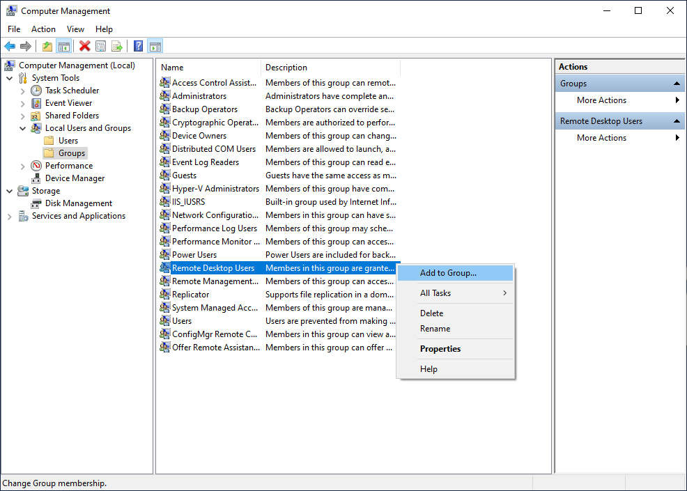
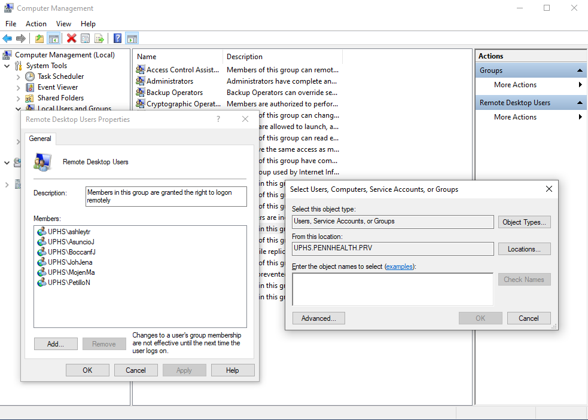

# Remote Access to the Hayden Hall UPHS Computer

!!! abstract "What this page tells you"
    Data & Computing Manager grants remote access to Hayden Hall UPHS computer MJ0HKNDA by adding the staff UPHS username to Remote Desktop Users, then files a UPHS ticket for the Citrix Remote Desktop app. Lists current remote users.

### Remote Access to UPHS Windows 10 Computer MJ0HKNDA in Hayden Hall Kitchen

1. Data & Computing Manager needs to grant CNT Staff remote access to MJ0HKNDA
    1. Data & Computing Manager needs Administrative Account on MJ0HKNDA Computer
    2. Log on to computer using Admin Account
    3. Search for and open "Computer Management" window
    4. Go to System Tools ➝ Local Users and Groups ➝ Groups
    5. Right click on Remote Desktop Users, and select Add to Group

    1. In "Enter the object names to select", type the CNT Staff's UPHS username
        1. Usually in the form of last name, first name initial, e.g. AsuncioJ
    1. Select "Check Names" and confirm that the CNT Staff has been selected
    2. Hit "OK" and then "Apply"

1. Manager will then submit a UPHS IS Self Service ticket for UPHS to add the "Remote Desktop Connection" Citrix app to CNT Staff's CitrixApps in their PennMed Remote Access Portal

**CURRENT LIST OF REMOTE USERS (****06/25/2026****):**

*   JosyulaM
