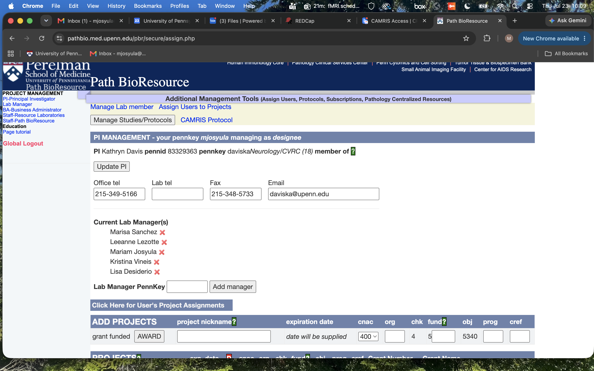
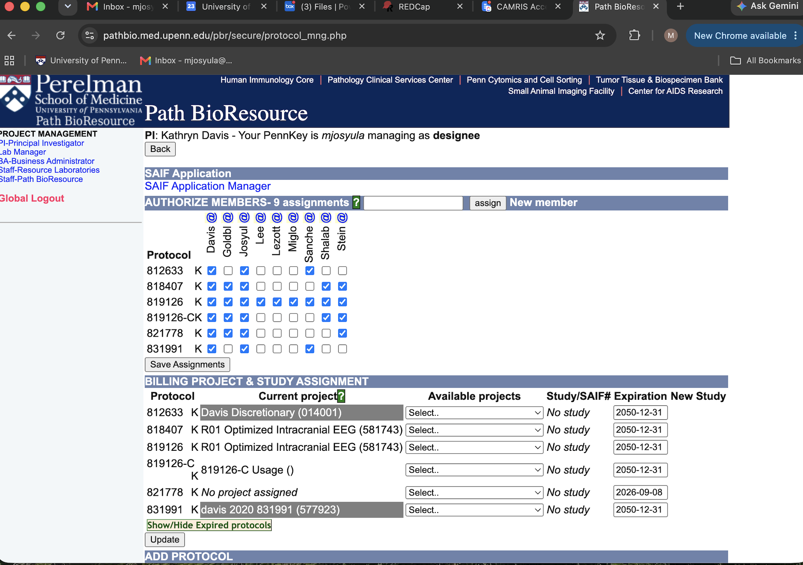

# Updating CAMRIS User Access

!!! abstract "What this page tells you"
    To change which studies a CAMRIS user can access: on the Path BioResource site go to Lab Manager > Davis, Kathryn A. > List Projects > Manage Studies/Protocols, check or uncheck boxes per study, then hit Save Assignments. Includes screenshots.

**Path BioResource Website-** [https://pathbio.med.upenn.edu/pbr/secure/assign.php](https://pathbio.med.upenn.edu/pbr/secure/assign.php)

1. Choose 'Lab Manager' from the tab on the left side of the screen
2. Highlight the 'Davis, Kathryn A.' bubble

1. Hit 'List Projects' bubble
2. Under 'Path BioResource' there will be a yellow box
3. Select the 'Manage Studies/Protocols' textbox

1. Now you will see this view

1. Hover over the column to see the individual's full name
2. Uncheck/check a box if you want to remove/add
3. When finalized, hit 'Save Assignments' at the bottom of the columns/rows
4. This will update who has access to which studies
