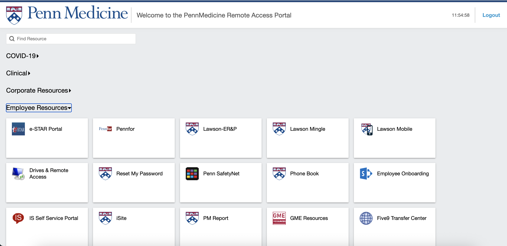
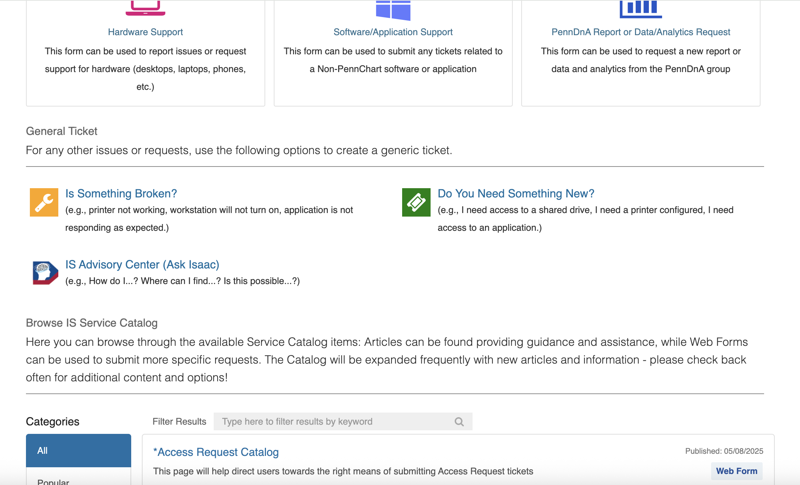
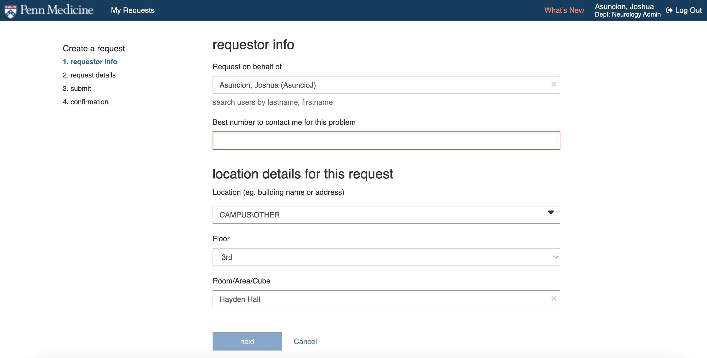
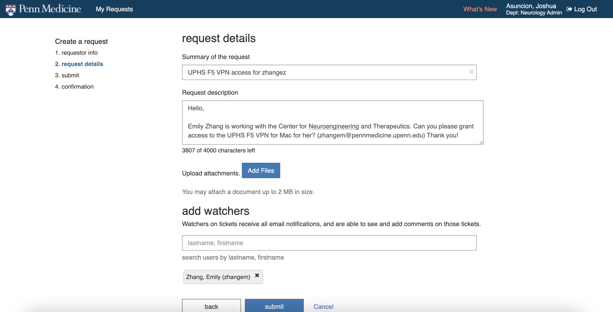
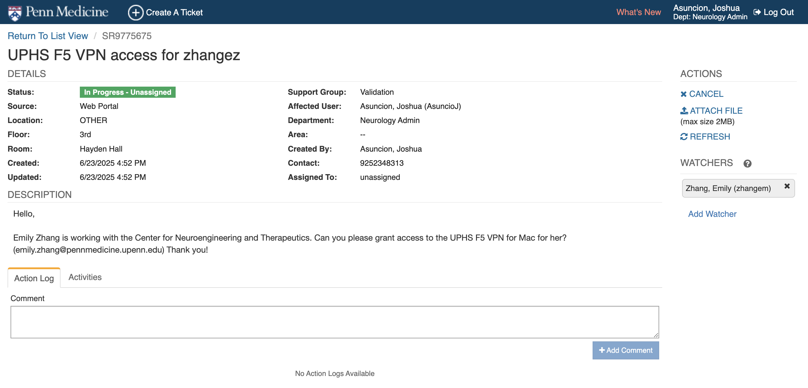
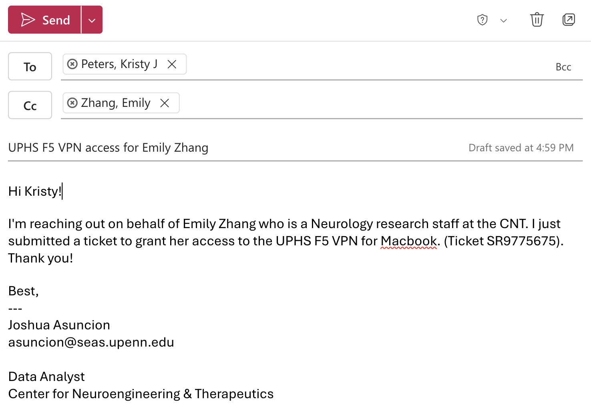

# UPHS F5 VPN Access

!!! abstract "What this page tells you"
    To get UPHS F5 VPN: submit a UPHS IS ticket at pennmedaccess (screenshots show template), email Kristy Peters to self-assign it, then install the F5 Big-IP client using the attached Mac instructions.

1. Submit UPHS IS ticket and save the ticket number
    1. Login to: [https://pennmedaccess.uphs.upenn.edu/my.policy](https://pennmedaccess.uphs.upenn.edu/my.policy)

    1. Click "IS Self Service Portal" and then login to the UPHS IS Helpdesk

    1. Click "Create A Ticket"

    1. Click "Do You Need Something New?"

    1. Fill out the requester info. See screenshot for template

    1. Fill out the request details. See screenshot for template

    1. Make sure to record the ticket number

1. Send an email to Kristy J Peters (Senior Advisor, Cybersecurity Risk & Compliance) at [kristy.peters@pennmedicine.upenn.edu](mailto:kristy.peters@pennmedicine.upenn.edu) to notify her of this request. She will self-assign the ticket and grant UPHS F5 VPN access.
    1. Template blurb for email:

1. Download and install the F5 Big-IP Client VPN application to your personal computer
    1. Please see the attached documentation for instructions
        [📄 F5 access Mac software.docx](../../assets/operations/uphs-f5-vpn-access/09-f5-access-mac-software-1.docx)
