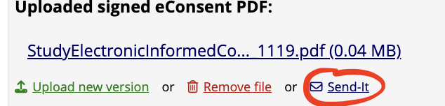
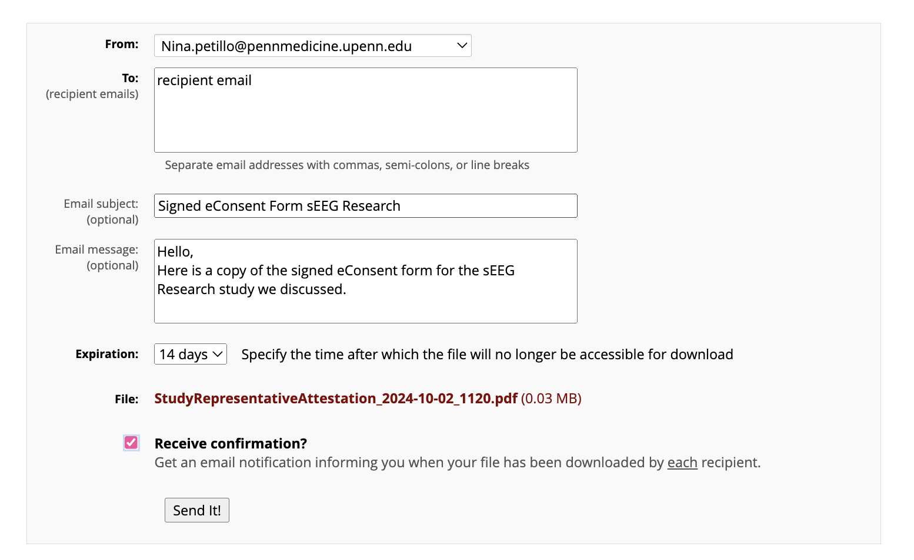
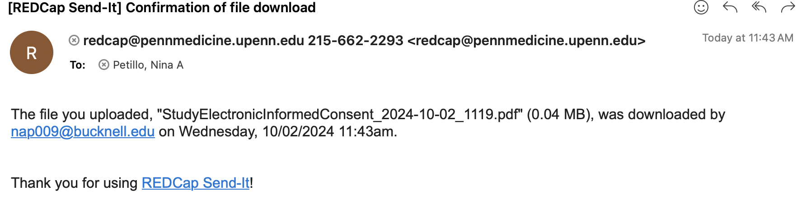

# How the e-Consent Form Works

!!! abstract "What this page tells you"
    How the REDCap e-consent workflow runs: fill Pre-Consent to trigger the emailed ICF survey, complete the Attest survey after the participant signs, write the consent note, then Send-It both signed PDFs with 14-day expiry and download confirmation. Add participant to the CNT Surgical Repository.

**OCR e-consent guidance:**

[📄 e-consent guidance ocr.pdf](../../assets/operations/how-the-e-consent-form-works/01-e-consent-guidance-ocr.pdf)

**Pre-Consent**

*   Fill out the subjects first name, last name, and email address
*   The study title/information will populate automatically
*   Choose remote or in-person for
*   Choose initial consent or re-consent
*   Mark form as complete
**ICF\_Survey**

*   After you mark the pre-consent form as complete, the participant will receive an email titled "sEEG Research e-Consent" (for the collaborative protocol at least)
*   The patient will review the consent form and then sign and date.
*   This information will auto-populate in REDCap once complete
**Attest\_Survey**

*   Once the participant has signed the consent form, you will open the "attest\_survey" field
*   Click "survey options" on the drop down in the top right
*   Open the field as a survey
*   Fill out your first name, last name, signature, and date of signature
*   This information will auto-populate in REDCap once complete

**Consent\_Note\_PDF\_Uploads**

*   Write a consent note in the first box
*   Document any questions that were asked and answered; mark "none" if no questions were asked
*   The signed PDF files (both the signed eConsent from the participant and the signed Attestation from the consenter) will automatically upload into REDCap
*   Next to **each** of these files, press "Send-It

*       *   Put the recipient email, email subject, and email message.
    *   Change expiration to 14 days
    *   Check off Receive confirmation so that you know when they download the forms
    *   To ensure the patient downloads the pdfs, put **"\[Action requested\]"** in subject line of email
*   "Date that signed eConsent was sent to participant" will be the date that you pressed "Send-It" for the "Uploaded signed eConsent PDF"
*   "Date that signed Attestation was sent to participant" will be the date that you pressed "Send-It" for the "Uploaded signed Attestation PDF"
*   If you checked off "receive confirmation" then you will receive the date the participant downloads the eConsent and Attestation forms, and can put these values in "Date participant downloaded eConsent" and "Date participant downloaded Attestation"
*   The email you will receive with these dates will look something like this:

#### **Make sure the consented participant is added to CNT Surgical Repository!**

*   download the signed ICF and Attestation forms to upload to their RID
