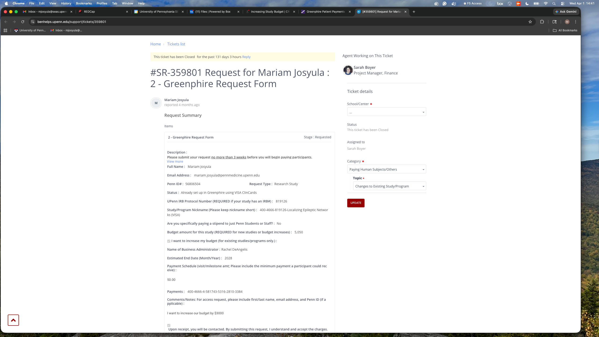
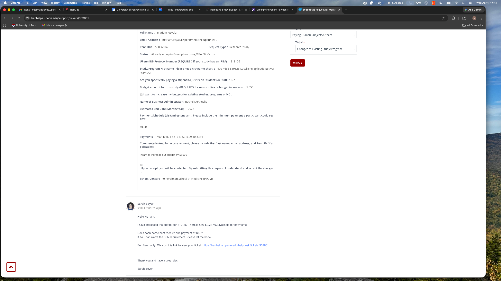

# Increasing a Study Budget

!!! abstract "What this page tells you"
    To increase a Greenphire study budget, open a BEN Helps ticket: request type Research Study, status 'Already set up in Greenphire', IRB number, study nickname, new budget with the increase checkbox, Rachel DeAngelis as administrator, fund end date and account code from Carolyn. Example included.

*   Increase the Budget:
    *   Open up a new ticket
    *   Enter in your name, email address, and Penn ID.
    *   In request type, select “Research Study”
    *   In status, please select “Already set up in Greenphire using VISA ClinCards”
    *   Enter in the IRB protocol number
    *   Enter in the name of the study in “Study/Program Nickname”
    *   Scroll down to “Budget amount for this study (REQUIRED for new studies or budget increases)”
        *   Enter in the amount you want to increase the budget to
        *   Select the checkbox “I want to increase my budget (for existing studies/programs only.)”
    *   For “Name of Business Administrator” please put Rachel DeAngelis.
    *   Enter in the Estimated End Date.
        *   This is the fund end date. You can get this from Carolyn.
    *   Enter in the 26-digit account code. The 26-digit account code is the Study ID found in the Greenphire system (explained above).
        *   You can also get this from Carolyn.
    *   **In the comments please put that you are requesting a budget increase.**
        *   “I want to increase our budget to XXXX” (usually we increase by $3000-5000 at a time)
    *   For School/Center please select “40 Perelman School of Medicine (PSOM)”
    *   Once all of the necessary information is entered, you can then select “Place Request” in red in the upper right-hand corner.

[benhelps.upenn.edu](https://benhelps.upenn.edu/support/tickets/346604)

EXAMPLE TICKET-

