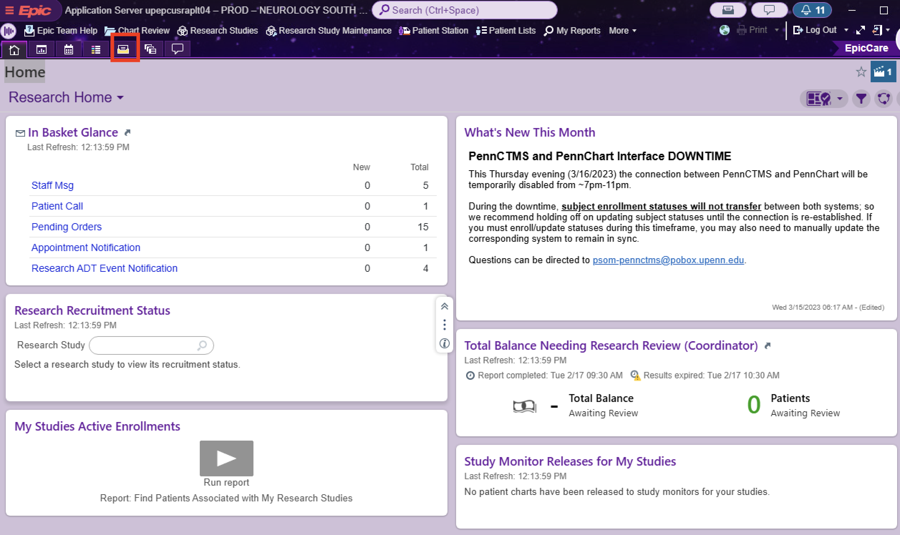
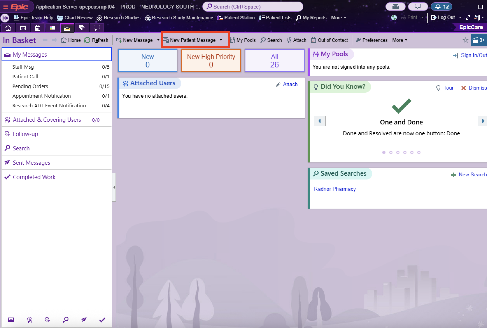

# Contacting & Scheduling Patients

!!! abstract "What this page tells you"
    To recruit post-op neuropsych patients: use the Box REDCap query, verify consent forms are uploaded (re-consent if consented before the April 2025 amendment), call via EPIC, log the outcome in Box, create a Teams link, and send the templated MyChart message with appointment details.

**REDCap Query for Patients to Test:**

[upenn.app.box.com](https://upenn.app.box.com/file/2137799421194)

1. Patients that have had surgery and consented to both 3T and 7T
2. Patients that have had surgery and consented to 3T
3. Patients that have had surgery and consented to 7T

**Before Contacting Patients**

1. Double check in REDCap that they have been consented to the correct research study/studies and that their signed consent form is uploaded into REDCap.
    1. If there is no consent note/form uploaded, go into the VDI to check if their scan data is in cnt-fs.
    2. If they have their research data in cnt-fs but no consent form uploaded, approach the patient as a first-time consent!!
2. Check the date of consent to the research studies. If it is prior to the modification made in April 2025 where the neuropsychology section was added to the protocols, you must re-consent the patient.
    1. If the patient consented to both 3T and 7T, use the most recent study consented.

**Consenting**

1. Find the patient's phone number in EPIC and call them to re-consent (if necessary) and schedule their post-op neuropsychology re-evaluation.
    1. If they are being re-consented, you must send them the e-consent form.
    2. If they don't need to be re-consented, go ahead with scheduling.
2. In the excel sheet in box (linked above), record that you approached the patient and the outcome.
3. Create the meeting link in your Penn Medicine Teams account and add the patient's email.
    1. If the patient has been re-consented, wait until they sign the consent form to create the meeting.
4. Log into in EPIC and go into My Basket (fifth icon from the right above the word "Home")

1. Click on New Patient Message , and type in the MRN of the patient you are trying to contact.

1. In your message, paste:
**Subject:** Post-Operative Neuropsychological Evaluation - Research (INSERT PROTOCOL NUMBER) 
**Message:**
Hello,

This is \[INSERT NAME\]. We spoke on the phone regarding your post-operative neuropsychological evaluation as part of the research protocol you consented to when you had your MRI in \[INSERT DATE\] (Protocol #\[INSERT PROTOCOL NUMBER\]). Thank you again for agreeing to participate.

Your appointment is scheduled for \[INSERT DATE\] from \[INSERT TIME\]. The session will be conducted virtually via Microsoft Teams. The meeting link is attached below.

\[INSERT MEETING LINK\]

As a reminder, please bring 6 sheets of paper and a pen/pencil to your meeting.

If you experience any difficulty accessing the meeting, please feel free to contact me here. You may also reach me at \[INSERT PHONE NUMBER\] or \[INSERT EMAIL\].

Best,
\[INSERT NAME\]
