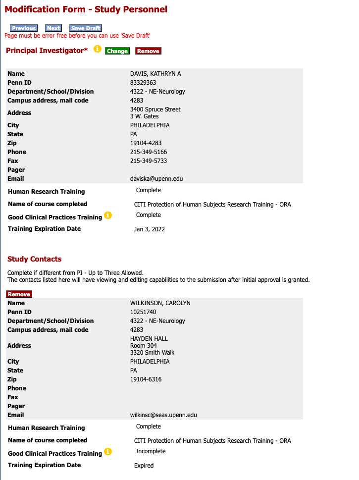

# Adding Personnel to an IRB Study

!!! abstract "What this page tells you"
    To add someone to an IRB study: verify their CITI, HIPAA, CV and license docs in PennBox, submit an HSERA modification with cover letter, application and CITI certificate, then upload the approval, update the study personnel list, send the training acknowledgement and add to eDOA.

*   When you want to add personnel to an IRB study, first make sure they have [the following documents in pennbox](https://upenn.box.com/s/bwjk5cr1d3b8r52dba0sc1pvkj5sl71s) in CNT administration➝IRB➝[CNT\_personnel](https://upenn.box.com/s/h7t1pc3oz4wzklqifjupkuol82j4z3cz) as they are required by OCR **(****_note: only CITI Biomedical Research is needed for submission when adding someone through HSERA, but for audit reasons, be sure we have these documents on file before adding_****)**
    *   CITI Biomedical Research - Human Research (no expiration)
    *   CITI Good Clinical Practice (expires every 3 years)
    *   _Current_ HIPAA (expires annually)
    *   _Current_ CV
    *   Medical license (_if applicable)_
*   If the study has an electronic regulatory binder in pennbox, their personnel folder should be labeled: PositionTitle-Firstname\_lastname (ex: ResearchCoordinator-Nina\_Petillo) **and these documents should be copied to their personnel folder in the eReg binder**
    *   If not, the documents can live in their personnel folder within CNT personnel (Lastname\_Firstname)
**To obtain the actual CERTIFICATE:**

*   Login to Workday
*   choose "Menu" on left
*   choose "Learning"
*   expand learning tab on left
*   choose "Print Your Learning Certificate"
*   type in the name of your course
*   should bring you to a page and at bottom left choose "print"
*   certificate will show up in top right corner and should be sent to your email

**HSERA Modification-**

*   **When creating a modification in HSERA: You will need to submit a** **Cover Letter****,** **Modification Application Summary****, and** **Biomedical CITI certificates** **for the people you are adding**
    *   **if changing the protocol and ICF, you will need to submit the tracked and clean versions**
    *   _Each time someone is added to a protocol, you should attach their CITI biomedical certificate, regardless of if it was previously submitted in a modification for a different protocol_
    *   Example cover letter for adding/removing personnel
        [📄 Example Cover Letter 819126.docx](../../assets/operations/adding-personnel-to-an-irb-study/01-819126-mod-cl-2024-1-23.docx)
    *   Example modification application document for adding/removing personnel
        [📄 Example Modification App 819126.doc](../../assets/operations/adding-personnel-to-an-irb-study/02-819126-3t-mod-2024-1-23.doc)
*   You can copy the most recently submitted version in pennbox of these documents from the same protocol and make edits from there
*   You should create a folder in pennbox within the proper IRB folder for each modification that you make
    *   **Naming convention for pennbox folders for modifications:**
        *   **Outer folde**r: IRB#\_DateOfSubmission\_ModificationType (i.e. AddPersonnel, ModificationProtocol, RemovePersonnel, etc.)
            *   i.e. 819126\_3T\_04\_07\_2025\_ModificationProtocolandICF
        *   **Inner documents**
            *   Label each document something like: IRB#\_DocumentType\_DateOfSubmission
            *   i.e. 819126\_3T\_ICF\_clean\_04112025; 819126\_3T\_CL\_041825
*   In [HSERA](https://hsera.apps.upenn.edu/hsProtocol/jsp/fast2.do?bhcp=1): Create➝modification➝search Protocol # ➝ click  for the protocol you want ➝ fill out the appropriate fields until you get to this page
    *   
    *   To remove any of the Study Contacts or Key Personnel, hit "**Remove**" next to their name
    *   To add Key Study Personnel, press "**Add**"

*       *   Search the last name of whoever you would like to add to the study and click who you would like to add
    *   Click through HSERA until you get to the last page, where you will upload the cover letter, modification application, CITI Biomedical document, and any other documents you might be submitting (protocol, ICF, etc.)

**AFTER THE MODIFICATION IS APPROVED-**

*   **Upload the approval letter to the folder you made in pennbox**
    *   Change the approval letter name to: APPROVED\_Date\_IRB#\_typeofmodification
*   Update the study personnel list (kept by the lab manager; location to be confirmed)
*   Email anyone you added to let them know they are now on the protocol

**Collaborative protocol only**:

*   Send the training acknowledgment form to anyone that is now on the collaborative protocol (**important: do this BEFORE adding them to the eDOA.**)
    *       [📄 Training Acknowledgement Template.pdf](../../assets/operations/adding-personnel-to-an-irb-study/06-protocol-training-acknowledgement-template.pdf)
*   Make sure this reflects the current protocol version. Send the current protocol as well for the new personnel to review before signing.
*   Once they have signed the Protocol Training Acknowledgement, Update the study personnel list (kept by the lab manager; location to be confirmed) and *(page not migrated)*
*   **add new personnel to the eDOA in REDCap**
