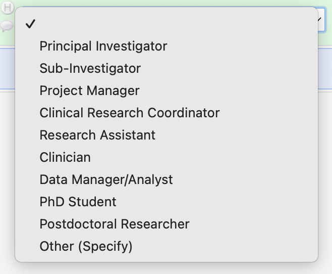
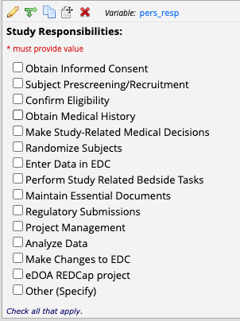
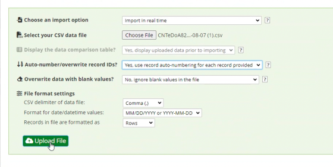

# eDOA REDCap Entry

!!! abstract "What this page tells you"
    How CRCs fill out the eDOA REDCap for the Collaborative Protocol 821778: role codes, study responsibility codes, which responsibilities go with each role, and how to bulk import personnel with the CSV template via the Data Import Tool.

[**REDCap eDOA for the Collaborative Protocol 821778**](https://redcap.med.upenn.edu/redcap_v14.3.13/DataEntry/record_status_dashboard.php?pid=40931)

1. For the eDOA, the CRCs are in charge of entering in the data below
2. Once these fields are filled out, it will send the email alert for the personnel/sub-PIs/PIs to sign and complete
3. The numbers below align to this REDCap project's coding (if the project is edited, be sure to add additional roles/responsibilities with the correct corresponding numbers to this SOP)
4. **See below for how to import a spreadsheet into REDCap for the eDoA**

**Role on Study options for personnel**

1. Principal Investigator
2. Sub-Investigator
3. Project Manager
4. Clinical Research Coordinator
5. Research Assistant
6. Clinician
7. Data Manager/Analyst
8. PhD Student
9. Postdoctoral Researcher
10. Other (Specify)

**Study Responsibilities**

PI Specific responsibilities (will only populate when Principal Investigator field is checked)

1. Assess eligibility criteria
2. Assess Adverse Events for relationship to study and whether event is expected
3. Review lab/test results for clinical significance
4. Certify study personnel responsibilities on eDoA

Other responsibilities

1. Obtain Informed Consent
2. Subject Prescreening/Recruitment
3. Confirm Eligibility
4. Obtain Medical History
5. Make Study-Related Medical Decisions
6. Randomize Subjects
7. Enter Data into EDC _(EDC=electronic data capture aka the redcap)_
8. Perform Study Related Tasks
9. Maintain Essential Documents
10. Regulatory Submissions
11. Project Management
12. Analyze Data
13. Make Changes to EDC
19\. eDOA REDCap project

1. Other (Specify)

**General Key for which "Study Responsibilities" should be assigned to which "Role on Study"** _(+ any others you feel are necessary)_

1. Principal Investigator➝ 1, 2, 3, 4
2. Sub-Investigator➝ 1,2,3,4
3. Project Manager➝ 11, 13, 14, 15
4. Clinical Research Coordinator➝ 5, 6, 7, 8, 9, 10, 11, 12, 13, 14, 17, 19
5. Research Assistant➝ 10, 11, 12, 16
6. Clinician➝ 5, 7, 8, 16
7. Data Manager/Analyst➝ 16
8. PhD Student➝ 11, 12, 16
9. Postdoctoral Researcher➝ 11, 12, 16
10. Other (Specify)➝ text submission
    1. i.e. Medical student→16

**eDoA Import**

1. Click "Data Import Tool"
2. Match to the screenshot below
    1. _make sure the data is in the correct format of MM/DD/YYYY_

1. Use this excel template
    1. _make sure to save as csv file to be able to import_

[📄 Example\_eDoA\_Import\_Template.csv](../../assets/operations/edoa-redcap-entry/04-example-edoa-import-template.csv)

For other studies, the import will work the same--just ensure that the column titles on your csv match REDCap. If you export a project from REDCap, it will show you the appropriate titles that you should use for the csv you want to import.
