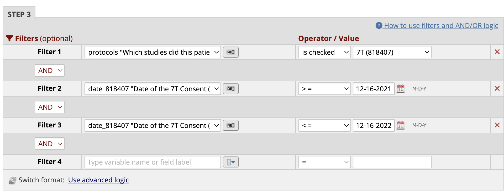
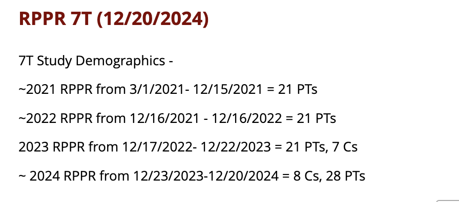
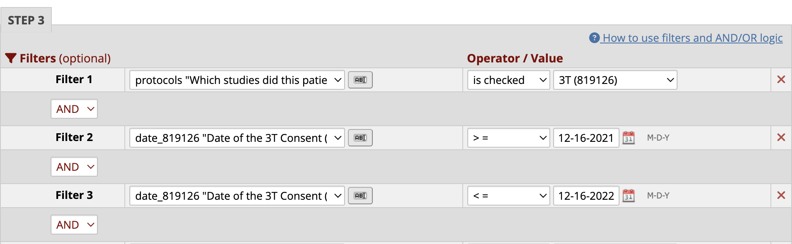
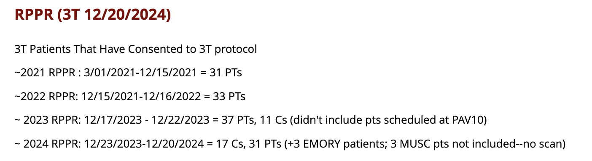

# RPPR Demographic Tables

!!! abstract "What this page tells you"
    Each year, build the NIH RPPR demographic tables (race, ethnicity, gender, age) for the 3T and 7T studies from the REDCap 'Grants' reports: edit the date filters to the past year, update the description, save, and export CSV. Includes a video tutorial and example CSVs.

Every year, we have to submit a recruitment report to the NIH for the 7T and 3T studies covered by Kate's R01 grant. We need to submit a demographics table for the subjects we enrolled which includes: **Race, Ethnicity, Gender, and Age.** We use our REDCap reports to generate these tables, which are then exported as a csv file and uploaded to the NIH system.

Below is a video tutorial on how to make these demographic tables from a REDCap Report. The video uses the 7T study as an example but the process and formatting for the tables is the same for all studies.

**Video Tutorial:**

🎬 Video: RPPR\_Demographic\_Table\_Video\_Tutorial.mov — kept in Dropbox › NeuroBridge › wiki-media as <code>8447-rppr-demographic-table-video-tutorial.mov</code>

We use reports in REDCap to generate the numbers for the RPPR for both 3T and 7T. The reports can be found under ["Grants" in REDCap.](https://redcap.med.upenn.edu/redcap_v14.8.3/index.php?pid=23568#:~:text=5\)%20Penn_RNS_Outcomes-,Grants,-1\)%20Intracranial)

Create Report:

1. 7T Table of patients enrolled in the past year from December XX of previous year - December XX of current year
    1. To change this to the current year, open the Report and go into **Edit Report**.
    2. Scroll to **Step 3**, and change the date in **Filter 2** to > = **12/XX of the previous year** and change the date in **Filter 3** to < = **12/XX of the current year**
    3. Example from 2022 Submission: 
    4. Also, in **Description,** copy the previous year demographics and add in the current year and number of patients enrolled. [Below is an example from what was submitted in 2024](https://redcap.med.upenn.edu/redcap_v14.8.3/DataExport/index.php?pid=23568&report_id=130255) (for the 2023 RPPR):

    1. Save Report
2. 3T Table of patients enrolled in the past year from 12/XX of previous year - 12/XX of current year
    1. To change this to the current year, open the Report and go into **Edit Report**.
    2. Scroll to **Step 3**, and change the date in **Filter 2** to > = **12/16 of the previous year** and change the date in **Filter 3** to < = **12/16 of the current year**
    3. Example from 2022 Submission: 
    4. Also, in **Description** copy the previous year demographics and add in the current year and number of patients enrolled. [Below is an example from what was submitted in 2024](https://redcap.med.upenn.edu/redcap_v14.8.3/DataExport/index.php?pid=23568&report_id=130254) (for the 2023 RPPR: 
    5. Save Report

**2023 RPPR csv files example**

[📄 2023\_3T\_RPPR.csv](../../assets/operations/rppr-demographic-tables/05-2023-3t-rppr-97.csv)

[📄 2023\_7T\_RPPR.csv](../../assets/operations/rppr-demographic-tables/06-2023-7t-rppr-60.csv)
