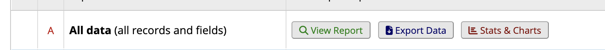

# RADAR Pull → REDCap Entry

!!! abstract "What this page tells you"
    Yearly, Joel Stein pulls MRNs and accession numbers for clinical 3T epilepsy and fMRI scans; coordinators add these patients to the Multimodal Clinical 3T Repository REDCap via CSV import (batches of 10), using the codebook and EPIC search phrases for handedness, lesions, neuropsych, and lateralization.

*   About once a year, there is a RADAR pull--Joel Stein will pull the list of MRNs and accession numbers for all patients in the last year that have had a clinical 3T scan (labeled in pennchart as MR HEAD EPILEPSY MULTIMODAL PRE EMU WO IV CONTRAST)
    *   Joel will also do a pull ~yearly for all patients in the last year that have had a functional MRI scan (task based fMRI)
    *   **A clinician may label patient's as being drug resistant or having PNEE. If so, you can fill this out in REDCap. If not, leave blank**
*   The scans will be pulled and put onto one of the servers (i.e. borel, BSC)
*   Coordinators are responsible for putting these patients in the Multimodal Clinical 3T Repository in REDCap to store their metadata [https://redcap.med.upenn.edu/redcap\_v15.1.2/index.php?pid=42518](https://redcap.med.upenn.edu/redcap_v15.1.2/index.php?pid=42518)
*   Because the pulls contain about 400 patients, it is easiest to create a cvs spreadsheet to use for filling out the data, and then import the spreadsheet into REDCap; I usually import patients in groups of 10 in case something goes wrong
*   **\*\*\*\*You should periodically check for updates on all existing patients in this REDCap--i.e. if they've since had neuropsych testing, surgery, scans, a new lesion, etc.**
    *   Ensure you reach out to Joel or Kate once a year ish to ask for the list of accession numbers for the most recent pull so that you can get the metadata and import that cohort!

**To create a spreadsheet with the proper titles:**

*   Open the Multimodal Clinical 3T Repository in REDCap
*   Click "Data exports, reports, and stats" located on the lefthand side
*   Next to "All data" click "Export Data"

*   Export the data as a "CSV/Microsoft Excel (raw data)"
    *   this will show you what is currently imported in the redcap
*   You can also go to "Data Import Tool" →click "**Download your data import template"** to get a blank template that you can use to import
    *   If you open the **codebook** for a REDCap project, you will see how each title and answer should be documented in a spreadsheet. **You should use this as a cheat sheet when filling out the spreadsheet you will import.**
        *   Example of codebook at the time this SOP was created:
        [📄 Import Template RADAR.csv](../../assets/redcap/radar-pull-redcap-entry/02-multimodalclinical3trepository-importtemplate-2025-04-16.csv)
        *   I.E: if a patient is right-handed, in the "handedness" column of the spreadsheet you will import, you would fill out a 1. Make sure there are no spaces in any of the spreadsheet boxes, as redcap won't allow you to import if there are any spaces in any of the spreadsheet boxes
*   Sometimes the pull contains duplicate patients that are already in this REDCap. Before you create a new record ID for a patient, look up their MRN within the Multimodal Clinical 3T Repository and ensure they do not already exist in this project. If they do, you can add the new accession numbers directly into REDCap to their record ID rather than creating a new one (i.e. exclude from imported spreadsheet and just fill out directly in the already created redcap record)

**How to find this information in EPIC:**

*   Below are a few key phrases you can use in a patient's chart to find the information necessary to fill out the REDCap. If any of the information is not available, many of the fields have an "unknown" option, or you can leave it blank for fields that have a textbox.
    *   **"Surgical Conference"**
    *   **"Epilepsy Diagnosis"**
    *   **"Epilepsy history"**
    *   **"Epilepsy Follow up"**
    *   For handedness: **"Handedness," "handed," "dominance," "dominant," "RH," "LH"**
    *   For lesions: look in the impression in the patient's MRI scans (either the MR HEAD EPILEPSY MULTIMODAL PRE EMU WO IV CONTRAST, fMRI, or 7T)
    *   **"Follow up"**
    *   "**Semiology**"
    *   For fMRI language lateralization: go to imaging→click **MR HEAD FUNCTIONAL LANGUAGE** to find the lateralization impression
*   Full neuropsych reports can mostly be found in "**letters**" and sometimes "**encounters**"
    *   look for letters by Dr. Kathy Lawler or Dr. Dara Fisher
*   Scan information can be found in "**imaging**"

**Document detailing what each neuropsych testing variable represents:**

[📄 Neuropsych Variables Key.docx](../../assets/redcap/radar-pull-redcap-entry/03-neuropsychology-archived-data.docx)
