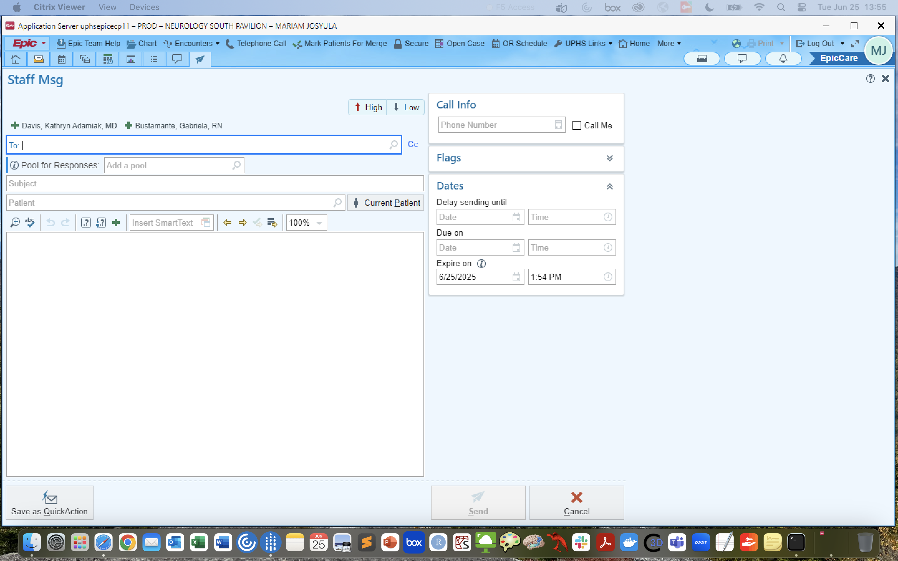

# Messaging in PennChart

!!! abstract "What this page tells you"
    How to send a PennChart In Basket message, and the exact Staff Msg template titled Missing Surgical Outcomes to send a clinician (cc Gabby Bustamante and Kate) asking for Engel/ILAE outcomes via the PECSURGICALOUTCOME dot phrases. Skip patients not seen in 3+ years.

*   Login to PennChart
*   Click the "in-basket" icon in the top left corner
*   Click "new message"
*   enter your recipeients
*   you can cc other people such as your co coordinator
*   enter a subject
*   to attach a patient, click current patient button and attach patient you want
*   write message
*   then press "send" in bottom right

#### **If PEC Followup data is not readily available in a (CURRENT) patients chart (i.e. the box is not there), send this message to their clinician:**
_(do not send message for patients who haven't been seen in 3+ years)_

*   go to **Staff Msg** in the top right corner-➝**new message**\-➝press current patient, fill in the names of the provider and CC Gabby Bustamante, Kate, and your co-coordinator
*   **Title** your message "Missing Surgical Outcomes"

Hello,

Your patient does not have available post-surgical/device outcomes available in Epic. As you know, the Penn Epilepsy Center has implemented standardized surgical outcome data collection. Please use the below "dot phrase" to document the surgical outcomes (1 year, 2 year, 3rd year) in a care management note and in your subsequent office visits.

If this isn't possible, please provide the Engel Score and ILAE Outcome for the 1 year, 2 year, and 3 year follow-up. Once completed please route the chart to the sender of this message and Gabby Bustamante.

The two dot phrases are PECSURGICALOUTCOME and PECNEUROMODULATIONOUTCOME

Thank you,
(YOUR NAME) on behalf of Kate Davis
