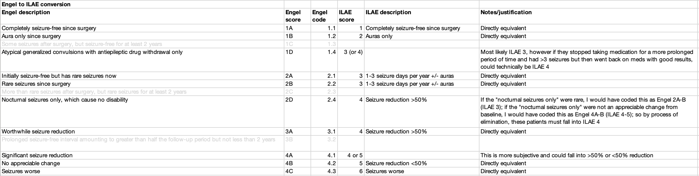

# Seizure Terminology Reference

!!! abstract "What this page tells you"
    Reference for data entry: seizure terminology equivalents, Engel-to-ILAE outcome mapping for resection and laser patients, ILAE classification cheat sheet images, generic-to-brand antiseizure medication names, and where to find histology in the surgical pathology report.

#### **Seizure Types**
**simple partial seizure** = focal aware seizure
**complex partial seizure** = focal impaired awareness seizure
**general tonic seizures** = bilateral tonic clonic seizure
**tonic clonic seizure** = bilateral tonic clonic seizure
**de ja vu** = aura
**MEG sharp** = MEG spike

#### **Engel Score to ILAE Outcome Category for Resection and Laser Patients-**
1A (1.1) = sz free since surgery
1B (1.2) = auras only
1D (1.4) = should be rare seizures but technically could also be seizure reduction >50%
2A or 2B (2.1 or 2.2) = rare seizures
2D or 3A (2.4 or 3.1) = seizure reduction >50%
4A (4.1) = should be no change but technically could also be seizure reduction >50% so flag these for me to check
4B (4.2) = no change
4C (4.3) = worsening

#### **ILAE Classification Cheat Sheet-**
\- made by Cat Kulick

🚫 Screenshot withheld (PHI review): Epic PROD Staff Msg compose with ILAE outcome SmartList dropdown — replace with a de-identified capture

#### **Seizure Medications**
Levetiracetam = Keppra
 Lorazepam = Ativan
 Lamotrigine = Lamictal
 Clobazam = Onfi
 Lacosamide = Vimpat
 Oxcarbazepine = trileptal, oxtellar
 Valproic Acid = Valproate, depakote
 Topiramate = Topamax
 Zonisamide = Zonegran
 Clonazepam = klonopin
 Gabapentin =  Gralise, Horizant, Neuraptine
 Brivaracetam = Brivact
 Carbamazepine = Tegretol XR, Carbatrol, Equetro
 Phenytoin = Phenytek, Dilantin Infatabs, Dilantin Kapseal
 Perampanel = fycompa
 Phenobarbital = phenobarbitone or phenobarb
 Eslicarbazepine = Aptiom and Zebinix
 Pregabalin = Lyrica
 Rufinamide = Banzel
 Cenobamate = Xcopri and Ontozry

#### **Histology**

*   All resection patients should have a surgical pathology report
*   If you need to find the histology, go into a patients chart and search "surgical pathology report"
*   At the bottom of this report, you will see "Specimen: \_\_\_\_\_\_\_\_\_\_\_." This is the histology
*   Laser ablation patients will NOT have a surgical pathology report
