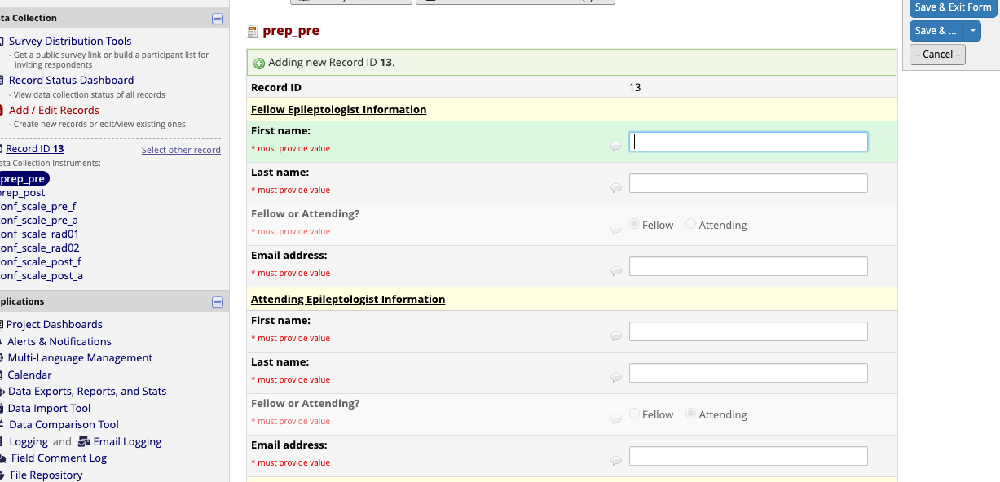
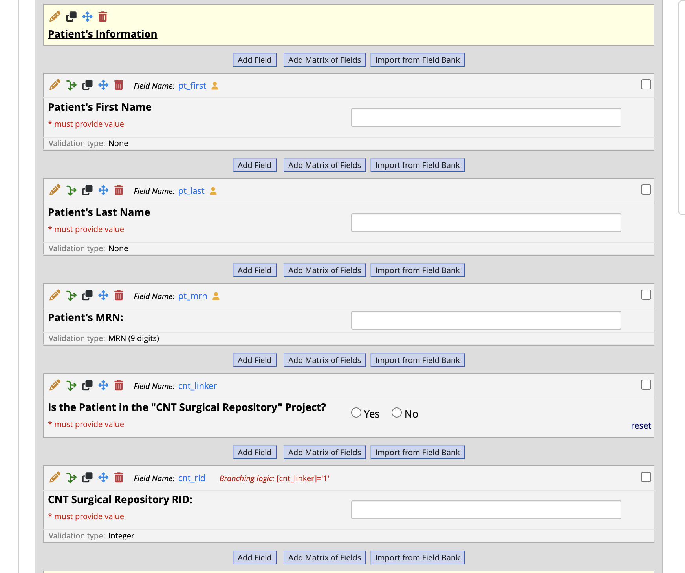

# Triggering REDCap Scale Invites

!!! abstract "What this page tells you"
    The Friday before surgical conference, add a REDCap record per presented patient (fellow/attending, patient name/MRN, conference date) and mark the prep_epileptologists and prep_post instruments Complete; this schedules the pre-conference (Tuesday 8am) and post-conference (Thursday 4pm) scale emails. Verify in the Survey Invitation Log.

**Overall setup-**

*   Cat, Gabby, or Mariam will trigger the pre- and post-conference scale invites on the Friday the week before surgical conference
    *   The pre-conference scale is set to be automatically sent on the Tuesday the week of surgical conference @8am
        *   Until the clinicians complete the scale, they will receive reminders Wednesday/Thursday @8am

*       *   The post-conference scale is set to be automatically sent on day of surgical conference (Thursday) @4pm
        *   Unless the clinicians complete the scale, they will receive an additional reminder Friday @12pm

### **Friday**

#### **Pre-Conference Scale Information-**

*   Gabby sends out who will be presenting at Thursday surgical conference on the prior week's Friday
*   **Information needed for trigger:** patient, patient's MRN, fellow, attending, date of surgical conference

#### **Pre-conference scales (repeat steps for each patient being presented)-**
**REDCap Project:** Quantitative MRI for Epilepsy Surgical Planning (Epilepsy)

*       *       *       *   choose 'add/edit records' under data collection on the left of the REDCap screen
            *   choose '\+ Add new record'
                *   go into the 'prep\_epileptologists' instrument by clicking the white circle

    1. 1. **Fellow Epileptologist Information + Attending Epileptologist Information**
            *   enter in full first/last name and then email

    1. 1. **Radiologist #1 Information and Radiologist #2 Information**
            *   pre-filled, no action required

**\*add screenshot once finalized\***

    1. 1. **Patient's Information**
            *   enter patient's full first name
            *   enter patient's full last name
            *   enter patient's MRN
            *   Mariam can check 'CNT Surgical Repository' project (can be done at a later time if needed)- not sure you all have access to ALL patients in this project

    1. 1. **Surgical Conference Date**
            *   enter the date of Thursday's surgical conference

    1. 1. **Triggering Pre-Conference Scale Invites**
            *   At the bottom of the instrument, select 'Complete' in the dropdown, then click 'Save & Exit Form.'
            *   This is required for REDCap to email the scale invites

    1. 1. **Triggering Post-Conference Scale Invites**
            *   Go to the 'prep\_post' instrument
                *   all the fields are embedded from the pre-conference scale instrument so no need to fill anything out
            *   At the bottom of the instrument, select 'Complete' in the dropdown, then click 'Save & Exit Form.'
            *   This is required for REDCap to email the scale invites Thursday @4pm

### **ALL DONE! 🙀**

#### Survey Checks

*   To check if the surveys are being sent as scheduled, go into the RID#
*   Choose 'Choose action for record'
*   Choose 'Survey Invitation Log'
*   Now you can view future notifications and when they will be sent
*   You can also choose 'View past invitations' at the trop left next to 'Survey Invitation Log' to see what has already been sent
